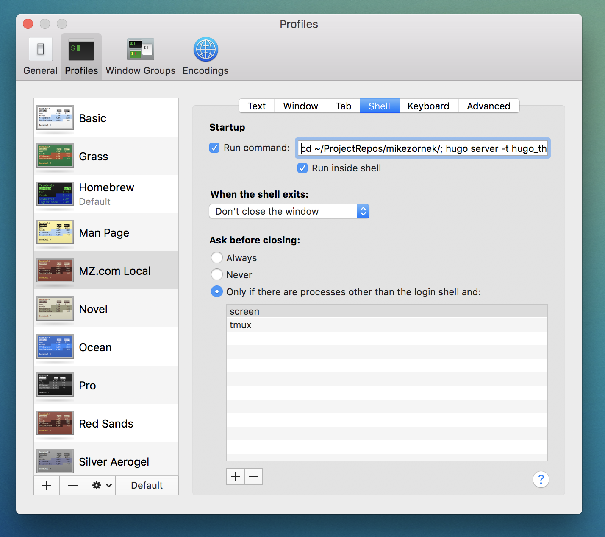

With my enjoyment of [Elixir](https://elixir-lang.org/) and things like [the new engine of this blog](http://mikezornek.com/posts/2019/1/new-year-new-site/) I find myself back in the Mac OS X Terminal more and more.

One quick tip I think many might miss, is that you can launch new Terminal windows based on a profile. Out of the box the only difference for the default profiles is color themes, but for each profile you can have it execute a series of commands when the new window is created.

For me, I like to use this to quickly jump to project folders or even quickly start up local servers. I also find it helpful to use different colors for different things, like say red for the web server, blue for the database and black for my main command line.

Give it a shot and save yourself some repetitive typing.

