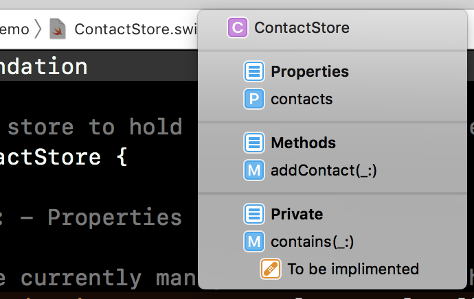
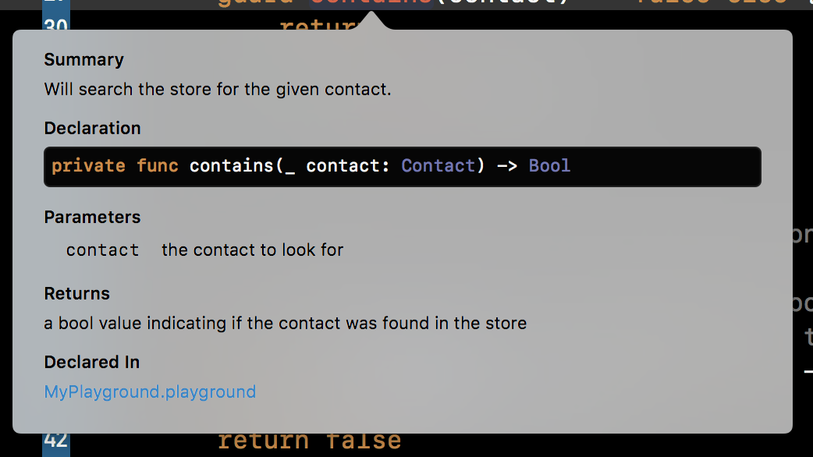

> This article is part of a series, [Professional iOS Projects](/professional-ios-projects/).

Professional iOS projects have good code documentation.

## What is code documentation?

When I talk of code documentation I generally mean two things. First is _inline code documentation_, those triple backslashed comments in a Swift file you use to describe types, properties and methods. Second, I mean _guides_, which are articles that describe aspects of the code from a higher perspective, usually explaining expected interactions as well as the thinking behind the design.

Documentation is great. It helps people who are new or returning to a code base learn how things work and like unit tests can help lead to better designs as documenting a poor design usually will help expose potential issues and misunderstandings.

## Why should I write documentation?

> All that sounds great but how come no one writes any code documentation?   

Sadly it's a victim of our current industry norms.

You won't find many "how to write great code documentation" classes in a computer science curriculum. Most "learning to program" books will overlook the topic entirely or limit coverage to a passing mention of the document syntax format for the given language. 

Even at work, when was the last time a pull request of yours was rejected for missing documentation? When was the last time your manager brought up code documentation during a sprint plan? Maybe you are getting pushed around for a quick delivery. Was documentation a requirement in the client contract? Has anyone suggested that if its not in the contract it’s not part of the deliverable? 

This is where we separate the coders from the professional programmers. 

Some, many in fact, work in this industry just to make a buck. Others like to consider themselves craftsman or professionals. These people constantly look for ways to improve themselves and the community around them. It is in these people I put my faith that over time, code documentation norms will get better, like other behaviors before it.

When I first started programming very few people used version control day to day, leaving it for only the most complex of projects. A daily ZIP file of the source and passing around `.patch` files worked just fine for many. 

Testing has also followed a similar path where back in the day only a few would consider testing helpful and tools were hard to find and integrate, but now test targets are part of the built-in project templates. 

Progress is being made.

> Aside: While I general feel the community norms around code documentation need to improve I did want to point out that open source is one ecosystem which is shown to highly value code documentation the tooling around it.   
>   
> If you are looking for good code documentation examples, try to find an active open source project to reference. You’ll usually find some helpful patterns to follow.  

## How do I write documentation?

Swift inline documentation is easy enough to get started with.

Example 1:

```swift
/// Describes a person whom we have met in real life.
class Contact {
    
    /// The name of the person.
    let name: String
    
    /// Initialize new `Contact` instance.
    ///
    /// - Parameter name: The name of the contact we met.
    init(name: String) {
        self.name = name
    }
}
```

To add documentation use three backslashes `///` to start a line of documentation. You’ll want to document the type, the properties and then methods. Also, notice for methods that take parameters there is a format to document them as well. 

> In Xcode you can also use `Option+Command+/` to bulk paste a documentation line template. This template is particularly useful when documenting a method with lots of parameters and other parts.  

Swift documentation supports Markdown and if you backtick mentions of a type it often will generate a link to that type when the documentation is rendered in Xcode.

Example 2:

```swift
/// A data store to hold `Contact`s of the user.
class ContactStore {
    
    //MARK: - Properties
    
    /// The currently managed `Contact`s of the store.
    private (set) var contacts: [Contact] = []
    
    //MARK: - Methods
    
    /// Accepts a contact and adds it to the store.
    /// If the given contact was already a member of the 
    /// store, the `contacts` collection is not changed.
    ///
    /// - Parameter contact: a contact to be added to the store
    func addContact(_ contact: Contact) {
        guard contains(contact) == false else {
            return
        }
        contacts.append(contact)
    }
    
    //MARK: - Private
    
    /// Will search the store for the given contact.
    ///
    /// - Parameter contact: the contact to look for
    /// - Returns: a bool value indicating if the contact
    ///   was found in the store
    private func contains(_ contact: Contact) -> Bool {
        // FIXME: To be implemented
        return false
    }
}
```

In this second example we use `MARK: - SectionName`. This helps split up our source file. In particular since we don’t have headers anymore I like how I can segregate `private` methods to the bottom. 



Another example here includes the use of `//FIXME`. FIXME is not triple backslashed so it’s not technically documentation but it will be showcased inside of Xcode’s editor.

The main way you’ll encounter this documentation is through Xcode’s Quick Help. Option click a method and you’ll see:



Sadly there is no official support for HTML generation but there are third party tools like [Jazzy](https://github.com/realm/jazzy) that can help.

## Writing Guides
In addition to inline documentation you’ll want to write up some more high level guides. These can cover many things from code tutorials to design retrospectives to agreed upon code patterns and terminology. 

A great example of this can be found in the [open source code base for NetNewsWire](https://github.com/brentsimmons/NetNewsWire/tree/master/Technotes). Brent has written lots of helpful documents including [Coding Guidelines](https://github.com/brentsimmons/NetNewsWire/blob/master/Technotes/CodingGuidelines.md) and a [Roadmap](https://github.com/brentsimmons/NetNewsWire/blob/master/Technotes/Roadmap.md).

## Resources
* [Markup Formatting Reference: Formatting Quick Help](https://developer.apple.com/library/archive/documentation/Xcode/Reference/xcode_markup_formatting_ref/SymbolDocumentation.html#//apple_ref/doc/uid/TP40016497-CH51-SW1)
* [Swift Documentation - NSHipster](https://nshipster.com/swift-documentation/)

## Counterarguments
Documentation is one of those things some developers get extremist about. One popular quote: 

> Good code is its own best documentation. As you’re about to add a comment, ask yourself, “How can I improve the code so that this comment isn’t needed?” Improve the code and then document it to make it even clearer.  
>
> [Steve McConnell](https://www.azquotes.com/author/38834-Steve_McConnell)  

There is nothing inherently wrong with this statement. I too avoid documenting very simple statements. The bigger problem is that the code we are writing today isn’t very good. It’s usually pretty lousy. It’s a version one for some half written client specification. 

If you aren’t finding possible improvements in the code you wrote last year you have a problem. The phase “good code” is very suspect.

There are extremes with anything. Use your judgement. Most people don’t get yelled at for writing too much documentation though.

## How to Get Started?

Document something, document anything. 

You need not take two weeks off to go back and document everything. Stick to documenting new types or types that are being refactored or take a shot at listing the most complex aspects of your current system and then work down the list.

Give code documentation some time to become a habit. Documentation’s value usually doesn’t popup until a few months after writing it.
