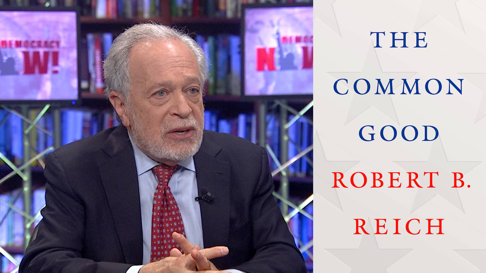

I've been a long time fan of [Robert Reich](http://robertreich.org/) and particularly enjoyed his documentary [Inequality for All](http://inequalityforall.com/) from 2013. This year he has a new book, [The Common Good](https://amzn.to/2Y6TiM3) -- and I liked it a lot.

> Robert B. Reich makes a powerful case for the expansion of America’s moral imagination. Rooting his argument in common sense and everyday reality, he demonstrates that a common good constitutes the very essence of any society or nation. Societies, he says, undergo virtuous cycles that reinforce the common good as well as vicious cycles that undermine it, one of which America has been experiencing for the past five decades. This process can and must be reversed. But first we need to weigh the moral obligations of citizenship and carefully consider how we relate to honor, shame, patriotism, truth, and the meaning of leadership.

I like this book because it goes above the here and now issues to ask the bigger question of how our society broke down and then offers some thoughts as to what it will take to fix it.

The book ends with a discussion guide which doubles as a fair outline of what's in the book. Check it out, and if you want to know more -- get [the book](https://amzn.to/2Y6TiM3).

## A Discussion Guide for The Common Good

### PART I: What Is the Common Good?

1. How do you define the "common good" in America? What do Americans have in common other than national symbols like the flag and the national anthem? What do these symbols mean to you?
2. Do Americans have obligations to the nation in addition to paying taxes, serving on juries, and voting? If so, what are they?
3. Some say Americans are selfish and self-centered. Others point to acts of kindness and courage—first responders to emergencies, everyday acts of altruism. How would you describe our national character?
4. Has America’s character changed over time—since your parents were children, for example? If so, how and why?
5. Do you trust government to do the right thing most of the time? Do you believe in our system of government—the Constitution, the Bill of Rights, federalism, and the rule of law?
6. What’s the difference between a concern for the common good and nationalism?
7. What role does a president play in setting the moral tone of the nation?

### PART II: What Happened to the Common Good?

8. Why has the public’s trust in all major American institutions—especially government, big businesses, banks, and the media—plunged over the past forty years? What events or trends have been most responsible for the decline?
9. Americans appear to have become far more partisan than we were forty years ago—liberals have moved to the "left" and conservatives to the "right," Republicans and Democrats are less willing to compromise, and everyone seems to be angrier. Why has this happened?
10. Have widening inequalities of income and wealth played a part?
11. Has the flood of big money into our political system played a part?
12. Are the two related?
13. Why before the 1980s did big corporations have responsibilities toward their communities and their workers, in addition to their shareholders? Why after the 1980s did big corporations focus solely on maximizing profits and shareholder returns? Should corporations go back to their former ways?
14. A major theme in the 2016 presidential election, coming from both major parties, was that the economic system is "rigged" for the benefit of those at the top. Why did this theme appear so prominently in 2016 and not before? Do you agree with it?

### PART III: Can the Common Good Be Restored?

15. What are the attributes of good leadership? Do leaders of business, government, and the media have responsibilities to restore trust in their institutions? If so, how should they go about it?
16. What roles do honor and shame play in contemporary American society? Ideally, who should be honored and for what, and who should be shamed and for what? How should such honoring and shaming occur?
17. Who do you trust to inform you about public issues such as climate change, the economy, or dangers posed by foreign governments? What are the qualities or characteristics you look for in deciding whom to trust in conveying the truth?
18. Does a democracy depend on a shared reality, or can a democracy function with people believing fundamentally different facts?
19. Are Americans adequately educated about how government and the economy are supposed to work, as well as how they actually work? If not, what should that education consist of, and when should it begin?
20. Do Americans have sufficient understanding of the obligations of citizenship? If not, who should be responsible for providing this understanding? Parents? Teachers? Public officials?
21. Do we have an obligation to break out of our self-made "bubbles" of friends, neighbors, and Internet algorithms that confirm everything we believe? If so, how can we do it? If not, can we still be effective participants in our democracy?
22. How do you think the common good can best be restored?
