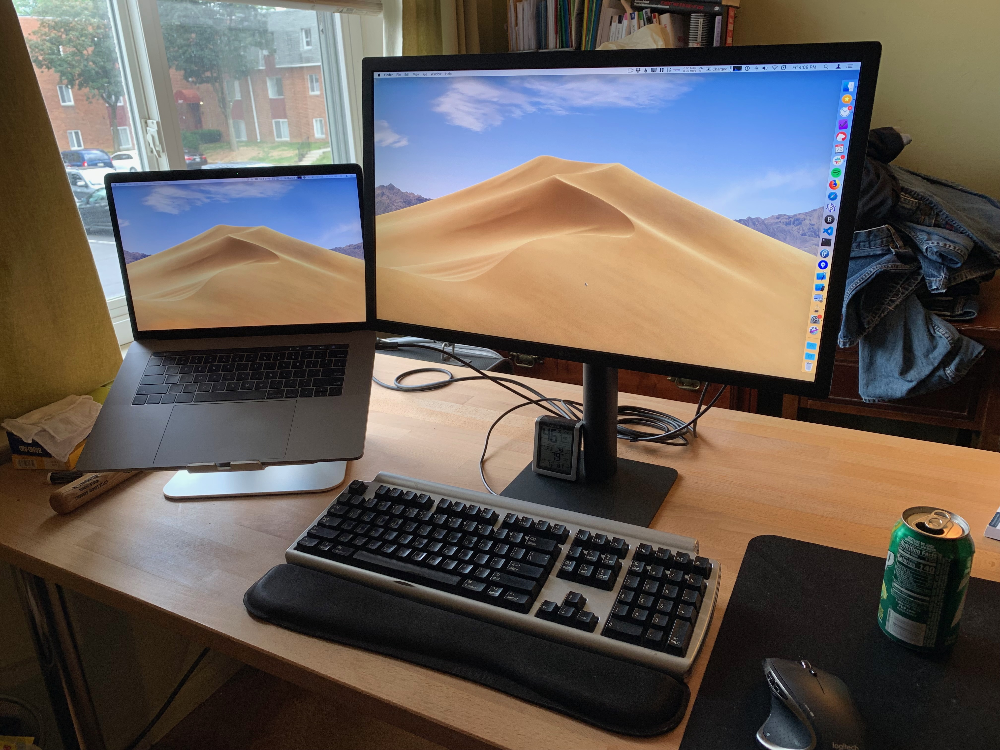
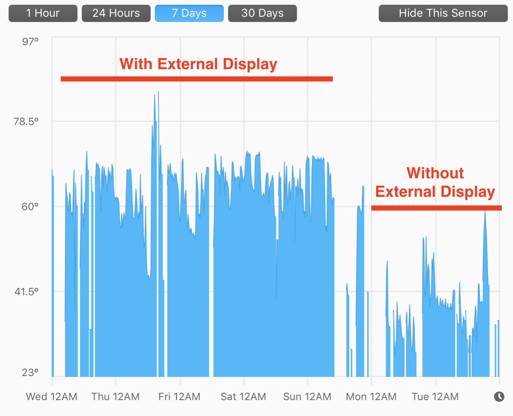

> Previously on, [The Great Monitor Search Continues](http://mikezornek.com/posts/2019/6/the-great-monitor-search-continues/). After identifying a need to get a new external display for my MacBook Pro, I first paused to see what WWDC might bring. After Apple released [a monitor that I could not afford](https://www.apple.com/pro-display-xdr/) I instead went with the [LG 49-inch UltraWide monitor](https://www.lg.com/us/monitors/lg-49WL95C-W-ultrawide-monitor) which, while productive and cool in many ways, did not jive with Mac OS X day-to-day. It was returned. Now having my second choice monitor, the [2019 23.7-inch LG UltraFine 4K Display](https://www.apple.com/shop/product/HMUA2VC/A/lg-ultrafine-4k-display), how is it going?

Jumping from a 49-inch ultra wide to a 23.7-inch monitor at first felt like many steps backwards. Once again I'm forced to perch my MacBook Pro on a stand to be my secondary monitor. While there are many new advances and benefits of the 23.7-inch monitor, it's hard to ignore that it doesn't fill the void the previous 2011 27-inch iMac (ran in display mode only) was filling even before I tested out the ultra wide.

That aside, so far the monitor is working out well.

The color and resolution are amazing. With my bedroom lighting the glossy screen avoids the typical reflection issues and so I benefit with richer colors without too much of a compromise. The 500 nits of brightness are amazing and even puts my MacBook Pro display to shame. I like running the monitor at a true retina 2x 1080p of resolution for general tasks but have nudged the monitor to a scaled 1440 while doing some longer programming sessions. With the more detailed resolution and sharper text I've even been able to lower my coding font to grab up some extra space.

The real benefit of this monitor however comes from its nearly seamless integration with Mac OS X. All of the expected brightness and volume controls work from the keyboard. There is no power button on the display and once you connect the Thunderbolt cord to the MacBook Pro the monitor wakes up and also starts charging the laptop. Even wake from sleep is fairly reliable. (I think twice I had to do a unplug/replug for the monitor to be found but this could have also been from the fact that the cord needs to be firmly connected and the design of USB-C can leave connections to come out a little too easy sometimes.

For downsides I'll mention the internal speakers. I like the fact they are included but the quality is pretty bad. I'm not an audiophile so it's hard for me to describe but in my own day-to-day I'm using the MacBook Pro laptop speakers instead (for now) as I feel like they have more range. (Aside: The old iMac had good, usable speakers, I wish the LG had them.)

I think it's a shame the monitor only has USB-C connections on the back. I would have appreciated a few USB-A type ports so I can plug my keyboard and mouse in directly without the need for yet another $39 adaptor. I also have a slight concern that this monitor won't be usable by any of my current or future Windows computers since they prefer Display Port or even HDMI as a backup. I dunno. I have done no testing and in general am living with the fact that this is probably going to be an Apple-only monitor for me.

I would have also appreciated a basic camera for conference calls. I have an external USB camera I can setup (with ANOTHER adaptor) but not having a camera/microphone for this common need seems like an oversight for such a high end monitor.

My final complaint, and this isn't for the monitor directly, is that using it makes my MacBook Pro (15-inch, 2016) run hot. Check out this graph, the early days are when I was working from home with the monitor attached and then the later days are me on the road at a conference with no monitor. Connecting the monitor seems to double the temperature, just to push the pixels let alone when I'm really pushing the CPU with code compliers or video exports.

I worry about running a laptop with high thermals like this regularly day-to-day. What really stings is that under a better scenario I would be connected to a modern and affordable Mac Pro tower that would have more cooling capacity -- but I digress.

In short, I'm generally pretty positive about the monitor. I think it does have a bit high of a price tag and notable compromises but the improved Mac OS X integration makes up for it for me. I wish we had more options on the market. I also wish Apple would just make a monitor for the rest of us.

PS: A few days ago [LG refreshed the 5K version](https://www.macrumors.com/2019/07/30/apple-online-store-new-5k-lg-ultrafine-display/) of this monitor [sold through Apple Stores](https://www.apple.com/shop/product/HMUB2LL/A/lg-ultrafine-5k-display). The previous 5K was discontinued when I had to make my choice which is a shame since I think the 27-inch might have been a better match for my needs. I think I'll sit on my hands for a while and watch for the new reviews. Perhaps in time I'll sell my 23.7-inch 4K and upgrade or maybe I'll just buy a second 23.7-inch 4K. That is one other benefit of the 2019 refresh is that the 23.7-inch has better support for monitor chaining. But then again, if I'm getting too much heat with one monitor I wonder how hard two would push my laptop.

The Great Monitor Search Continues (again)...
