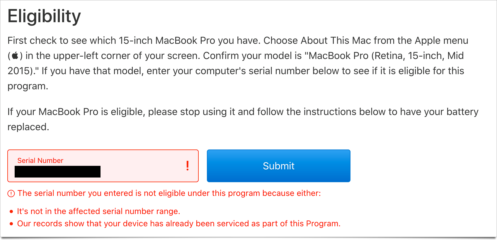

In recent weeks the FAA has put a flight ban on the MacBook Pro laptops with recalled batteries. [NPR writes](https://www.npr.org/2019/08/13/750985881/u-s-air-regulators-ban-macbook-pros-with-recalled-batteries-from-flights):

> The Federal Aviation Administration has banned certain MacBook Pro laptops on flights following an announcement by Apple Inc. that some use batteries that pose a fire or safety risk.
>
> The laptops were sold between September 2015 and February 2017 and can be identified by their product serial number, according to the company's notice.

The Apple support site [is here](https://support.apple.com/15-inch-macbook-pro-battery-recall).

Since the model range is so wide and the laptops all look the same I don't know what this going to mean for people flying with their laptop.

I recommend printing out the support page with your serial number coming up as clean in case you are red flagged going through security.

Happy flying.
