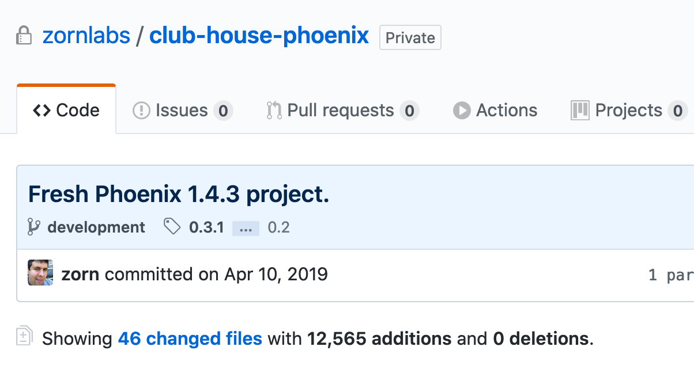

Today, after more than a year of side project progress, I finally am starting to share some of my progress regarding [Clubhouse Hosting](https://clubhouse.host/) through the release of the first Public Alpha.

My first commit (over a year ago):

In my full time consulting work I push for "release small and fast" but personal responsibilities, this project's scale, and the new technologies I've had to learn through the process have slowed me down tremendously. I still have a ton of spit and polish to do, and even bigger ideas once the basics are in place but I'm excited to hit this milestone, even if it is only a Public Alpha.

> The platform is still in-development but available now as a Public Alpha. This means many features are incomplete and probably broken. Users should expect things to change, sometimes in breaking ways, and know the site still lacks production-acceptable backup and export systems.

The real focus of this release is getting feedback. I'm asking friends, peers and anyone interested in the goals of the project to lend me their time for some online user testing. If you would like to donate your time, please consider [scheduling some time](https://calendly.com/zorn/open-meeting) on my office hours calendar.

From this point on I plan to do regular updates. You can follow along via the Clubhouse Hosting [Micro.Blog](https://micro.blog/clubhousehost) or [twitter](https://twitter.com/clubhousehost) accounts as well as consider signing up to the mailing list from [the front page](https://clubhouse.host).

Thanks for your support!