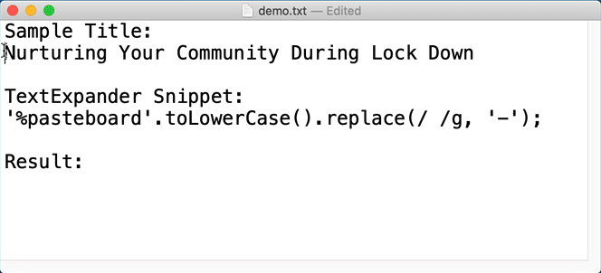

I've been a long time [TextExpander](https://textexpander.com/) user. You don't know of TextExpander? Shame!

> TextExpander lets you instantly insert snippets of text from a repository of emails, boilerplate and other content, as you type – using a quick search or abbreviation.

My common shortcut snippets include:

* Email: `z@zl` into `zorn@zornlabs.com` and `m@m.com` for `mike@mikezornek.com`.
* Date: `ddate`
* Time: `ttime` -- very handy while testing UI as a piece of dynamic content, yet descriptive and ordered.
* Common Google Terms: `-ep` into `Elixir Phoenix`. 
* Phone Numbers: `cphone` and `hphone` into the real phone numbers.
* Support Email Replies -- when I did a lot of that thing. 
* URL to my meeting calendar: `-meeting` into `https://calendly.com/zorn/open-meeting`
* Common Xcode Comments: `-mark` into:

```
// MARK: - Outlets
// MARK: - Properties
// MARK: - Life Cycle
// MARK: - Methods
// MARK: - Private
```

* SwiftLint Disables:

```
// swiftlint:disable rule_name
[CLIPBOARD]
// swiftlint:enable rule_name
```

I added a new one today, for the common need to convert a title-like string into a filename-friendly one.

```javascript
'%pasteboard'.toLowerCase().replace(/ /g, '-');
```

Thus expanding `-urlp` into "Nurturing Your Community During Lock Down" (the clipboard) into `nurturing-your-community-during-lock-down`.



I'm on the hunt for more too. Let me know if you have any recommendations!