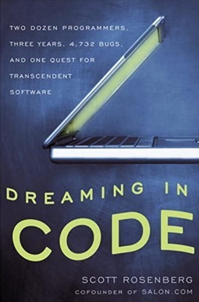

Dreaming in Code is a book by Scott Rosenberg. On [the book website](http://www.dreamingincode.com/) he write:

> Why is software so hard?
>
> Hard to make well. Hard to deliver on time. Hard to use.
>
> Our civilization runs on software. Yet the art of creating it continues to be a dark mystery, even to the experts, and the greater our ambitions, the more spectacularly we seem to fail.
>
> Dreaming in Code: Two Dozen Programmers, Three Years, 4,732 Bugs, and One Quest for Transcendent Software sets out to understand why, through the story of one software project -- Mitch Kapor's Chandler, an ambitious, open-source effort to rethink the world of e-mail and scheduling.
>
> I spent three years following the work of the Chandler developers as they scaled programming peaks and slogged through software swamps. In Dreaming in Code I tell their stories.

I finished the book last night and found it very enjoyable. Its not a must read by any means but for those programmers who like to learn about process and project management, from a storyteller perspective you might enjoy. The best chapters I think are those dedicated to the general history and art of programming.

Towards the end of the book I started using the Kindle highligher (which is a first for me). Here are some excerpts:

> "When you learn about computer science," Lanier said in a 2003 interview, "you learn about the file as if it were an element of nature, like a photon. That's a dangerous mentality. Even if you really can't do anything about it, and you really can't practically write software without files right now, it's still important not to let your brain be bamboozled. You have to remember what's a human invention and what isn't."

> ~

> He discovered that we ask more work of students who want to become writers and poets than of those who aim to become software developers: They must study with mentors, they must present their work for regular criticism by peers in workshops, and they're expected to labor over multiple revisions of the same work. "I think we need to be ashamed of this," Gabriel says. "What we put forward as computer education is a farce."

> ~

> "Designers should all take some time and learn programming," John Anderson declared one day over lunch. "Then they won't keep proposing such really difficult things." "But then they wouldn't come up with great ideas," Lisa Dusseault replied.
