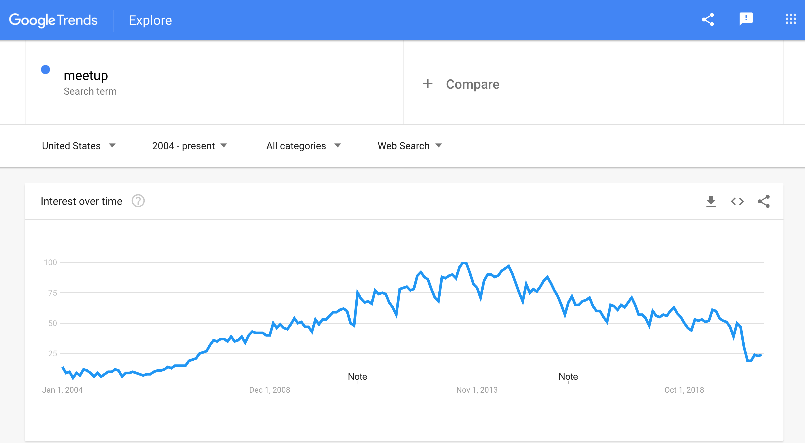

> This blog post was orientally posted to the Guildflow product blog, which will soon [be shutdown](/posts/2021/10/guildflow-shutdown/).



Discussion topics from the video:

- My ongoing research into meetup groups. [Still looking for more people to interview too!](http://mikezornek.com/posts/2020/8/help-me-with-an-introduction-to-your-meetup-organizer/)
- Technical meetups are on the decline. Why?
  - Part of it is the avalanche of technical information online.
  - Part of it is people being able to more easily find and connect with same minded people online.
  - COVID has only expedited this decline.

**If your meetup group is limited to meeting once a month, at a building, to eat pizza and talk about a technology, I fear your group may not be around in 5 more years.**

- There are still a ton of great benefits from a running a meetup community.
- How should meetups evolve?
  - More events, smaller events.
  - Some in-person, some online.
  - Not every member will attend every event.
  - Social events: hack nights, side project saturday, show and tell.
  - Goal-oriented events: book clubs, workshops, mentoring, masterminds, [side project time bartering](http://mikezornek.com/posts/2020/8/bartering-with-other-developers-on-side-projects/).
  - Passive connections: Chatting and DM via Slack or Discord. Group Twitter account to promote member successes.
  - Maybe do bigger events every 6-months? formal dinners, picnics, mixers?
  - Need to spend more time onboarding new members when the group lives online.

[The Google Trend chart for "meetup".](https://trends.google.com/trends/explore?date=all&q=meetup)

Thanks for watching and best of luck with your group.
