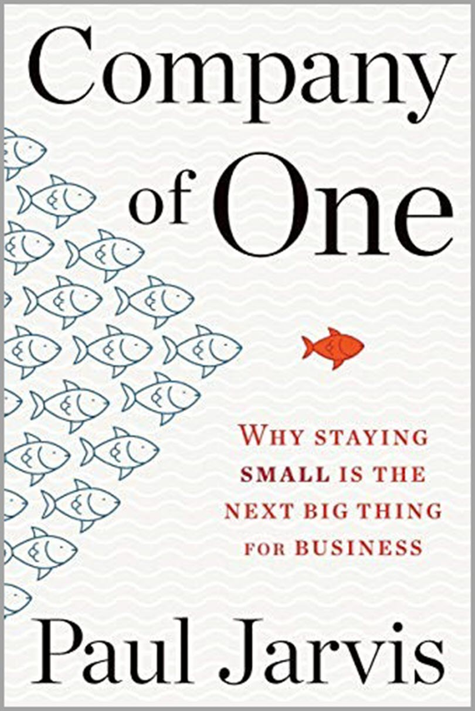

<figure style="width: 30%; margin: 0;">

<figcaption>Company of One Book Cover</figcaption>
</figure>

This weekend I finished [Company of One] by Paul Jarvis. The book pitches:

[Company of One]: https://ofone.co/

> What if the real key to a richer and more fulfilling career was not to create and scale a new start-up, but rather, to be able to work for yourself, determine your own hours, and become a (highly profitable) and sustainable company of one? Suppose the better—and smarter—solution is simply to remain small? This book explains how to do just that.

I bought the book on a whim after seeing a GoodReads friend recommend it. I thought it would be a timely book to fuel my introspection as I [shut down one major project][1] and consider what is next.

[1]: https://mikezornek.com/posts/2021/10/guildflow-shutdown/

Overall I found the book to be enjoyable and engaging. I even picked up a new [podcast subscription][2] to hear the author talk more about the ideas described in the book.

[2]: https://artofproductpodcast.com/episode-93

I do think the book's pitch feels a bit overreaching. Rereading it now, it feels downright misleading. There are some solid recommendations about going out on your own. However, the big idea that makes the book a recommendation for me is how it challenges us to rethink growth. Why do we want to grow sales, get more customers, hire more people? What are we doing, why, and is it sustainable? Are we hiring people so we can do less work or the company can do more work?

I align with the bootstrapper community over venture capital startups. VC's addition to growth is a big part of that, but I think this book also brings home the idea for bootstrappers. 

Even in a bootstrapped company, it would be easy to end up building a machine that you do not enjoy running. You may start the company because it gives you a stage to work with a specific technology and an audience you enjoy. Suddenly you grow too fast, without understanding WHY you want to grow, and all of sudden you are spending your days doing things that do not spark joy, like managing a large group of employees or drowning in customer support. 

As I step back and consider what is next for me, I think it'll be essential to brainstorm my ideal day, week, month, and year and build the company and products that can enable that life.

For style critique, I found the book to be a little heavy on the references of other writings and research. Specifically, it felt repetitive to have such works referenced and then very thin, terse insights made. I get that this builds a more persuasive picture over time, but it was a repetitious pattern that felt like padding. 

It also did not help that some of the references felt a little dated. Knowing what we know now, maybe [Basecamp isn't a good reference for a model working environment][3]. Bringing up Google's 20% time for personal projects without talking about how it is no longer an active practice feels disingenuous. 

[3]: https://www.theverge.com/2021/4/30/22412714/basecamp-employees-memo-policy-hansson-fried-controversy

For style appreciation, I like how the chapters end with introspecting questions under the headline "Begin to think about...". Ultimately I find the most successful books help you dream up questions to ask way more than books that pretend to have all the answers.

***

I think this can be a helpful book for those like myself who are contemplating work opportunities, projects, or a new company. However, the valuable topics brought up are much more about growth than the title 'Company of One' really suggests.