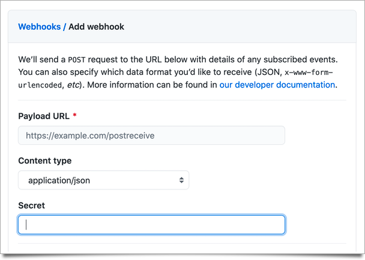

_This post was originally written for my old ElixirFocus blog, and transfer here after its closure._

Some of the most interesting and valuable behaviors we can build as web developers are through connecting different web applications together. Often times this comes in the form of webhooks, where one web app will POST events to your own web app. Keeping that communication secure is important and today we will take a peak into how you can secure webhook payloads in a Phoenix application.

## Webhook Security 101

Webhook might sound like some scary, exotic term but at the end of the day webhooks are nothing more that a web server endpoint configured to receive HTTP POST requests in some agreed upon format. The concern however is, without any additional security, anyone could discover the endpoint and start sending their own malicious payloads to your web application.

To help secure a webhook, when you first set it up you'll give the third party some generated secret. As an example, here is where you can store the secret while configuring a GitHub webhook:

[](github-secret.png)

When GitHub then sends the HTTP POST request they will include, in the headers of that request, a signature of the payload using the previously shared secret. As you process the HTTP POST request you can then generate your own signature, based on the incoming payload and the known secret, to verify the payload's authenticity. If the secrets match then you have much more trust that the payload came from the correct third party.

## Validating a Payload Signature in Phoenix

To get this to work in Phoenix we'll need a few core behaviors.

First, we will want the ability to generate a signature based on a payload and a secret.

```elixir
  def generate_payload_signature(_, nil) do
    {:error, :missing_app_secret}
  end

  def generate_payload_signature(payload, app_secret) do
    {:ok, :crypto.mac(:hmac, :sha256, app_secret, payload) |> Base.encode16(case: :lower)}
  end
```

Second we'll need a way to pull out the signature from the connection's request headers, if present:

```elixir
  defp signature_from_req_headers(req_headers) do
    case List.keyfind(req_headers, "x-hub-signature", 0) do
      {"x-hub-signature", full_signature} ->
        "sha256=" <> signature = full_signature
        signature

      _ ->
        nil
    end
  end
```

Finally we'll connect the dots creating a simple call site function where someone can pass in a `Plug.Conn` and a payload and ask if it is authentic.

```elixir
  def is_authentic_payload?(%Conn{req_headers: req_headers}, payload) do
    case signature_from_req_headers(req_headers) do
      nil ->
        false

      signature ->
        is_payload_signature_valid?(signature, payload)
    end
  end

  defp is_payload_signature_valid?(payload_signature, payload) do
    case generate_payload_signature(payload, webhook_secret()) do
      {:ok, generated_payload_signature} ->
        Plug.Crypto.secure_compare(generated_payload_signature, payload_signature)

      _ ->
        false
    end
  end

  defp webhook_secret do
    Keyword.fetch!(Application.fetch_env!(:webhook_signature, :github), :webhook_secret)
  end
```

There are a few ways you could go about getting this check into your controller code. The most challenging part is that out of the box Phoenix does not make the raw body of an HTTP POST request available to you through the `Plug.Conn` struct. Instead a default Phoenix app uses parsers and converts such payloads into native Elixir value types.

One way to turn off this behavior is to edit your Phoenix app's `endpoint.ex` file and remove the auto-parsing behavior for all routes of that endpoint. You can find some more info about doing this in the [Plug docs](https://hexdocs.pm/plug/Plug.Parsers.html#module-custom-body-reader) in a section titled "Custom body reader".

Since this parsing behavior is helpful for non-webhook requests in our example app, we will relocate the parsing configurations out of the `endpoint.ex` file and into the pipeline definition on the `router.ex` file. This way we can keep the parsing behavior working for the rest of the example app and do something custom for our webhook endpoint.

```diff
defmodule WebhookSignatureWeb.Endpoint do
  # CONDENSED FOR DEMONSTRATION

-  plug Plug.Parsers,
-    parsers: [:urlencoded, :multipart, :json],
-    pass: ["*/*"],
-    json_decoder: Phoenix.json_library()

end
```

```diff
defmodule WebhookSignatureWeb.Router do
  # CONDENSED FOR DEMONSTRATION

  pipeline :browser do
    plug :accepts, ["html"]
    plug :fetch_session
    plug :fetch_flash
    plug :protect_from_forgery
    plug :put_secure_browser_headers

+    plug Plug.Parsers,
+      parsers: [:urlencoded, :multipart, :json],
+      pass: ["*/*"],
+      json_decoder: Phoenix.json_library()
  end

end

```

Our next question is where do we this verification check? In our example app, we will keep the controller code focused on the behavior of processing the payload and put the behaviors for signature verification inside some plugs as part of the router's pipeline for this specific endpoint.

The first plug will read the contents of the `Plug.Conn` body into a new assigns value `:raw_body`.

```elixir
defmodule WebhookSignatureWeb.Plugs.RawBodyPassthrough do
  @moduledoc """
  This plug will read the body for `POST` and PUT` request and store it into a
  new assigns key `:raw_body`.

  This plug is used on certain routes in preference to the default Phoenix
  behaviors that would automatically decode the params and request body into
  native elixir values for a controller. It is a required choice since the body
  of a `Plug.Conn` can only be read from once.
  """

  import Plug.Conn
  alias Plug.Conn

  @spec init(Keyword.t()) :: Keyword.t()
  def init(options), do: options

  @spec call(Conn.t(), term()) :: Conn.t()
  def call(%Conn{method: method} = conn, opts) when method == "POST" or method == "PUT" do
    case Conn.read_body(conn, opts) do
      {:ok, body, _conn_details} ->
        Conn.assign(conn, :raw_body, body)

      {:more, _partial_body, _conn_details} ->
        conn
        |> send_resp(413, "PAYLOAD TOO LARGE")
        |> halt
    end
  end

  def call(conn, _opts), do: Conn.assign(conn, :cached_body, %{})
end
```

The second plug will pull out the signature from the HTTP request headers and then verify it matches our expectations.

```elixir
defmodule WebhookSignatureWeb.Plugs.RequirePayloadSignatureMatch do
  @moduledoc """
  This plug will verify that the payload from a webhook request matches the
  accompanying header signature, based on a previously shared `webhook_secret`.

  When the payload is verified the connection continues as normal.

  When the payload is unverifiable the connection is halted with a 403 response.
  """

  import Plug.Conn
  alias Plug.Conn
  alias WebhookSignature.PayloadValidator

  @spec init(Keyword.t()) :: Keyword.t()
  def init(options), do: options

  @spec call(Conn.t(), term()) :: Conn.t()
  def call(%Conn{method: method} = conn, _opts) when method == "POST" or method == "PUT" do
    case PayloadValidator.is_authentic_payload?(conn, conn.assigns.raw_body) do
      true ->
        conn

      false ->
        conn
        |> put_resp_content_type("application/json")
        |> send_resp(403, "{\"error\":\"PAYLOAD SIGNATURE FAILED\"}")
        |> halt
    end
  end

  def call(conn, _opts), do: Conn.assign(conn, :cached_body, %{})
end
```

Finally we'll bring it all together, defining an `:api` pipeline and using that pipeline for our `GitHubWebhookController` route.

```elixir
defmodule WebhookSignatureWeb.Router do
  # CONDENSED FOR DEMONSTRATION

  pipeline :api do
    plug :accepts, ["json"]
    plug WebhookSignatureWeb.Plugs.RawBodyPassthrough, length: 4_000_000

    # It is important that this comes after
    # `WebhookSignatureWeb.Plugs.RawBodyPassthrough` as it relies
    # on the `:raw_body` being inside the `conn.assigns`.
    plug WebhookSignatureWeb.Plugs.RequirePayloadSignatureMatch
  end

  scope "/github", WebhookSignatureWeb do
    pipe_through :api

    post "/webhook", GitHubWebhookController, :webhook
  end
end
```

If the signature match is successful the controller will be allowed to do its processing of the payload values.

If the signature match is not successful we return a [403 response](https://httpstatuses.com/403) since "The server understood the request but refuses to authorize it."

## Show Me The Code

There is an example project with the behaviors expressed in this post on GitHub:

<https://github.com/phoenix-by-example/webhook_signature>

## Further Reading

For more on webhooks, you can check out [GitHub's documentation](https://docs.github.com/en/developers/webhooks-and-events/webhooks).
