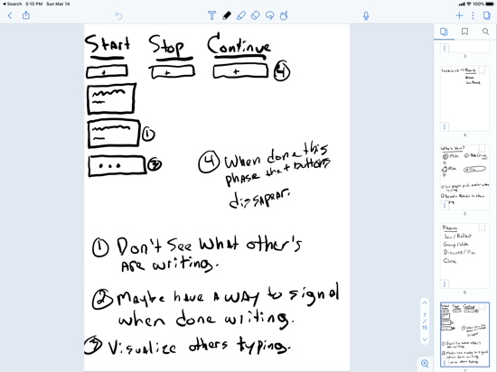
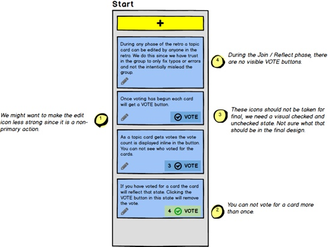

_This post was originally written for my old ElixirFocus blog, and transfer here after its closure._

Phoenix by Example is all about crafting educational content extracted from open source example projects. Today I am kicking off my latest example project, RetroTaxi!

From the [pitch document](https://github.com/phoenix-by-example/retro_taxi/blob/main/docs/c1/feature_post_and_vote.md):

> A retrospective meeting is a regular practice of agile teams or any group of people who are looking for continued improvement to their team process, communication or habits. Successful retro meetings give the team an opportunity to reflect on what is working, what is not and what they want to do next.
>
> Retrospective meetings can be executed in many different ways but with the advent of more people working remotely having an online collaborative tool to help execute the meeting and capture feedback is often advantageous. Some people will initially lean on collaborative tools like Google Docs to help execute a retro meeting and while it can work, it is not very elegant or structured. There are also dedicated retro tools but most are locked behind account registration, paywalls or try to do too many things.
>
> This project aims to provide a simple, focused tool to help people run a retro meeting online. Our solution will value:
>
> - **A registrations-free experience** over formalized team management.
> - **One-time use boards** over detailed historic archives.
> - **Conversations** over analytical measurements or note taking.
> - **A responsive web experience** over platform-specific apps.

RetroTaxi will utilize [Phoenix LiveView](https://hexdocs.pm/phoenix_live_view/Phoenix.LiveView.html) fairly heavily and should be a useful source of topics to discuss.

## Project Goals

The [first](https://github.com/phoenix-by-example/greeter) [two](https://github.com/phoenix-by-example/get_shorty) projects of Phoenix by Example were fairly simplistic in nature and one of the first goals is of RetroTaxi is to do **a more through exploration of a real world project process**. As such you'll see some early discovery time has been spent in preparing [a pitch document](https://github.com/phoenix-by-example/retro_taxi/blob/main/docs/c1/feature_post_and_vote.md), which is a slice of the larger Shape Up process.

<figure>
 
 <figcaption>Sample of some early discovery sketching and interface <a href="https://basecamp.com/shapeup/1.3-chapter-04#breadboarding">breadboarding</a>.</figcaption>
</figure>

Some mockups from the pitch document:

<figure>
 
 <figcaption>Board layout.</figcaption>
</figure>

<figure>
 
 <figcaption>Card state.</figcaption>
</figure>

The second project goal is to (hopefully) **provide more useful and usable solutions to real world problems**. When I built the [GetShorty](https://github.com/phoenix-by-example/get_shorty) link shortener example there were no real aspirations that anyone would actually use the tool day-to-day, but moving forward I'd like to find small slices of opinionated, usefulness solutions to model the examples after. If you find this and have thoughts on retro meeting and the tools involved, please [reach out](mailto:mike@mikezornek.com). I'd love to hear your observations.

## Next Steps

With the early discovery and my [first pitch](https://github.com/phoenix-by-example/retro_taxi/blob/main/docs/c1/feature_post_and_vote.md) written I see the next steps as follows:

- Sketch out the HTML/TailwindCSS needed to execute the design.
- Build out the core contexts needed to model the behaviors of the board.
- Create the LiveView to wire up the behaviors to the UI, breaking the interface into simple, testable components.
- Refine the interactions and test non-happy path experiences (browser reload/rejoin).
- Deploy and test the app to be used on the public internet.

The plan is to do this project in 6 weeks, with about 10 hours per week of dedicated time. I'll be blogging my progress here so if you want to stay informed be sure to subscribe.
