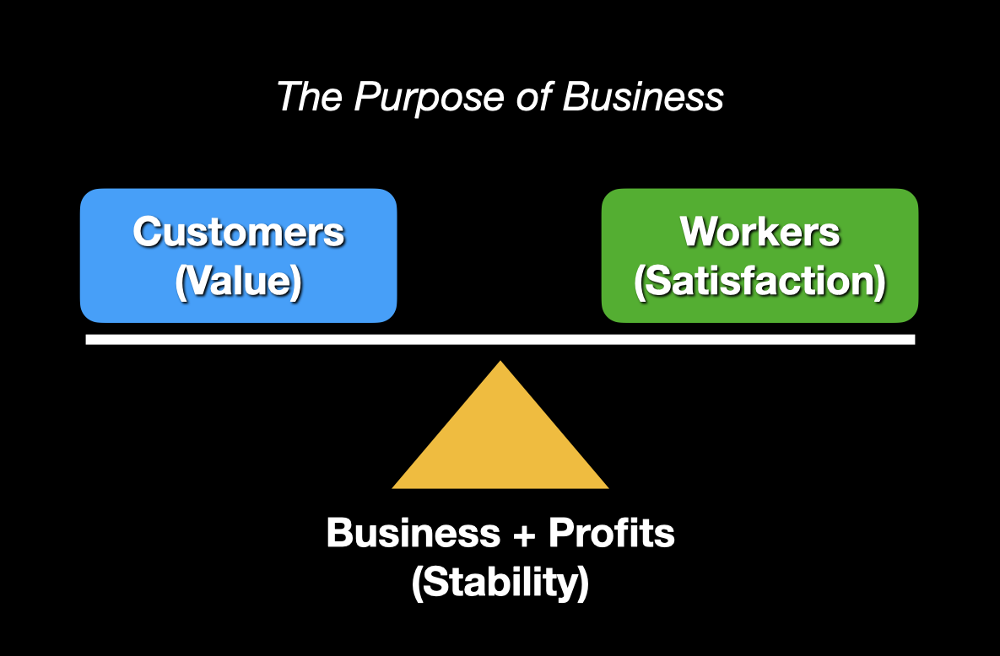

This blog post is part of an open exploration of my core values when it comes to work. Ideally reading through these posts will help you consider your own values. If you happen to be here researching my [consulting services](/for-hire/), my hope would be these notes help define possible alignment on your project.

---

First we must acknowledge, a **business** is a human construct that was built to accomplish a goal. In the United States, and other capitalist-countries, many times the primary goal of a business is to generate and quickly extract profits for the owners or stakeholders. I however have an appreciation and different perspective when it comes to the purpose of a business.

I like to think of a business as the balancing act amongst three primary forces.

First we have the **customers**, who are provided value through products and services. Without the customer we are lost and so we must prioritize our work and attention towards their needs and concerns at all times.

Second we have the **workers**. Many businesses view the workers as an unfortunate requirement to accomplish their business goal (profits). The business will determine the minimum amount of compensation that will keep the workers showing up which sadly creates a dysfunctional relationship. I like to think that the primary goal of the ideal business should be to provide a long-term, welcoming and supportive environment for its workers. Worker satisfaction comes from meaningful, rewarding and sustainable work. Prioritize the customer, but never at the sacrifice of the worker.

Finally we have the **business** (and its profits). In my ideal the business and profits are there to provide long-term stability between the customers and the workers. Each of those groups will need extra support at different phases of a business and a profitable business is better setup to handle those needs. I am not against a business owner or stakeholders taking _some_ profits out of the system to reward an investment of time or money but it bothers me when that is the primary goal of the business. Another options to consider when trying to construct a fair and balanced approach to business is [employee ownership of the business](https://blog.testdouble.com/posts/2020-05-12-esop-owned/).

---

It can be challenging to reach these ideals inside systems you don't fully control but none-the-less I find self-reflecting on your values and sharing your thoughts to be a rewarding process. With luck you can connect with people who share your values and have constructive conversations with those whose values differ.
