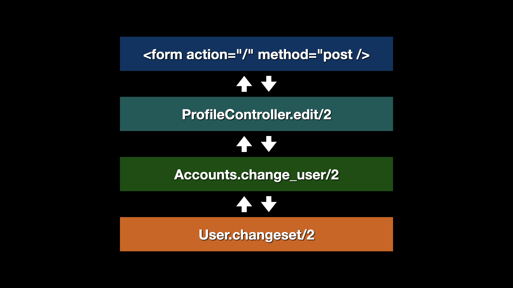

_This post was originally written for my old ElixirFocus blog, and transfer here after its closure._

> With schemaless changesets you have the power to hand craft validations for specific web form presentations and define firm boundaries of responsibilities between your web presentation layer and the business-specific contexts of your app.

It's a story we can all relate with. A new app is born using `mix phx.new hello`. 

Some `mix phx.gen` generators are used to begin to shape a solution, perhaps something like: 

```bash
$ mix phx.gen.html Blog Post posts body:string word_count:integer
```

And then over time the `Post` schema grows. Different web forms are needed and so multiple `changeset` functions are added for the diverging user tasks. You might even start adding `virtual` fields to schemas just to handle web form needs.

It gets to a point where no one wants to edit or refactor the schema since it has grown too large and complex. 

How do get we get out of this mess?

## Part One: Break Things Down

When you find yourself with a large schema I would first look to how you can break down this **BIG** noun into other smaller nouns. 

Perhaps you have a large `User` entity. Maybe you could isolate and extract some of its responsibilities. Maybe introduce a `Credentials` entity and a user has many of them. Maybe break out a `Profile` and a user has one of those.

Perhaps you have an `Notification` entity that is being mutated to track its progress through some kind of delivery process to a third party. Maybe instead of an ever mutating string value of `status` you introduce a new entity for `DeliveryAttempt` and then notifications can have many of those and derive a `status`. With less mutation you likely will need less changesets functions and the code will naturally be more focused.

Breaking down domain concepts into smaller structures can improve the expressiveness and clarity of a codebase. Now, while I hope this little reminder can help brainstorm ideas for your own project there is another sneaky issue at play in our story and that is the changeset dependency problem.

## Part Two: Breaking Your Changeset Dependencies

As useful as Phoenix generators can be to stand up a basic app, or to get through a tutorial introducing you to concepts about the framework, there is a dark pattern you would be wise to acknowledge if accepting its compromise.

In an ideal scenario an `Ecto.Changeset` should **NOT** have a dependency through line from an app's business context into the web controller and onto the web form of the page. 

**Letting a changeset that low in the stack influence the web forms is dangerous.** 

Lets explain.

First, having any chunk of code touch too many layers begins to handicap your ability to refactor. I tend to align with the thought that "Good Code Is Easy To Change Code". If you are looking for a simple measurement when evaluating the quality of a codebase, changeability is as good as any principle to lean on.

<figure>
 
 <figcaption>A common but brittle approach that creates strong dependencies across all the layers.</figcaption>
</figure>

Second, having low stack changesets dictate web form behavior creates a dysfunctional approach to user experience design where you force the user to represent their work as it will (eventually) be persisted in a database table row. In an ideal situation you'll be crafting custom web forms to capture user intent and then transform the incoming data into the needed persistance format. Do not let the database dictate the user interface!

### Using Schemaless Changesets

So with all of that said, how does one use a [schemaless changesets](https://hexdocs.pm/ecto/data-mapping-and-validation.html#schemaless-changesets)?

Normally if you had a defined an Ecto schema like `Registration` you'd build a changeset with code like:

```elixir
fields = [:first_name, :last_name, :email]

changeset =
  %Registration{}
  |> Ecto.Changeset.cast(params["sign_up"], fields)
  |> validate_required(...)
  |> validate_length(...)
```
Creating a schemaless version is super easy and very much the same. Instead of starting the pipe with a schema type you instead start it with a simple tuple containing the data and some metadata about the data's types.

```elixir
data = %{}
types = %{name: :string, email: :string}

# The data+types tuple is equivalent to %Registration{}
changeset =
  {data, types}
  |> Ecto.Changeset.cast(params["sign_up"], Map.keys(types))
  |> validate_required(...)
  |> validate_length(...)
```

The `data` in this case can be a simple `Map` or a more defined struct. For example, in the RetroTaxi project there is a web form presented on the home page and so I built a `Struct` to represent [the request](https://github.com/elixirfocus/retro_taxi/blob/main/lib/retro_taxi/board_creation/request.ex) like:

```elixir
defmodule RetroTaxi.BoardCreation.Request do
  defstruct [:board_name, :facilitator_name]

  @type t :: %__MODULE__{
          board_name: String.t() | nil,
          facilitator_name: String.t() | nil
        }
end
```

Later when creating a changeset we use this schemaless pattern:

```elixir
def change_request(%Request{} = request, attrs \\ %{}) do
  types = %{
    board_name: :string,
    facilitator_name: :string
  }

  {request, types}
  |> Changeset.cast(attrs, Map.keys(types))
  |> Changeset.validate_required([:board_name, :facilitator_name])
  |> Changeset.validate_length(:board_name, min: 1, max: 255)
  |> Changeset.validate_length(:facilitator_name, min: 1, max: 255)
end
```

Other than this difference, you can use the changeset with the Phoenix form tool just like before.

> I'll also take a moment to give a nod to the `embedded_schema` Ecto type which can be used here in place of the arbitrary `Struct` or `Map`; see [the documentation](https://hexdocs.pm/ecto/data-mapping-and-validation.html) for a full sample. My gut tells me to isolate usage of things called "schemas" to entities or values that will end up in the database for a greenfield project, but it's a small preference. I also like the idea that the concepts of "changeset" need not be limited to the Ecto library.  

### The Missing Error Gotcha

The one issue you may run into with this schemaless changeset approach is that as you test validations on your web forms you will not see any errors. The reason for this is that traditionally the changeset you render in a `POST` request will come out of a `Repo.insert/2` or `Repo.update/2` error tuple and that changeset will have its `action` attribute set to a non-nil `:insert` or `:update` value. The Phoenix web form tools use the presence of this value as a signal to render the errors. For us, this means we need to set `action` explicitly like the sample below.

```elixir
  def process_request(request, user_id) do
    changeset = change_request(request, %{})

    case changeset.valid? do
      false ->
        # In the first published version of this post we edited the `action` directly but
        # it is probably safer to use the defined `apply_action` function, though the 
        # result is pretty much the same.
        # {:error, %{changeset | action: :insert}}

        # We need to force an action value so the Phoenix forms will display the errors.
        # Code is more explicit here for demonstration purposes.        
        {:error, changeset_with_action} = Ecto.Changeset.apply_action(changeset, :insert)
        {:error, changeset_with_action}

      true ->
        # Perform the actual request.
    end
  end
```

## Conclusion 

With schemaless changesets you have the power to hand craft validations for specific web form presentations and define firm boundaries of responsibilities between your web presentation layer and the business-specific contexts of your app. Lots of people will not invest in this separation of concerns, and depending on the life-cycle of the application and the needs of your users that might be fine. If however, you find yourself making multiple flavors of changeset or adding lots of `virtual` fields to a schema just to make the web forms fit in -- it might be time to rethink your approach.
