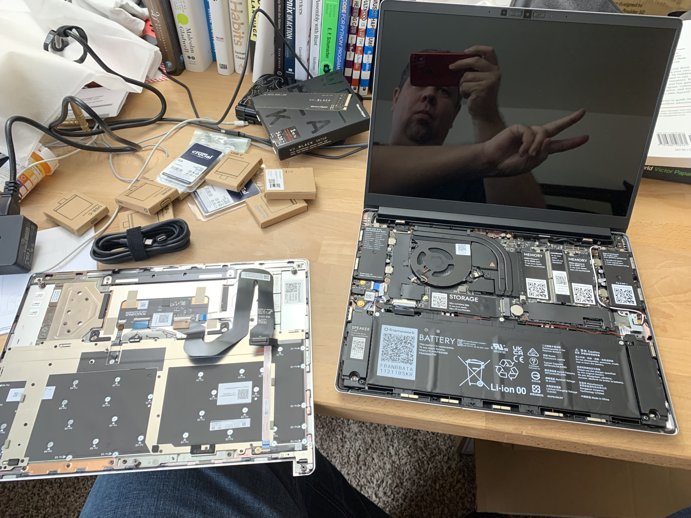
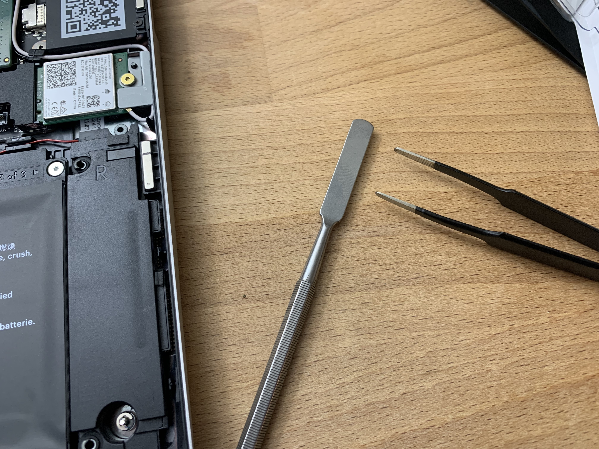

A few days ago I took delivery of a [Framework laptop][4], a new product that prioritized repairability in support of the [Right to Repair][3] movement. I'm enjoying it a lot and wanted to share some early observations. 

[4]: https://frame.work/
[3]: https://www.repair.org/

My notes below will be limited to hardware-related observations. As part of this laptop experiment, I'm also running an [Ubuntu install][5] and that has its own set of challenges from a long time MacOS user. Perhaps in the future I'll share more about that.

[5]: https://ubuntu.com/download/desktop

## Recommended Teardown Videos

First, if you want a proper visual demo, I would look to the [iFixit teardown][1] or [Louis Rossmann's stream archive][2]. I have a few photos below but am not attempting anything close to a full visual inspection.

[1]: https://www.youtube.com/watch?v=AV2umY3R0vw
[2]: https://www.youtube.com/watch?v=vQLws5KfntE

## DIY Edition

While you can purchase a prebuilt version with Windows installed, I elected to buy the DIY edition. This version comes with a selection of customized components like SSD, RAM and network card in the box but it is your job to install them. With DIY you also do not have to pay for a Windows license, which is great for me since I want to use Linux.

Installation of the components was fairly easy (even for someone with limited hardware experience) and Framework has [a wonderful setup guide][7] with lots of pictures if you need any help. The most notable issue for me was the wifi card. I had never had to install one before and the antenna wires can be a little delicate, particularly if you have larger hands like myself. While the laptop does come with a the one screwdriver size you need, I got some help via tweezers and a flat edge tool from a [iFixit toolkit][6] I already owned when it came to the wifi card installation.

[7]: https://guides.frame.work/Guide/Framework+Laptop+DIY+Edition+Quick+Start+Guide/57
[6]: https://www.ifixit.com/Store/Tools/Pro-Tech-Toolkit/IF145-307

There are a ton of little design choices that make this laptop feel special.

* Not only do you get a screwdriver in the one size you'll need (many other laptops require an armada of different screwdrivers to work on), it is even magnetized to hold the internal screws just a little better while working.
* The screws on the base of the laptop are captive, meaning they won't fall out and get lost when loosened.
* If you were to loose an internal screw, there are extra screws inside the case.
* The base and screen frame are held in with magnets, not glue, allowing for easy opening and alignment.
* Instead of picking a fixed collection of ports, the Framework laptop has a simple expansion system which allows you to customize ports based on your needs. I am currently using a mix of USB-C, USB-A and HDMI components but they also have SD cards, extra storage and other options.
* The machine comes with a 1080p camera and a pair of microphones connected to physical privacy switches that disconnect them when unwanted.
* There is a fingerprint sensor built into the power button. This is the one hardware feature that does not work out of the box for the current Ubuntu release but there are [known instructions][9] shared by the supportive Linux users within the Framework community forum on how to get it to work. I plan to do this soon.
* The screen resolution is 2256x1504, a taller 3:2 ratio than most other laptops, giving you a little extra workspace and enough pixels to run your OS in a high DPI mode for crisp text.

[9]: https://community.frame.work/t/fingerprint-scanner-compatibility-with-linux-ubuntu-fedora-etc/1501/18

The overall build quality feels great. I saw [Dave2D complain][8] about some flex in the monitor but I'm not seeing an issue in my build. Keyboard feel and travel are nice although I still struggle with location of some keys due to historic time spent on my Mac.

[8]: https://www.youtube.com/watch?v=jmgBwMHpP1w

## Observed Issues

I prefer a larger laptop, like my 16-inch MacBook Pro. I like the larger screen and overall larger body on my lap, as I work sitting on a recliner. This laptop is 13.5 inches but feels a little small for my personal preference. I look forward to future Framework options that might be larger with dedicated graphics cards.

The trackpad is mechanical and not haptic which by itself is not an issue for me but still unfortunate. More importantly I have struggled with my out of the box Ubuntu trackpad experience. 

First I was dealing with a frustration that a right-side tap was signaling right clicks, but this was solved with some quick tweak software. Ongoing is an issue with two finger scrolling speed being way too fast. [I think this is a Gnome issue][10], and am hopeful a custom preference can be found to slow things down. I hear some people on a future version of Ubuntu are not having this problem so we'll see. Finally there is my thumb placement at the bottom of the trackpad which can interrupts pointer movement with my index finger. These are technically software issues so I don't want to ding Framework too much but want to share my notes as transparent as I can.

[10]: https://community.frame.work/t/looking-for-help-adjusting-trackpad-scroll-speed-on-ubuntu/7080/

Alongside my MacBook Pro, I use an external display that supplies both power and the display connection over a single Thunderbolt 3 cable. Early attempts to replicate this using Framework [have failed][11] and I'm forced to use a second cable for power and the Thunderbolt cable for the display. I've been told there are some other improvements coming to the firmware for this, so maybe this will be resolved in time.

[11]: https://community.frame.work/t/not-getting-power-display-from-single-cable-when-using-my-2019-23-7-inch-lg-ultrafine-4k-display/7249/

The speakers are good, though not as good as my MacBook Pro speakers. They are located under the front side edges which sadly makes the audio a little muffled against my legs when working with the computer on my lap while sitting on my recliner.

At 55Wh the battery capacity feels a little on the low side, but considering my typically use will not come into that play often.

## Ideas

The expansion slots are a very unique aspect of the Framework laptop and sparks imagination for future possibilities. One possible idea, though size might be an issue, would be to package a little cellular connection module, allowing internet connectivity on the road.

I'd also love to see the DIY option get rid of the Windows logo for the SUPER key and instead use the Framework logo, but acknowledge for this first hardware version that is a nitpick ask.

And once again, for my personal preference, a larger 15 or 16-inch version with a dedicated graphics card would be awesome.

## Conclusion

Buying a first edition laptop from a new company is no doubt a risky move. I bought a Framework laptop because their company values have alignment with Right to Repair which I am also very supportive of. Additional, the laptop comes at a time when I am actively trying to diversify my experiences outside of MacOS and it serves that purpose very well.

It has only been a week, but so far I am very positive about my Framework laptop purchase.
