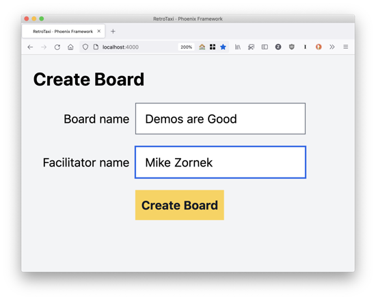

_This post was originally written for my old ElixirFocus blog, and transfer here after its closure._

A few months ago I kicked off the next sample project for this website, a team retrospective board built using Phoenix LiveView called [RetroTaxi](https://github.com/elixirfocus/retro_taxi/). More info about the project is available in the [project kickoff](/posts/retro-taxi-project-kickoff/) and today I'll share how it has been coming along.



From the scope of the [original pitch document](https://github.com/elixirfocus/retro_taxi/blob/main/docs/c1/feature_post_and_vote.md) you'd like to think I would have gotten further along by now but a mix of client responsibilities and then a [extended personal vacation](https://mikezornek.com/posts/2021/7/vacation/) kept me distracted. Over the past week however I have gotten back into the project and can show some basic things working.

First, a user can visit the home page and create a new board. This create board form also asks for their name, since they will be displayed as the meeting's facilitator to future collaborators.

<figure>
 
 <figcaption>Create new board form.</figcaption>
</figure>

With the board created you are redirected to the board page, which shows the custom title and displays the facilitator in the to-be-fleshed-out "who's here" section.

Each board has four columns and each column has content cards. You can add cards to columns and you can edit cards. There is no active pub/sub between multiple people viewing the board and seeing the cards change (yet), that is still forthcoming.

<figure>
 
 <figcaption>Sample of current board with editable content cards.</figcaption>
</figure>

The site is styled with Tailwind CSS through I wouldn't say it represents a final visual language by any means. I hope to finish the project with a vanilla Phoenix LiveView setup and then move on to experiment with [Surface](https://surface-ui.org/) for a fuller UI component experience.

Since I wrote the [original cycle one pitch](https://github.com/elixirfocus/retro_taxi/blob/main/docs/c1/feature_post_and_vote.md) I feel like my understanding of what I want to build and how it will all work has been very fluid. I have pretty much dropped the concept of cycles and have just started tagging issues with a `MVP1` label since this project's progress has clearly not been constrained by time.

I'm going to try to be more deliberate with [issues](https://github.com/elixirfocus/retro_taxi/issues) and pull requests moving forward so if you want a peek or contribute, check them out.

Hopefully I'll also be able to start extracting some more code-specific blog posts from the project soon. If you have any specific questions, let me know <mike@mikezornek.com>.
