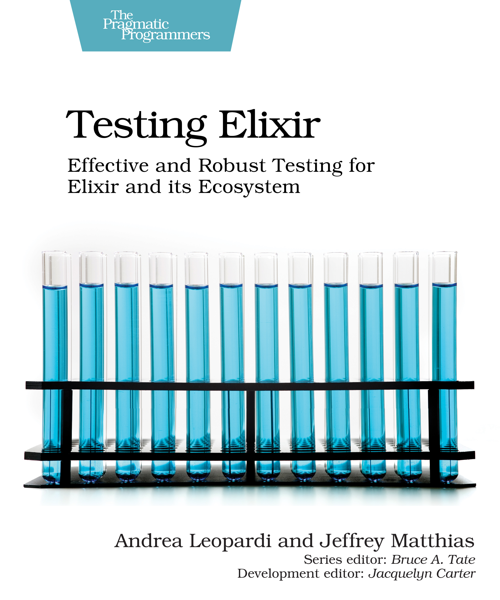
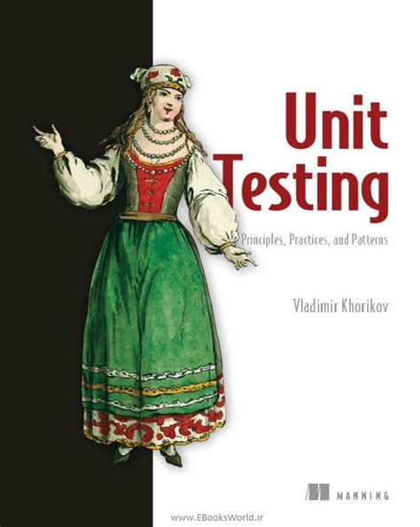

I am pleased to share the reboot of the Elixir Book Club.

Starting Sunday, November 13th at 10:30am (Eastern Time), we'll meet for an hour via Discord to talk about our next book...

## Testing Elixir

<figure style="width: 40%; margin: 0 auto;">

<figcaption>Testing Elixir Book Cover</figcaption>
</figure>

<https://pragprog.com/titles/lmelixir/testing-elixir/>

I read this back in April of 2021 and thought well of it. It's a good overview of the various testing tools available and how to apply them to Elixir scenarios and patterns (OTP, Ecto, Phoenix).

During the first meeting will review chapters 1 and 2. After that, we will meet to review two or so more chapters every two weeks.

To participate, you'll need to [join the Elixir Book Club Discord](https://discord.gg/6WJqHkY66x), and shortly I expect the main [book club website](https://elixirbookclub.github.io/website/) to be current with our new book and dates.

## Extra Credit?

If you are interested in software testing, I HIGHLY recommend this other book as well: U**nit Testing Principles, Practices, and Patterns**.

<figure style="width: 40%; margin: 0 auto;">

<figcaption>Unit Testing Principles, Practices, and Patterns Book Cover</figcaption>
</figure>

<https://www.manning.com/books/unit-testing>

Where Testing Elixir will help you learn the tooling and explain the **how**, Unit Testing Principles, Practices, and Patterns will help you discover the **why** and ultimately assist you in **crafting a resilient testing strategy** for your projects.

I read this book in June 2022, and it hugely influenced me and how I want to test moving forward. It could serve as a great companion or follow-up book for people in our club, though the club's focus is officially and exclusively on Testing Elixir.

Hope to see you at the book club!
