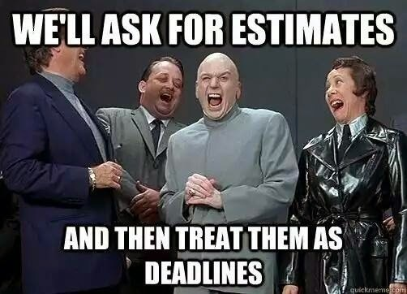

This week I completed my third week with a new client. It was a notably challenging week since the main goal was to write up a significant project estimate, which was due by Friday. We delivered the estimate earlier this morning, and I think we did a good job. I'm sure the estimates themselves are WAY off from where reality will land, but that isn't the goal as I see it.

The goal of this estimate is to, in a time-boxed format, create a framework for more meaningful discussions to happen. These numbers should not be looked at as facts but shape those first steps of discovery.

<figure style="width: 50%; margin: 0 auto;">

</figure>

A few notes and observations:

1. While it brought on a bit of anxiety in the early part of the week, I think we greatly benefited from the time-boxed nature of the request. We knew we had to deliver something on Friday, which influenced how much fidelity we could give toward specific feature estimates.
2. We used typical Fibonacci story points for each fundamental feature/focus. We had a base point value and then a high point value. We also labeled each estimate as Low/Medium/High risk, which was meant to signal that, should the fidelity of this range be too large to make an informed business decision, we could do more discovery and sharpen those numbers.
3. This was tough for me since I am still new to the codebase. I was able to partner with the previous tech lead, and that helped a ton, but my number ranges were still significantly larger than if I had been on the project previously with a known team.
4. Once we had the base and high points, we totaled them and crafted some team scenarios. This was the worst part. Usually, I'm able to gauge a team point velocity based on historical observations, but this would be a team who would be new to a codebase and each other, so the numbers are very suspect. We did our best and tried to document uncertainty as transparently as possible. We noted that should this proposal be accepted, we should set up regular check-in against these numbers and adjust the team/scope/timeline as necessary.
5. We worked in an onboarding penalty to the team velocity, spread across many months. I think this was a good move and made the scenarios more realistic.
6. In our recommendations for team size, we noted the risk that an individual contributor may not stay on the team for the entirety of the project. Adding an additional contractor is not about a 1:1 increase in velocity but risk management. We want to maintain domain knowledge through expected staff changes.
7. In our scenarios, we did not document time towards routine platform maintenance (this is in production with real customers) or personal vacation time. We did document our non-documentation so that when it comes time for realistic scheduling, these can be considered.

For what it needed to be, I think the outcome document of the week will help the stakeholders. 

It is by far **not** my favorite way to approach projects. For that, I'd probably lean toward something like [Shape Up](https://basecamp.com/shapeup).
