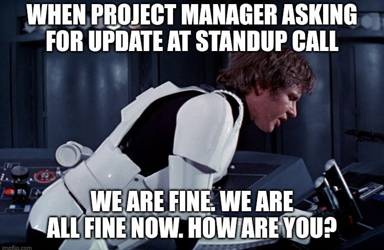

I find async standups to be a productive and low-cost ceremony in my development teams.

An async standup, in short, is each day, typically in the morning hours, team members are asked to post an update about what is going on in their work. This post is not about time tracking or otherwise work inspection but more an opportunity to take a breath, celebrate your wins, acknowledge your losses, ask for help and share your plans. A good outcome of standups is ensuring you get the help you need from your team to be successful .

<figure style="width: 70%; margin: 0 auto;">

</figure>

There is an async standup format I've been using for over a year now, and since it seems to be sticking, I figured I'd take a moment to share it and explain why I like it.

❤️ **Feeling:** ...  
✅ **Accomplishments:** ...  
🥅 **Goals:** ...  
🆘 **Help:** ....

❤️ **Feeling** is a great place to share your personal, human mindset. "Got limited sleep last night because the kid is sick.", "Feeling anxious about the upcoming proposal deadline.", "So happy that the Phillies won last night!" Being open and expressive about how we feel can, over time, help build trust within the team.

✅ **Accomplishments** is a place to document your day-by-day outcomes. Many of these might be traditional progress towards some new code, but it can be just as valid to share that you discovered a problem and documented an open question somewhere.

🥅 **Goals** is where you highlight your plan for the day. I sometimes get overwhelmed at midday and then return to my goals to recenter and figure out what I need to be focusing on. It's okay if goals occasionally carry over from day to day, though if this stresses you out, maybe end with a stretch goal that is almost expected not to be completed today.

🆘 **Help:** is probably the most critical line. Need a PR reviewed or some open questions addressed? Don't be shy! Be explicit and ping specific people, "Hey @jim, I really need your advice about this PR feedback from @pam." If you have no help requests, an affirmative "No blockers." is good to see. I prefer this than to omit "Help" entirely.

🚨 **Awareness** is a line I'll sometimes add to spotlight information I want the team to see. "Going to be offline this afternoon for a dentist appointment." or "I'll be on vacation next week, work with @dwight during my absence."

Many of my past teams have posted our standups in a Slack channel. In my newest team, we've been trying to avoid using Slack entirely and instead are using GitHub Discussions. We have a dedicated monthly standup thread, which works well since simple issue numbers like `#123` will auto-link to relevant issues and pull requests, and you can still `@` mention people to kick a notification.

Before I leave, I'll mention that this is not a format I came up with. It was observed during my subcontracting with [Test Double](https://testdouble.com/). They were a particularly empathetic company towards project process, ceremony, and developer happiness. This standup format was one small example.

Curious to hear how you and your team do standups. [Let me know.](/contact)
