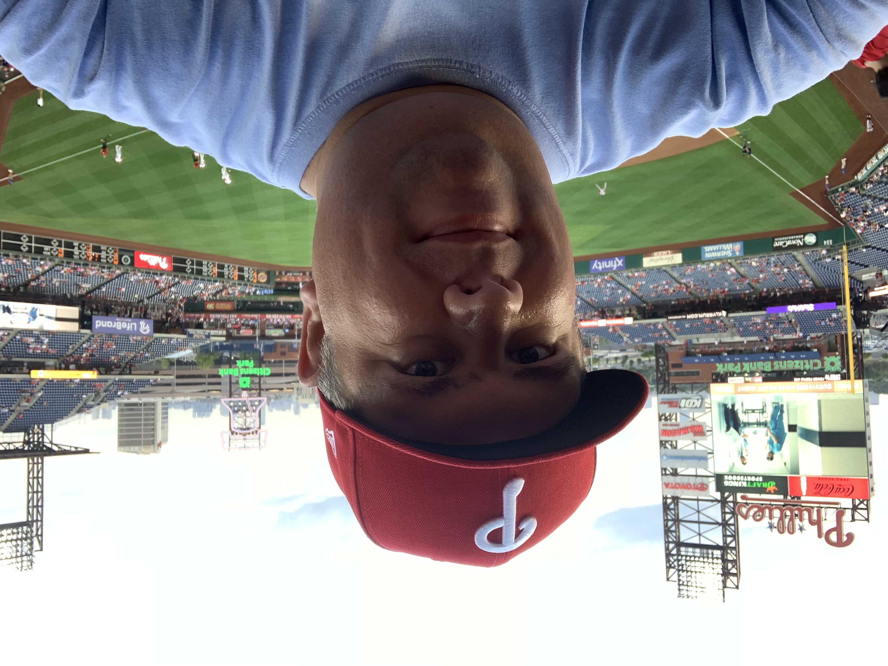

This weekend the Phillies lost the World Series to the Houston Astros. Of course, this is a disappointing loss, but overall I look back on the 2022 season with immense pride for my team and offer particular thanks for giving me so much enjoyment during a time of personal need.

<figure style="width: 70%; margin: 0 auto;">

<figcaption>Zorn at Citizens Bank Park wearing a Phillies cap.</figcaption>
</figure>

With the loss of my mother in early February, I was greatly looking to the upcoming baseball season as a chance for escape. I've always been a baseball fan (my high school years being a notable peak), but this year's distraction opportunity would be very welcome. 

When the lockout prevented the start of spring training, I was discouraged. Eventually, that worked out, and the season kicked off a few games late. I invested much of myself into Phillies, even during those frustrating early months. I watched the games and listened to the local podcasts.

As the season continued, they eventually fired Joe Girardi, promoted Rob Thomson, and started climbing back into the wildcard race. Things were looking up. 

I took [baseball-themed vacations](https://mikezornek.com/posts/2022/7/baseball-hall-of-fame/). I played [baseball games](https://mikezornek.com/posts/2022/6/1-standup/) on my Playstation 4. It was truely a summer of baseball.

When September hit, the Phillies were looking good for a wildcard spot, but we all started freaking out as signs of repeated September collapses were imminent. Somehow, along with some help from the similarly collapsing Milwaukee Brewers, the Phillies ended the season and were back in the playoffs after an 11-year drought.

While the fans were thirsty for some playoff wins, I suspect most, including myself, were pretty satisfied that they got in at all. Then the playoffs commenced, and game by game, the Phillies continued to find a way to win -- all the way to the world series. 

This October was so much fun, and I'm so delighted to have been able to enjoy it.

Thank you to the fans, the podcasters, the Twitter accounts full of memes/screencaps, and the entire Phillies organization for providing an unforgettable year.
