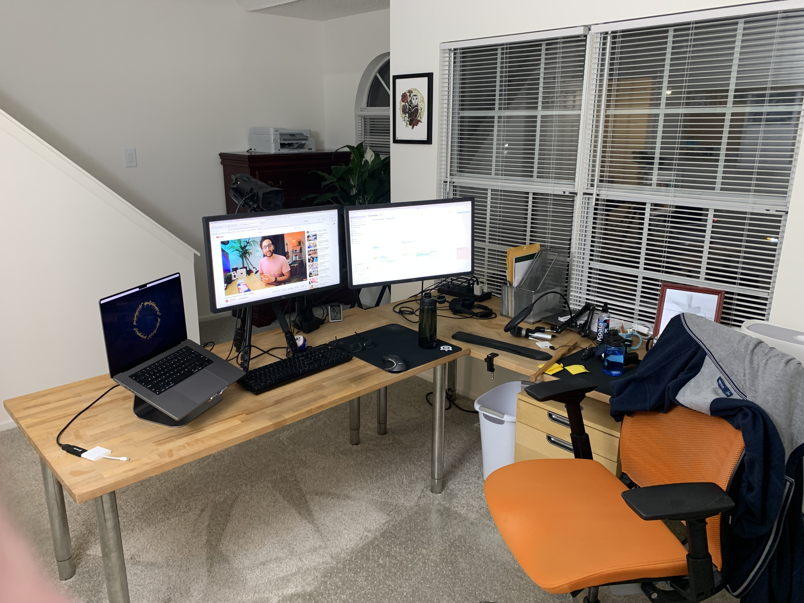
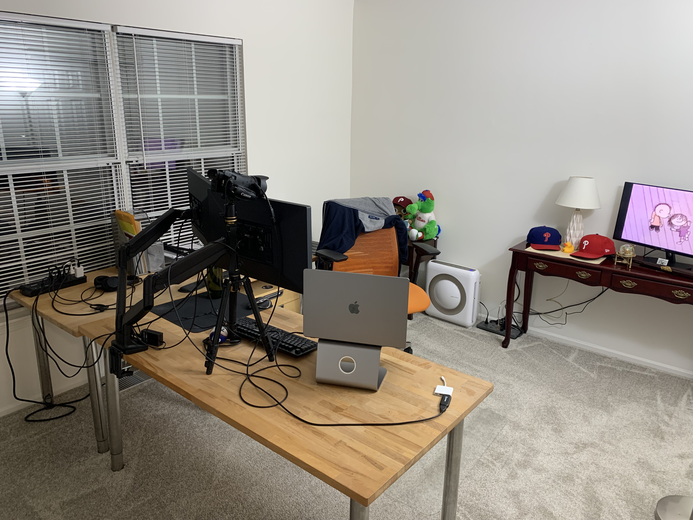
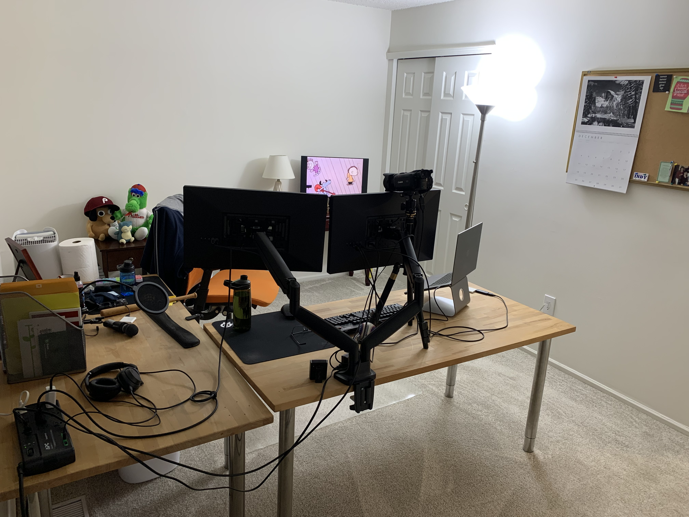
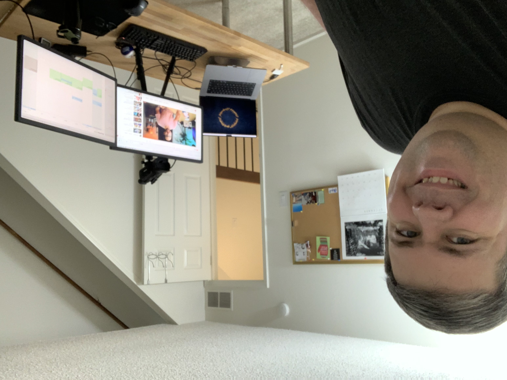

Saturday, December 17, 2022 -- This weekend kicked off with some dedicated time to my office. On Friday, I caught up on a stack of mail/bills/paperwork, and then today got over the hump of cleaning up the office itself. It's the first time since moving in during October that the office has been fully cleaned and set up. No boxes or random crap in the corner. It's all tidy and feels great.

On Monday I am scheduled to take delivery of a new bookcase for the office. In the new year I'm also planning to look into some alternative lighting, better cable management, more wall art, and maybe a motorized standing desk.

With luck, the new office vibes will lead to some positive production toward **my projects**.

As for those, things are good -- though I am trying to get a bit [more billable work](http://mikezornek.com/posts/2022/12/elixir-consulting-availability/).

My current part-time client has been going fine on the Elixir/Phoenix side, where we continue to update libraries and dependencies, but the React Native stuff has been nothing but headaches. I have a paid consultant peer coming on board for a few hours to help me get over the hump and plan out more extensive updates.

[ElixirClub](https://www.elixirclub.org) early feedback is good. About ten people signed up for the site/email notifications. Will work over the next few days to schedule those initial events, work out some project update templates, and finish setting up the paywall. On track of an early January launch.

My volunteering with [Dockyard Academy](https://academy.dockyard.com/) continues. I've been able to attend teaching sessions about twice a week to help answer student questions and provide some basic curriculum feedback.

[Franklin](https://github.com/zorn/franklin) progress is slow, but I might be able to make my Christmas deadline (documented in the README) if I focus better during the week.

[Elixir Book Club](https://elixirbookclub.github.io/website/) is going on too. Tomorrow I will lead a discussion through chapter 4 of Testing Elixir.

Off projects, I'm enjoying working through season 6 of DS9, season 2 of Quantum Leap and have started a new playthrough of Zelda: Breath of the Wild. I've never gotten more than 10 hours into that one but trying to take it in with a different perspective this time.
