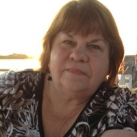

Over the last few months, I have had to increasingly step back from friends and work to help take care of my mother. She passed away on Friday, February 4th. Her [obituary] is shared below, and the memorial service will be this Saturday.

In lieu of flowers we ask for donations be made in her name, Maureen Carney, to [Fox Chase Cancer Center][1] who treated her and all of our family extremely well.

I look forward to connecting with everyone again after I take some time to get things settled.

***

<figure style="width: 30%; margin: 0;">

</figure>

Maureen L. Carney (nee Heffernan)

December 28, 1951 - February 4, 2022

Maureen L. Carney (nee Heffernan) passed away February 4, 2022. Devoted mother of Michelle Zornek and Michael Zornek. Loving sister of Joanne Moy (George), Mary Rose Brill (Jack), Betty Leonardo (Bryan). Dear aunt of many nieces, nephews, great nieces, and great nephews. Maureen will also be sadly missed by her loving friends.

Relatives and friends are invited to gather Saturday, February 12, 2022 9:00 AM to 10:45 AM, Burns Funeral Home, 9708 Frankford Ave., Philadelphia, followed by her Service 11:00 AM. In lieu of flowers, contributions to Fox Chase Cancer Center, 333 Cottman Avenue, Philadelphia, PA 19111 in her memory would be appreciated. Due to COVID, a celebration of Maureen's life will be held later in the spring.

[obituary]: https://www.burnsfuneralhome.com/obituary/maureen-carney-nee-heffernan
[1]: https://www.foxchase.org/giving/how-to-give
