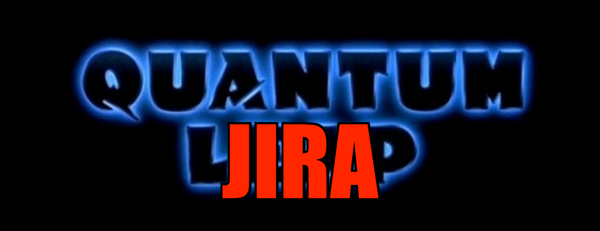

Random crossover that occurred to me during a morning walk.

<figure style="width: 70%; margin: 0 auto;">

</figure>

Theorizing that one could be productive within his own lifetime, Doctor Mike Zornek stepped into the Quantum JIRA accelerator - and vanished. He awoke to find himself trapped in tech of the past, facing repos origins that were not his own, and driven by an unknown force to change commit history for the better. His only guide on this journey is Al, an overworked product manager, who appears in the form of a Slack avatar only Mike can see and hear.

And so Doctor Zornek finds himself leaping from ticket to ticket, striving to put right what once went wrong and hoping each time that his next ticket... will be the ticket home.

[Original Theme Narration](https://www.youtube.com/watch?v=DjK9GJMBpt0)
