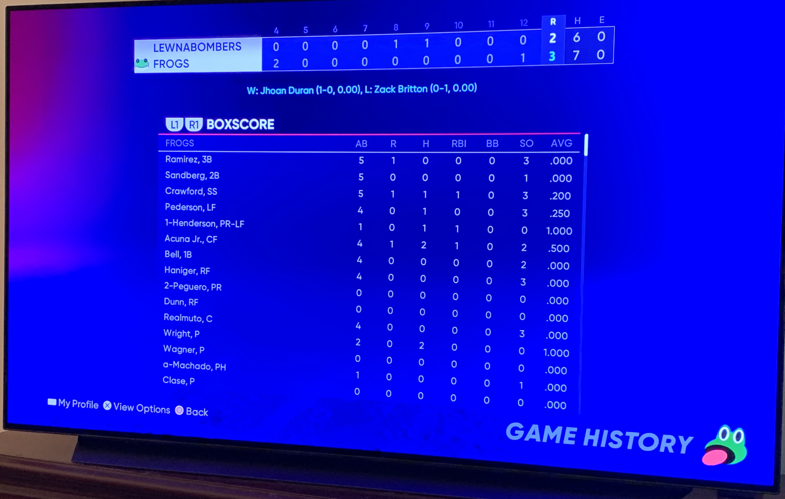

❤️ **Feeling:** Feeling great. Excited to be on vacation again and have an opportunity to work on some personal projects.

✅ **Accomplishments(Tuesday):** Closed out some open pull requests with my client and otherwise wrapped up my contract. Did some laundry (towels). Won a 12-inning overtime game in MLB: The Show with my Diamond Dynasty team, the Philadelphia Frogs. After a night of piss poor batting and 22 strikeouts, with 2 out, 2 strikes, and a man on third, I ran a squeeze play where Rickey Henderson (99 speed) bunted in the winning run. It was glorious. Sadly this also aligned with a [5-hour overtime loss by the Phillies][game], which I had on in the background.

[game]: https://www.mlb.com/gameday/giants-vs-phillies/2022/05/31/661618

🥅 **Goals:** Sleep in (done!). Morning walk (done!). More laundry. Blog about my overall vacation plans. Read the next chapter in my [Unit Testing: Principles, Practices, and Patterns][testing] book, which I am really enjoying. Do some project idea auditing to see if I can work out what I'd like to work on over the break.

[testing]: https://www.manning.com/books/unit-testing

🆘 **Help:** I'll be headed to the shore soon™ and welcome book recommendations, work or play.

