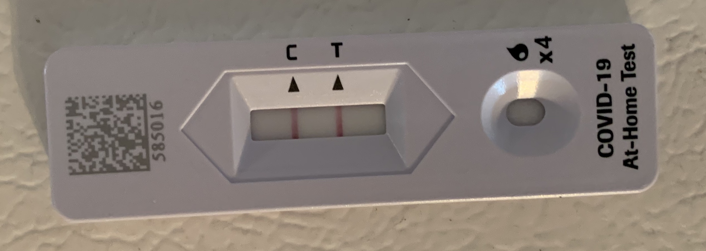

June 24, 2022 -- I'm back from vacation early after getting COVID. 😭

So on Sunday I headed to the shore with my sister. For a few days we enjoyed ourselves with typical shore actives like the beach and some favorite eats. By Wednesday afternoon however I started to get a bit of a sore throat. Tested negative but decided to stay in the hotel room and rest up. In the morning on Thursday I was feeling worse and tested positive. We packed up and headed home early.

My general symptoms includes, headache, light body aches, light sore throat and cough. No high temperature and blood oxygen is fine. No significant breathing issues or exhaustion. 

Because of my diabetes my doctor put me on the antiviral medications. The most notable side effect is a metallic taste in my mouth but I'll take that with the hope of a quicker recovery timeline.

So for now, I'm hunkered down in my apartment, resting and trying to sleep as much as I can. Props to my sister who continues to feel fine and test negative for getting me a food order and my supplies.
