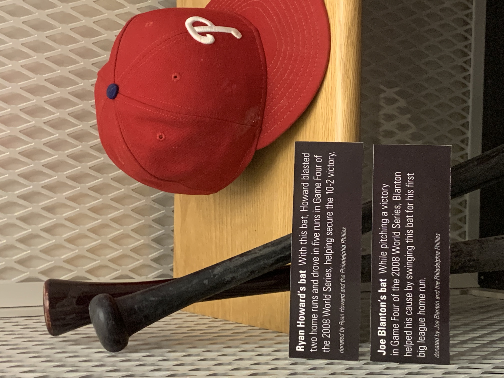
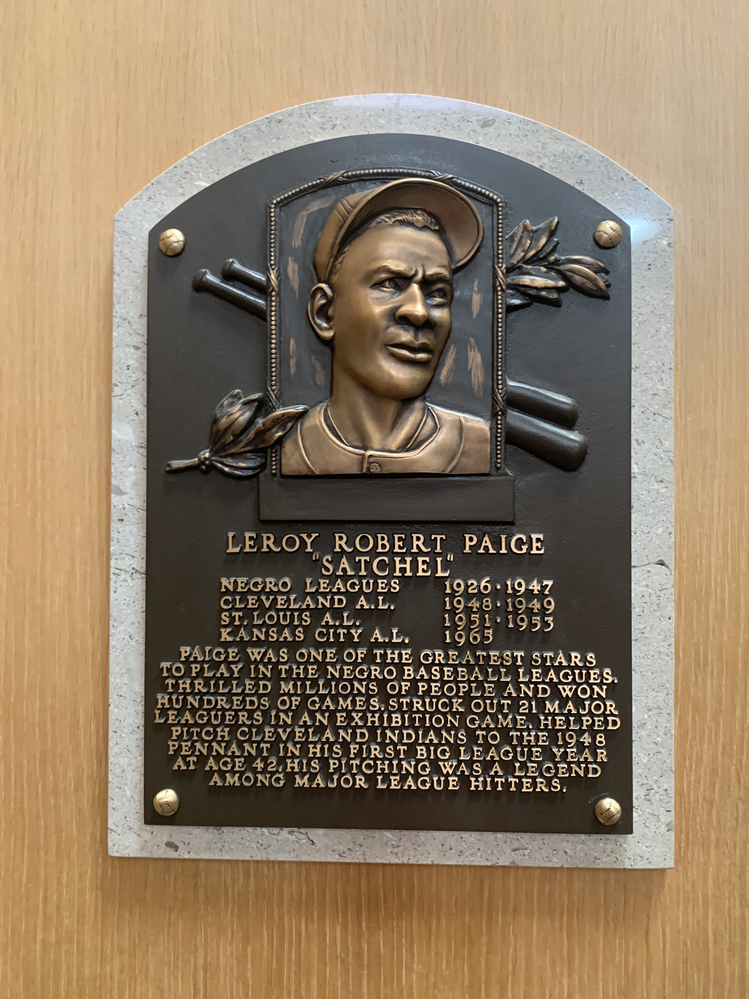

I just returned from my trip to the [Baseball Hall of Fame] in Cooperstown, NY, and I thought I'd share some notes and photos.

[Baseball Hall of Fame]: https://baseballhall.org/

I knew I would be off work in June and July, and while some shore trips are sprinkled across my summer calendar, I wanted to fill in the weeks with some trips and get out of the apartment. I've been saturating myself in baseball this summer, so Cooperstown seemed a good fit. From Philadelphia to Cooperstown by car is about five hours, give or take. The drive was uneventful and relaxed, with lots of pretty forest-filled mountain views. I also got lucky with some [audiobooks] that filled the air nicely. 

[audiobooks]: https://twitter.com/zorn/status/1548724520789352449

While my sister offered to come with me, I took the trip by myself. I encouraged her to stay with her friends during her extended shore house vacation. She is not into baseball and while I think she enjoys the occasional in-person game with me, that drive to and back, plus the entire day in town, seemed like a bit much.

I drove up Tuesday afternoon and checked into my room at [The Railroad Inn]. Great little place. It was one of the more pricey options but very well done and a short walk into town and the hall of fame.

[The Railroad Inn]: https://therailroadinn.com/ 

After unpacking, I put on my walking sneakers and explored the town. Saw Doubleday Field, the nearby lakefront, and lots of other nooks. It was a hot day but not overbearing. Benches under tree shade were very welcome when found for short breaks.

After my walk, I cleaned up and headed to [Upstate Bar and Grill](https://www.upstatebarandgrill.com/) for dinner and to watch the All Star game. Had some good hot wings and french fries. The fries came with a sriracha aioli, which I would never have asked for but surprisingly enjoyed. Had a few extra Cooperstown Lagers and then headed home. I fell asleep watching the last innings of the All Star game from bed with plans to wake early for the hall of fame in the morning.

Woke up around 7am on Wednesday. Strolled into town around 8:15am and got a breakfast sandwich and coffee at the local [Stagecoach Coffee](https://stagecoachcoffee.com). Was at the Hall of Fame by 9am and walked through the gates just as they opened. There were 20 other early birds like me.

The Hall of Fame is spread across three floors. You start with exhibits on the second floor, move up to more exhibits on the third, and then back down to the ground floor for the actual inductee placks. I started at 9am, watched the 15-minute "Generations" movie, and then took my time working through the exhibits. 

I took a few photos, mostly of Phillies stuff that caught my eye or other players I am fond of. My goal with photos of museums like this is not high quality per se but to capture a few visuals to help me recall the trip and the feeling of the place. The goal here is NOT to fully document the place; how can one even try.

 

 

The Hall of Fame was very enjoyable. Visiting it alongside my rewatching of the Ken Burns Baseball documentary (which I've been working through over the past few weeks) put me in an excellent mindset to appreciate everything I was looking at. Lots of cool memorabilia and some great pull quotes/stories shared. I like those more than the raw statistics, still appreciating how numbers help one compare the play style and successes of one player vs. another.

After the hall, I got a late lunch at [Mell's at 22](https://www.melsat22.com) and then took back to Main Street for some souvenir window shopping. There are lots of stores. They sell all kinds of baseball nicknacks and baseball cards. At the hall itself, I had already picked up a t-shirt gift for my sister, a new baseball book [Remembering Harry Kalas], and a "who's on first" baseball (which has special relevance for me as I love the movie [Rain Man](https://www.youtube.com/watch?v=Lz-ihW8RXSM)). 

I wanted a little mini bat souvenir, and there are a few bat store options in town. Many offer full custom bats, but I wanted something a little smaller. I ended up with a mini bat half the size between my current little mini bat and a full-sized bat. For many of my peers who will see my toying with my current mini bat over Zoom, which I tell them is my [thinking bat](https://youtu.be/qZ7FrRs9rs8?t=66), I now consider this new bat a second thinking bat, for when the problem is just a little bigger.

[Remembering Harry Kalas]:https://shop.baseballhall.org/remembering-harry-kalas/

[See all the sides of the ball in this short movie.](who-is-on-first-ball.mov)

Also, let us have some empathy for the poor souls running the Hall of Fame gift shop.

 
 
 

I ended the afternoon with a small scoop of peanut butter and chocolate ice cream and then headed back to the inn. There I relaxed a bit. I enjoyed some hard iced tea drinks and read [a Phillies book](https://twitter.com/zorn/status/1549896657512407040) I brought with me on the inn's patio. Around dinner time, I walked over to a nearby pizza place. The pizza was "NY style" with a thinker crust. Not my preference, but it was pretty good. Back at the inn, I rested in my air-conditioned room. Was happy to discover Moneyball playing on TV and watched it.

The next day, Thursday, I got up around 8am and packed up. The inn provides a nice little kitchen of breakfast supplies. Before heading home, I enjoyed a coffee, english muffin, and strawberry granola bar. The home drive was, once again, pleasant and uneventful. I almost finished my one audiobook. I think there is an hour or so left of it, and I'm curious to hear how it ends. Will have to resume it during my next walk.

Overall a fun and successful trip. If you are a baseball fan, I think you'd enjoy it. Otherwise, it is a pretty small town, so not too much to see but a nice relaxing spot if you want to unwind. 
