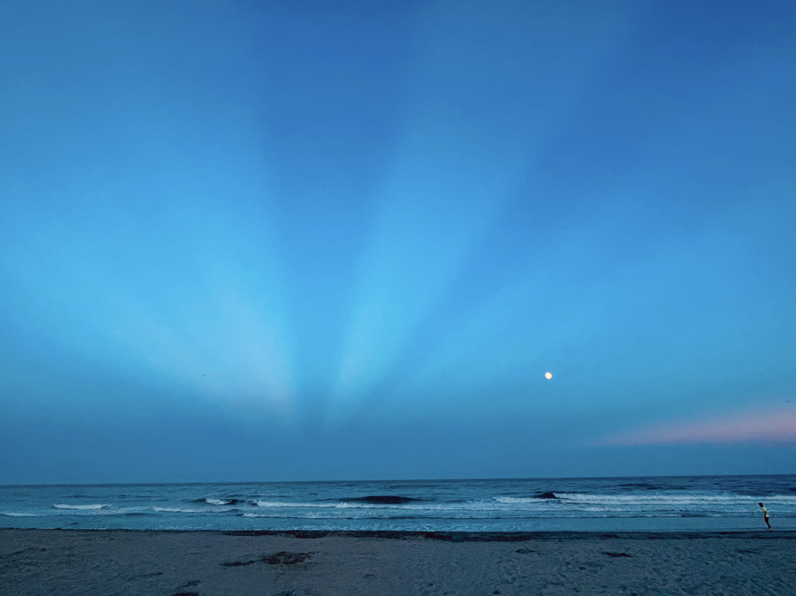

Friday, August 12, 2022 -- The past week started with some enjoyable and relaxing beach days down the shore.

My sister, who has been enjoying some extended time staying at her friend's house, welcomed me down for a visit. I arrived Sunday morning and stayed through Wednesday afternoon. Most of our time was spent at the beach with a few food excursions, including some well enjoyed breakfast outings.

My sister and her friend like to go to the beach later and stay late. We had some great weather and they took some cool photos. 

We had a very bright moon and the colors that came out at the end of the day were notably pretty. 

To be clear, this is the moon, not the sun. The day is over--we are headed home.

When I got back to the city Wednesday night I caught up some random emails and then hosted the Philly Elixir meetup.

Thursday saw me finish setting up my new laptop. I got Elixir and related tooling installed and configured. Took a little extra tweaking to account for M1 friendly BEAM versions but nothing too crazy. 

I was able to mostly recreate my VS Code setup via the text based user settings, keybindings, and snippet files. I reinstalled my extensions one-by-one but I suspect I could have done a better job at exporting the list.

By today, Friday, I got back into my Exercism Elixir track progress. I solved, recorded, and published the [Log Level](https://www.youtube.com/watch?v=2GwBl6qm088) exercise. I also solved and recorded the Guessing Game exercise which I'll publish tomorrow.
