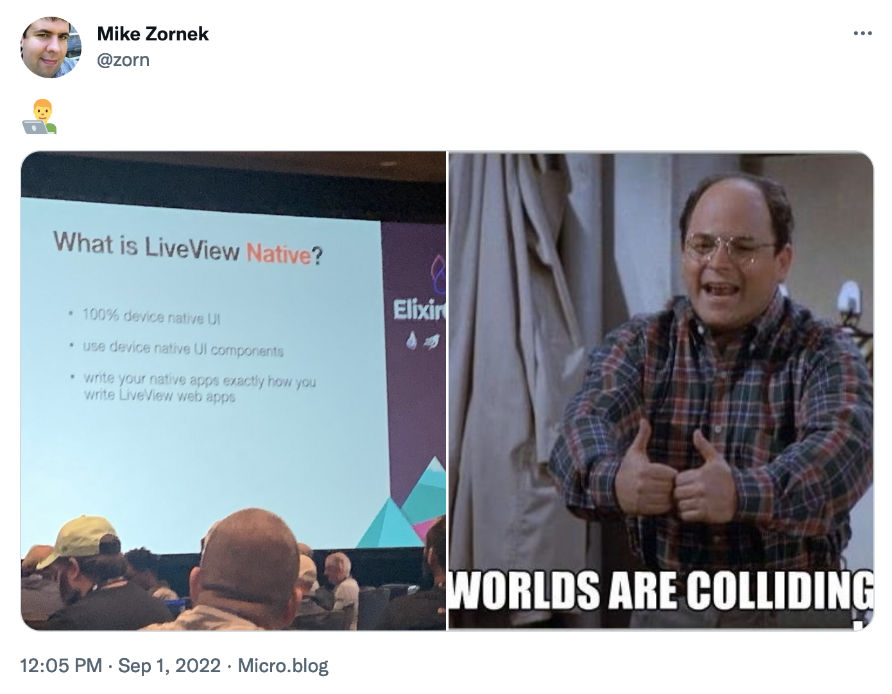
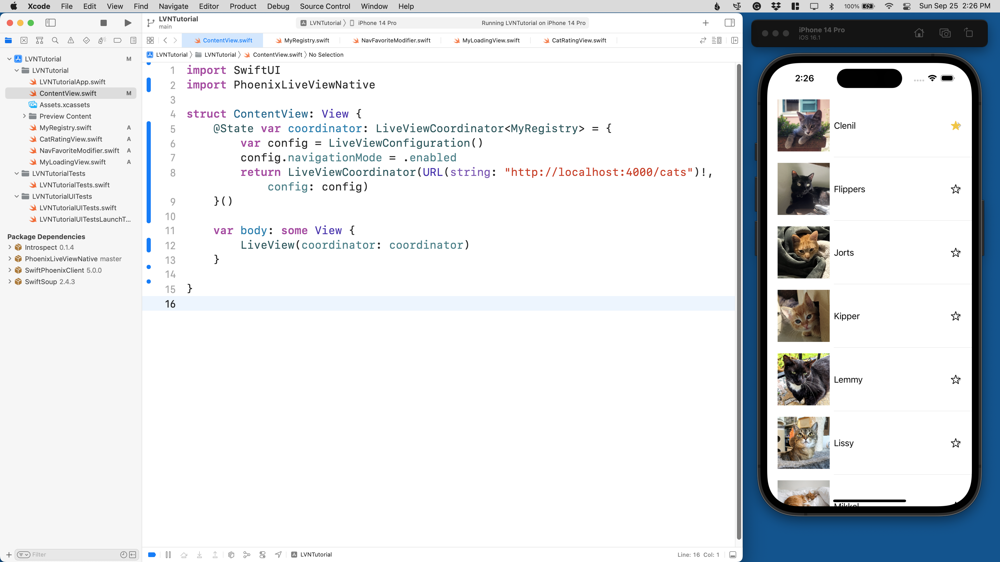
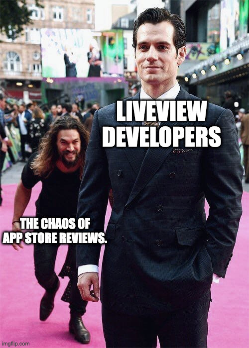

This weekend I finally had some time to experiment with [LiveView Native], working through the [introduction tutorial] during a Side Project Saturday event run by my local Apple developer group. After working through the tutorial, I demoed the results to my Apple friends. We had some great discussions about the pros and cons of the approach. Those discussions locked in some of my early hot takes, and in this post, I'll try to capture and share some of my early thoughts and concerns.

## What is LiveView Native?

[LiveView Native] is a project that aims to empower exsiting LiveView developers with the ability to deploy native applications using LiveView, with an initial focus on iOS and Android apps.

[LiveView Native]: https://github.com/liveviewnative
[introduction tutorial]: https://liveviewnative.github.io/liveview-client-swiftui/tutorials/yourfirstapp/
[Phoenix LiveView]: https://hexdocs.pm/phoenix_live_view/Phoenix.LiveView.html

There are a lot of technologies at play, so I'm going to take a moment to summarize the players involved:

* **Elixir** is a functional programming language that runs in the Erlang/BEAM virtual machine. This runtime excels at providing concurrent and fault-tolerant systems.
* **Phoenix** is a popular framework used to build web applications in Elixir.
* **LiveView** is a feature of Phoenix that lets people build interactive, real-time, and collaborative web experiences. It leans on an architecture where a websocket keeps the browser connected to a process on the server. As a user interacts with the page, events are sent to the server process, and then a declarative/reactive UI is updated based on the new process state.
* **Swift** and **SwiftUI** are the primary programming language and UI framework pair for building modern/native **iOS** applications.
* **Kotlin** and **Jetpack Compose** are the primary programming language and UI framework pair for building modern/native **Android** applications.
* **React** is a frontend JavaScript framework used to create single-page web applications, a competitor to LiveView.
* **React Native** is a framework used to build React-powered apps inside a web view wrapper running on iOS and Android. Because of its web view wrapper, React Native is known to be memory expensive and sometimes exhibit sluggish performance. 
* **Dart** and **Flutter** are a programming language and UI framework pair that lets you build cross-platform mobile applications. The unique take of Flutter is that it does all of its own UI drawing, allowing for a much more controlled and speedy UI render. It can use component libraries to emulate its host OS, with varying degrees of success (re: uncanny valley effect).

Now, with all that said, what is **LiveView Native**?

In a traditional LiveView, we have a server process and a client web browser. The LiveView renders a template of HTML influenced by the process state and sends it down the wire. As new events are processed and the state changes, very terse diffs are sent to the client browser, allowing the user's UI to be updated.

LiveView Native substitutes the client web browser for a native client view running on iOS or Android. Instead of writing templates in HTML, we write them in SwiftUI or Jetpack Compose. LiveView will continue to own responsibility for figuring out the view diffs while the mobile apps will render these SwiftUI or Jetpack Compose views just like they would if built more traditionally.

There is no web view like you'd see in a React Native app, nor is there any new UI framework like you'd see in Flutter. 

It's a unique take on the problem that unlocks potentially impressive solutions, but like any technology, you must understand your compromises.

## Worlds Are Colliding!

I've been working with Elixir since 2017 and LiveView since it was announced in 2019. Before Elixir, I spent more than a decade doing Apple platform development, first on the Mac and then on the iPhone. By the end, I was teaching iOS programming classes at places like Amazon and Google via my job at Big Nerd Ranch. So when this announcement came out, I felt like worlds were colliding and said as much.

<figure style="width: 70%; margin: 0 auto;">

</figure>

I have many historic pessimistic opinions on multi-platform frameworks that try to sell "write once, deploy everywhere." I'll get into some of those later, but first, I'll share my tutorial observations.

## My Day with LiveView Native

During the first half of Side Project Saturday, I worked through the [Your First LiveViewNative App](https://liveviewnative.github.io/liveview-client-swiftui/tutorials/yourfirstapp/) tutorial. This tutorial has you build both a Phoenix project and an iOS project. 

In the Phoenix project, you build a `CatsListLive` live view with SwiftUI-specific `heex` template content. 

<figure style="width: 90%; margin: 0 auto;">

</figure>

In the iOS project, you'll add some of the LiveView Native package dependencies and then configure the default `ContentView` to load the swifty `LiveView` view class, which points at a `localhost:4000` URI via configuration. 

When you launch the iOS app, the `LiveView` view class inside of SwiftUI will connect to the Phoenix server, which makes a live view server process for `CatsListLive` and then sends down the template. When received inside of iOS, the view hierarchy is injected, and then regular old SwiftUI will render it just as if it had complied typically. 

<figure style="width: 90%; margin: 0 auto;">

</figure>

You may notice that the SwiftUI code templated in `heex` has things like `phx-click="toggle-favorite"`. When the button is "clicked" in the iOS app, the event is sent via the websocket to the live view process on the server, the state is updated per standard LiveView lifecycle mechanics, and then the template is re-rendered, and diffs are applied.

Another interesting thing in the demo is the use of `navigationlink` and traditional Phoenix routes and redirects to handle the "NavigationController" like push and back button behavior all iOS users are accustomed to.

Once I completed the tutorial, I presented the project to my peers. As I expected, there was general curiosity about how it worked compared to other multi-platform solutions (like React Native and Flutter). We clicked around the LiveView Native dependencies and reviewed how things were being built. I explained how the view diffs were very tight and not just some text-based XML diff. They asked questions about other SwiftUI view modifiers and how animations would be handled, which I did not know yet.

There was also a reaction of "this feels like a lot of complexity with many failure points" and "is this worth the complexity cost?" For them, I think that is an expected response. These people have embraced Apple platforms and are already building with Swift and SwiftUI. They have no appetite for learning Elixir, Phoenix, or LiveView for this new way to run an app or any genuine appreciation for the unique niche it can solve (real-time and collaboration experiences). 

However, this tool is not really built for them. So who is this being built for? Time for hot takes.

# What pain is LiveView Native is trying to solve?

<figure style="width: 70%; margin: 0 auto;">

</figure>

The [marketing site](https://native.live) for the project states:

> LiveView Native empowers developers to build native and web applications seamlessly with Phoenix. Now there's no need to manage multiple teams or juggle multiple frameworks: The same developers can manage both, cutting down delivery timelines and freeing up resources to focus on innovation.

Given my experience, I find this statement to be suspect.

Any developer trying to build a LiveView Native app with no historic native mobile development experience will need to overcome a significant list of concerns.

* They will need to compose templates with pseudo-SwiftUI/Jetpack Compose layout code. These UI/layout frameworks are drastically different from the HTML/Tailwind layout code they use. It's a steep learning curve.
* They will need to work around the lack of client-side JavaScript events (coming soon, maybe?). They may miss the inability to leverage existing JavaScript solutions already in use in their current LiveView solutions.
* They will need to resolve offline experiences and real-world spotty connectivity/reconnection issues for phones in buildings/tunnels/elevators. (This is true of web-based LiveView as well.)
* They will need to overcome the complexities of the Xcode and Android Studio IDEs, both extremely deep topics.
* They will need to learn all the trials and tribulations of app store review and deployment. This may be the most significant risk (see below).
* They will encounter harder-to-debug problems because of the complexities of this stack. There is no browser console to inspect/change things. Debugging is very different in Xcode/Android Studio.

I'll also add that I have many friends already working in SwiftUI natively in Xcode daily. While SwiftUI can provide an unexpected boost to productivity for basic needs, there is a point where it falls down, and it is not easy to compensate for. If you observe the iOS developer community, this is a massive point of conflict and discussion. Depending on your LiveView Native layout's complexity, you might be in for a world of pain.

## Will Apple approve this?

<figure style="width: 40%; margin: 0 auto;">

</figure>

I hate app store review and distribution exclusivity. It was one of the primary reasons why I left the platform years ago.

My concerns around "will Apple approve this?" was one of the first questions that came to mind watching the ElixirConf keynote announcement. The fact DockYard had already gotten an [ElixirConf chat app] through review was impressive, but unfortunately, past review approval does not guarantee future outcomes. I've seen many apps approved for years that suddenly get blocked for doing something they've always done.

[ElixirConf chat app]: https://apps.apple.com/us/app/elixirconf-2022-chat/id1641807562

Looking at the [App Store Review Guidelines](https://developer.apple.com/app-store/review/guidelines/#software-requirements), we find section `2.5.2`, which states:

> **2.5.2** Apps should be self-contained in their bundles, and may not read or write data outside the designated container area, nor may they download, install, or execute code which introduces or changes features or functionality of the app, including other apps. Educational apps designed to teach, develop, or allow students to test executable code may, in limited circumstances, download code provided that such code is not used for other purposes. Such apps must make the source code provided by the app completely viewable and editable by the user.

The fact that we are editing the UI in real-time, potentially adding, removing, or changing features, feels like we violate this section. 

However, if you search the web, you'll find plenty of posts talking about [iOS server-driven UI](https://duckduckgo.com/?q=ios+server-driven+ui) and even this recent [conference talk](https://360idev.com/session/building-server-driven-ui-in-ios/) that explains:

> Companies like Airbnb, Spotify, Flipkart, Swiggy and several others use a technique called Server Driven UI, which allows them to remotely update their user interfaces based on the response received from the server. This allows them to bypass the review process and keep their apps sync on multiple platforms.
> 
> In this session, you are going to learn how to get started with building a server driven UI in iOS.

So I don't know. 🤷‍♂️ It's one of those things Apple keeps vague and open to interpretation. Having chosen to leave the platform because of these controls, I am incredibly hesitant to return and bet my business on app store whims.

## Conclusions

LiveView Native is an interesting project with a unique take on the multi-platform framework problem space. I have doubts it can overcome the "lets LiveView people do mobile without knowing mobile" shtick, but I am happy to be proven wrong.

I don't plan to be too active around the project (have no interest bowing down to Apple for app approvals ever again) and instead will invest my LiveView learning time into the new component attributes / UI library opportunities. 

Based on my podcast listening habits and general community awareness, LiveView Native is a significant project for the LiveView community. I expect many to tinker with this in the coming months, and I look forward to reading their blog posts and findings.

PS: I hope people don't take my positioning concerns about the project as a personal attack. The tech itself is very impressive. I fear this project won't be able to honor the simplicity promise it is being promoted with. Teams who DO accept the extra complexity and tradeoffs of this "stack" may be empowered to build software that would otherwise take more time -- it's just there is no free lunch; they will still have to know a lot about mobile development to do so.

## Random Leftover Draft Notes

* One company that comes to mind for this sort of thing is [Sketch](https://www.sketch.com). They build a native Mac experience AND lean on websockets with an Elixir backend to enable a real-time collaborative experience. They do not use LiveView but do benefit from the BEAM.
* I was disappointed with Xcode that when I copied/pasted Swift code from the tutorial into Xcode, it did not run a code formatter on save. My friends say you can configure plugins to help with that, but wow, I'm bummed that it hasn't been defaulted by Xcode/Apple yet.
* When composing SwiftUI templates in a `heex` file, we intentionally use things like `phx-click`, which make sense given the goals of the project. Still, I can't help but note that when I was a mobile app developer, most frameworks took pride in using terms like "touch" and "tap," so it can feel odd to see "click" in this space. Seeing people say "click" was always a smell that something did not belong. Like when people say `Iphone` or `xCode`.
* One niche I think is perfect for Flutter is when you want to build a very styled/themed UI and want it to be the same across iPhone/Android. Things like video game menu UIs or brand/movie tie-in things. 
* It was neat to see the LiveView Native team use Apple's own `DocC` [tutorial template tooling](https://developer.apple.com/documentation/docc/tutorial-syntax). I was aware this was out but had not seen it firsthand.
* One pro for LiveView Native is that it does have a path to migrate to traditional SwiftUI should the project benefit from a more conventional approach. That is not true of the others.
