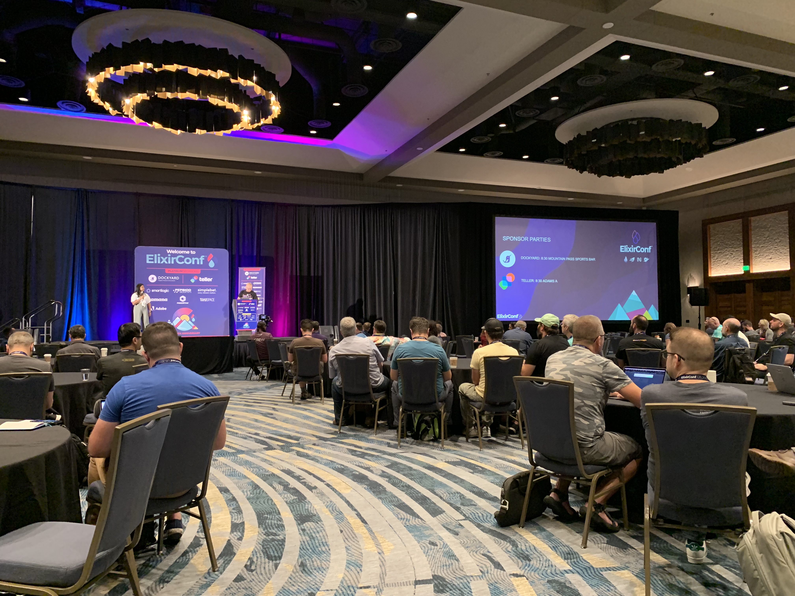
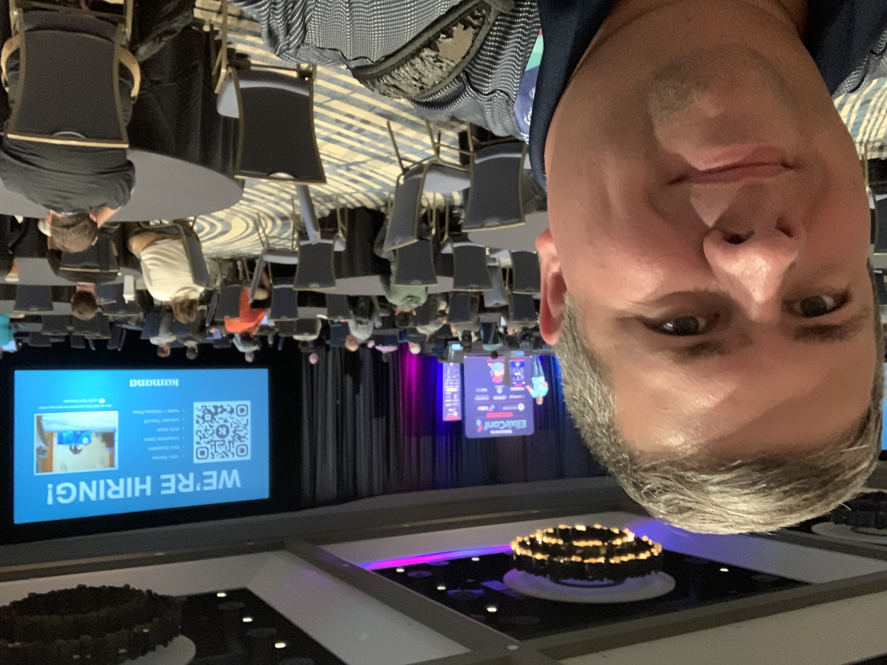
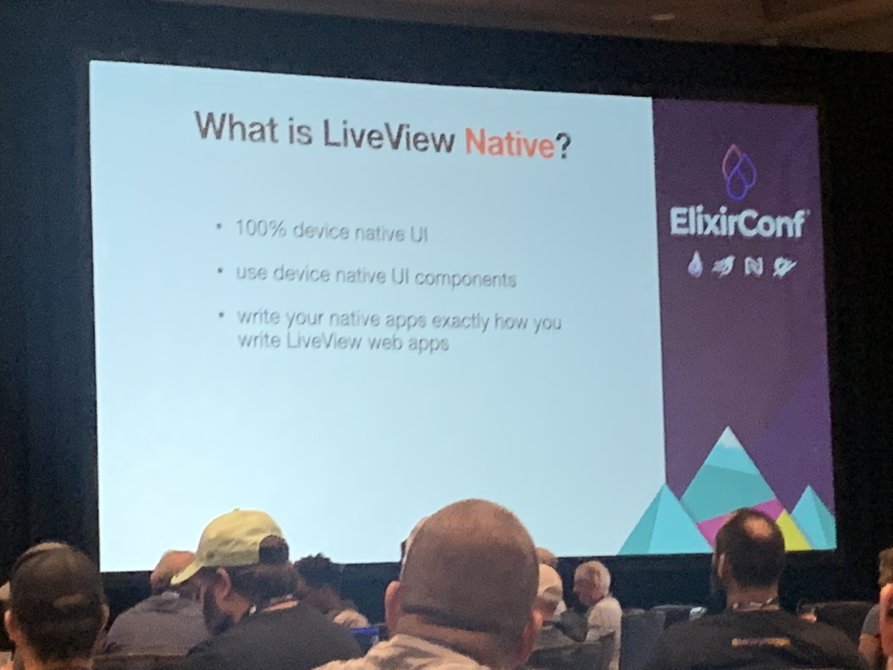
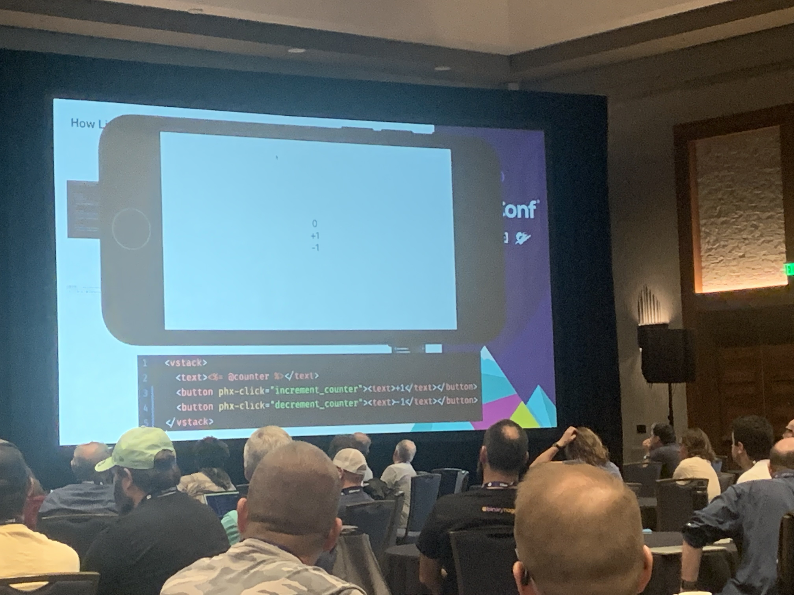

This past week I attended [ElixirConf](https://2022.elixirconf.com/) in Colorado. It was my first time out at an in-person conference since COVID lockdowns. As much as I hated the travel, it was great to see everyone.

I got a lot of face time with a handful of people I had worked with over the last two years and a bunch of others whose company I have enjoyed via online meetups, book clubs, and Twitter. Even a tiny in-person conversation adds an extra level to those ongoing "online peer relationships," and I'm happy to have made many new connections.

\* Yes, it would seem many Elixir companies are still hiring; though I'd say only half the talks mentioned that when historically, maybe 75% of the talks would so 🤷‍♂️ maybe there is a slight dip.

### For more photos, check out [this album](https://photos.google.com/share/AF1QipMotSnbzx_Wy0B_f4dD9Ejip4eXS9SMbArcLGQae4H_eIN-81qoeMyeK_TYr_eUMw?pli=1&key=UUcxQjFFYUw0SWROaFJHYjJCYjBMeHdDc0RKVmxn) started by Todd Resudek.

The conference content was fantastic, almost overwhelming.. I'll note a few big takeaways below, but a complete review would be quite extensive and is out of scope for this post.

- **LiveView Native** -- Brian Cardarella of DockYard shared a new project that aims to provide a way to build mobile applications that can act as a LiveView client. Using this, you can connect a mobile application to a LiveView process on the server and then render native views based on heex templates, intermixing LiveView Native view renders with "normal" platform views (such as SwiftUI used in the demo). More info can be found on the [LiveView Native marketing site], [GitHub project], and related [Hacker News thread]. It is still pretty early tech but has a lot of people buzzing. I'll share more thoughts after I get a chance to kick the tires.

[LiveView Native marketing site]: https://native.live/
[GitHub project]: https://github.com/liveviewnative
[Hacker News thread]: https://news.ycombinator.com/item?id=32694668

- **Elixir 1.14** [is out](https://hexdocs.pm/elixir/1.14.0/changelog.html)! It includes `Kernel.dbg/2`, a new macro for debugging, `PartitionSupervisor` for handling some bottleneck scenarios, improved errors on binaries and evaluation, slicing with steps, expression-based inspection and more.
- **Phoenix 1.7 is immanent.** It will include verified routes and component properties. It also has Tailwind built-in as the default. Chris also shared a roadmap for future work which included plans to integrate some aspects of the `phx_live_storybook` project as well as a rethink of LiveView/Component messaging (which was a point of issue Miki Rezentes brought up in her talk and I'm in total agreement with -- right now it's a bit clunky).
- I had an excellent time in **my telemetry class** on Tuesday. Still have to finish my last lesson, but I had some beneficial experiences adding custom events and attaching common library events through a informative collection of sample projects.
- I sat in on many sessions showcasing the continued evolution of **Livebook**. Nice to see this tool continue to mature and empower education and knowledge sharing.
- Mark Ericksen did a presentation walking through [some tools](https://github.com/superfly/fly_postgres_elixir) that can help make **normal Ecto usage apply to a globally distributed database** environment, as one would see on fly.io. I have not done a fly deployment (yet), but this is something I should check out.
- [juvet](https://github.com/juvet) is a cool little in-dev framework for making **Slack bots**.
- Kip Cole's talk on **Time Algebra** and a new library called [Tempo](https://github.com/kipcole9/tempo) was an unexpected and impressive talk.
- David Bernheisel is preparing a paid-for extension to his **[Ecto in Production](https://www.ectoinproduction.com/)** resource. I can't wait to support it.
- Owen Bickford talked about his new **[WebAuthn LiveView component](https://github.com/liveshowy/webauthn_live_component)**, which simplifies integrations that want to lean on this new auth tech. Looks extremely useful, and as iOS starts to promote PassKeys, I think many will seek this out.
- And a lot more which I don't have time to document.

Conferencing during COVID is stressful. I masked up aggressively during the plane trip to and from the show. I did not mask while attending. Most people did not mask. I'd guess maybe 5% did mask.

The big value of the show for me was socializing with people, from hallway chats to lunches and even some code pairing. Masking during these interactions would have been a notable hindrance. I have a hard enough time hearing people with my bad ear in these rooms, let alone adding a mask to my own voice (or theirs). If the conference required masking or if I observed a community norm, I was prepared to do so, but in the end, I did not. I'll live with that outcome, keep an eye out for symptoms, and take an at-home test over the next few days. Bummed this stress point is even here, but those are the cards we are dealt.

The last takeaway I'll note is a personal observation I need to return to sharing. As an iOS developer, I did many presentations and conference talks but have not mirrored this behavior with my presence in the Elixir ecosystem. In part, during the early years, it was mostly imposter syndrome -- as an Elixir newbie, who am I to tell these people anything -- but those days are past, and I really need to start giving back some.

I expect the ElixirConf videos to be shared publicly on YouTube in the next few months. Keep an eye out for more info on [their channel](https://www.youtube.com/c/ElixirConf).
