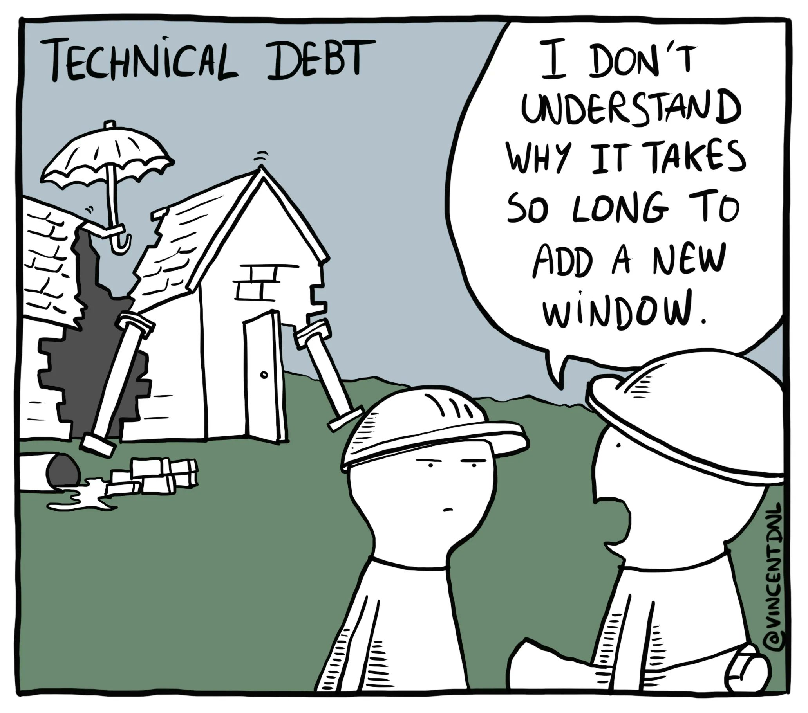

The [Elixir Book Club][2] is reading [Software Design X-Rays:
Fix Technical Debt with Behavioral Code Analysis][1]. 

[1]: https://pragprog.com/titles/atevol/software-design-x-rays/
[2]: https://elixirbookclub.github.io/website//

This past Sunday, we had our first meeting, reviewing chapter one and sharing some interesting discussions on technical debt. I wanted to capture some thoughts while they are fresh in my head. 

## What is technical debt?

So the book starts by defining technical debt as:

> a metaphor that lets developers explain the need for refactorings and communicate technical trade-offs to business people. When we take on technical debt we choose to release our software faster but at the expense of future costs, as technical debt affects our ability to evolve a software system. Just like its financial counterpart, technical debt incurs interest payments.

Personally, I would add the concept of decay and entropy in addition to mindful choice. Often code that is eventually identified as technical debt was added to the system with a less perfect understanding of the requirements or the requirements changed after the fact. Perhaps the developer leveled up their skills and now has new ideas about approaching the problem and avoiding previously accepted tradeoffs. 

Software libraries are also deprecate over time and need to be updated/replaced. Otherwise, you must deal with open security issues or the troublesome constraint of integrating old libraries with newer industry expectations.

## Working towards a tech debt framework

The eventual goal of the book aims to give you a framework to look at large codebases and understand what areas of the codebase would benefit from addressing technical debt the most. It uses git's version history as a source and wants to provide statistical signals you can use in addition to (and in favor of) exclusive emotional reactions.

I think this sounds great. It tracks the same way I want production observability signals to help me understand the system.

What the book **does not** get into is the discussions around getting time allocations in sprints to address technical debt. Depending on your circumstances, that is a more meaningful blocker than figuring out how to spend that technical debt time. The book club discussions ran on this for a while.

## Selling 

<figure style="width: 50%; margin: 0 auto;">

<figcaption>Technical Debt Meme</figcaption>
</figure>

Saw this meme over the weekend, and while it might make you smile, it's a symbol of the common misunderstanding of technical debt. You may see the house in that broken state, but the owner might see a working house and need help understanding what all the fuss is about. We don't share the same vision of the system. We each have our own perspective and biases.

To continue the construction metaphor, yes, the inner wiring of the house might be decrepit and a fire hazard, but the owners are not electricians. They see and use abstractions like light switches and heat. They don't see nor understand the system's inner workings, and it's your job to provide that perspective. To help them understand how things work, why it might be a good idea to replace the wiring, and what failing to replace it looks like regarding managed risk.

I suspect many programmers don't like being a salesperson, but you need to do it to be a successful voice on behalf of the system.

Last week while attending Philly ETE, I saw a great talk on this topic titled [Leading with the Platform: A Platform Engineering Approach to Tech Debt][3] by Jess Mink. I suspect it will be posted on YouTube in the coming months, so you might want to look for it.

[3]: https://2023.phillyemergingtech.com/session/leading-with-the-platform-a-platform-engineering-approach-to-tech-debt/

In the meantime, you can also check out this article on [how to sell technical debt][4] and why positioning the business value of technical debt is crucial to getting buy-in and approvals.

[4]: https://thoughtbot.com/blog/selling-technical-debt-to-the-business

## Sprint planning and broken glass

Usually, there is a product manager at the helm a sprint plan. Simplifying a split amongst the stakeholders let's say we have one group being the customers/owners and the other being the developers. Each group has their own short-term and long-term interests. A good sprint has a health mix of of all four areas If the weights of any of these four areas get too out of proportion for too long, things will get into a bad state.

Specifically to the short-term interest of developers, I'm a big proponent of giving individuals **timeboxed broken glass autonomy**. This is a metaphor that comes from theme parks. If you are an employee, and your job has you walking the park day in and day out, when you see broken glass on the floor, you should stop and clean it up for the serenity and safety of everyone else. 

A more strict and formal management style would have the employee report the observation, have it queued for review, and then (maybe) acted on days or weeks later—a lot of overhead for what would be a 10-minute clean-up job.

Giving programmers autonomy to identify, timebox, and execute pain points they experience in the codebase is both efficient and satisfying for the programmer.

## Trust

"All this sounds nice, but my product manager does not trust the development team. They never approve technical debt work."

Earning and having trust with coworkers is a foundational and challenging need. If the product manager does not have trust in the development team, ask those hard _why_ questions.

For the developers:

1. Work hard to empathize with the product manager and the million spinning plates they are trying to keep up.
2. A common cause of friction is missed deadlines, so work with the product team to descope work and create small iterative loops with extreme priority. Always keep the system in a shippable state.
3. Be expressive about progress, letting the product manager dig deep when needed, but have a high-level understanding at all times.
4. Give them the information and choices, and when a choice is made, work to execute it professionally.

For the product managers and owners: 

1. Be transparent with your whole team about the company's status and goals. Don't consider these non-programming status communications as wasteful. Developers make hundreds of decisions on the company's behalf, with or without this context. The more informed they are, the better decisions they can make. 
2. Create space for trust to be earned. Instead of assigning a sprint's worth of tickets to a team, let the team choose the capacity.
3. Create space for empathy to grow. Encourage pairing across multiple job titles so people better know what all corners of the company feel like.

For more on trust, I recommend [The Five Dysfunctions of a Team: A Leadership Fable by Patrick M. Lencioni][5]. 

[5]: https://bookshop.org/p/books/the-five-dysfunctions-of-a-team-a-leadership-fable-patrick-m-lencioni/9742373

## Join us

If you'd enjoy discussing technical debt, join us for future book club discussions. We meet on Sundays every two weeks via our Discord. More info at: <https://elixirbookclub.github.io/website//>.
