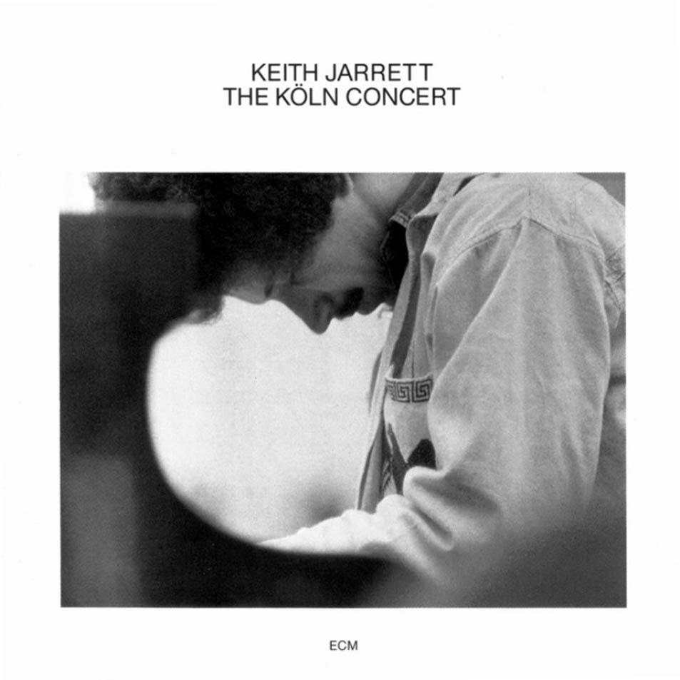

In March of 2024, I purchased a record player after seeing one at my cousin's place.

I am not an audiophile; in fact, I have partial hearing loss in my left ear. Nonetheless, I like the physicality of playing a record. The intent of putting the vinyl down on the platter, lining up the needle, and letting it play out without the distractions of a computer or phone. Taking the time to enjoy the wonderful visuals of the album art and (sometimes) styled coloring of the vinyl as the music plays out.

I constantly fret about the relationship I have with technology, and I like how grounded this feels in the real world.

Over the year, I have acquired about 20 records, but here are some that stand out.

## Stardew Valley Soundtrack

[Soundtrack Info](https://www.fangamer.com/collections/stardew-valley/products/stardew-valley-complete-ost-vinyl-box-set), [Expansion Soundtrack Info](https://www.fangamer.com/collections/stardew-valley/products/stardew-valley-1-4-1-5-vinyl-soundtrack)

Stardew Valley has become one of my favorite games of all time, and its soundtrack is a notable reason why. Like many of the instrumental records you'll see on this list, I enjoy listening to this while I read my books or otherwise enjoy a nice fireplace day. The music has a wonderful mix of upbeat and somber tracks, and the alum art and vinyl presentation capture the mood well.

## Red Dead 2 Soundtrack

[Score Info](https://www.discogs.com/release/14990700-Various-The-Music-Of-Red-Dead-Redemption-II-Original-Score)
[Music Info](https://www.discogs.com/master/1611353-Various-The-Music-Of-Red-Dead-Redemption-II-Original-Soundtrack),

Another all-time favorite game, the Red Dead 2 soundtrack and song albums bring me back to 1899 every time. I love the ambient music of the soundtrack that mixes soft exploration songs and intense gunfight anthems. When the vocal song hits, I get a major kick of nostalgia for those larger-than-life game moments and endings. These albums were not in print and easy to find, but I'm happy to have acquired them. They are regularly on rotation in my house.

## Random Access Memories, Daft Punk

[Album Info](https://www.discogs.com/master/556257-Daft-Punk-Random-Access-Memories)

I have enjoyed Daft Punk growing up. I recall bobbing my head to [Discovery](https://www.discogs.com/master/26647-Daft-Punk-Discovery) on my iPod during many walks and workouts. Even in recent times, I regularly enjoy the [Tron Legacy soundtrack](https://www.discogs.com/master/291615-Daft-Punk-TRON-Legacy-Original-Motion-Picture-Soundtrack) (I have it on vinyl as well) -- but there is something special about Random Access Memories. It fits no genre and explores sound in a unique way that is hard to express. Spending time listening to this on a nice set of speakers and giving it your focus is special. While we all have music preferences, this is the recommendation you could give to anyone who says they love music.

## Six Evolutions - Bach: Cello Suites, Yo-Yo Ma

[Album Info](https://www.discogs.com/release/12524051-Yo-Yo-Ma-Six-Evolutions-Bach-Cello-Suites)

I've been listening to Yo-Yo Ma for years. My first introduction to him was during an iTunes demo, and I did not turn back. [The Cello Suites: Inspired By Bach](https://www.discogs.com/master/438050-Yo-Yo-Ma-The-Cello-Suites-Inspired-By-Bach) was one album I listened to many times, often while I coded. I could not find it on vinyl and ended up picking up Six Evolutions in its place. I've enjoyed this now as well. It's a great album to throw on while journaling or looking for inspiration.

## Keith Jarrett's Köln Concert

[Album Info](https://www.discogs.com/master/26241-Keith-Jarrett-The-K%C3%B6ln-Concert)

This was the surprise of the year for me. While many of the albums I've picked up I have a deep history with, this came to me serendipitously through [a YouTube video](https://www.youtube.com/watch?v=wIXMkZAcgRo).

> Keith Jarrett's Köln Concert started as a total disaster. Not only was he exhausted and hungry, but he had to improvise an entire concert on a broken, unplayable piano. This concert would go on to be the best-selling solo jazz album and the best-selling piano album of any genre.

After sampling the concert online, I bought my copy.

I enjoy piano albums but have not done much jazz piano. It hits differently and is enjoyed. I love the story behind the concert, which adds to my appreciation for what is happening during the concert. It inspires me to embrace constraints.

---

How about you? Any special music hit you this year? I'd love to [hear about it](/contact).
