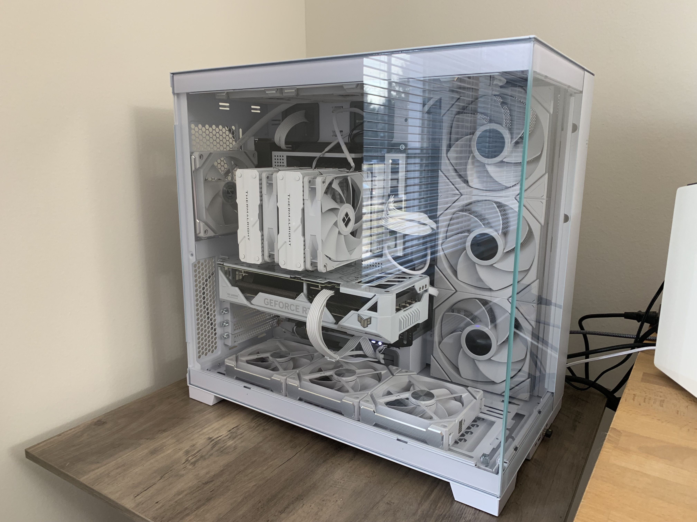
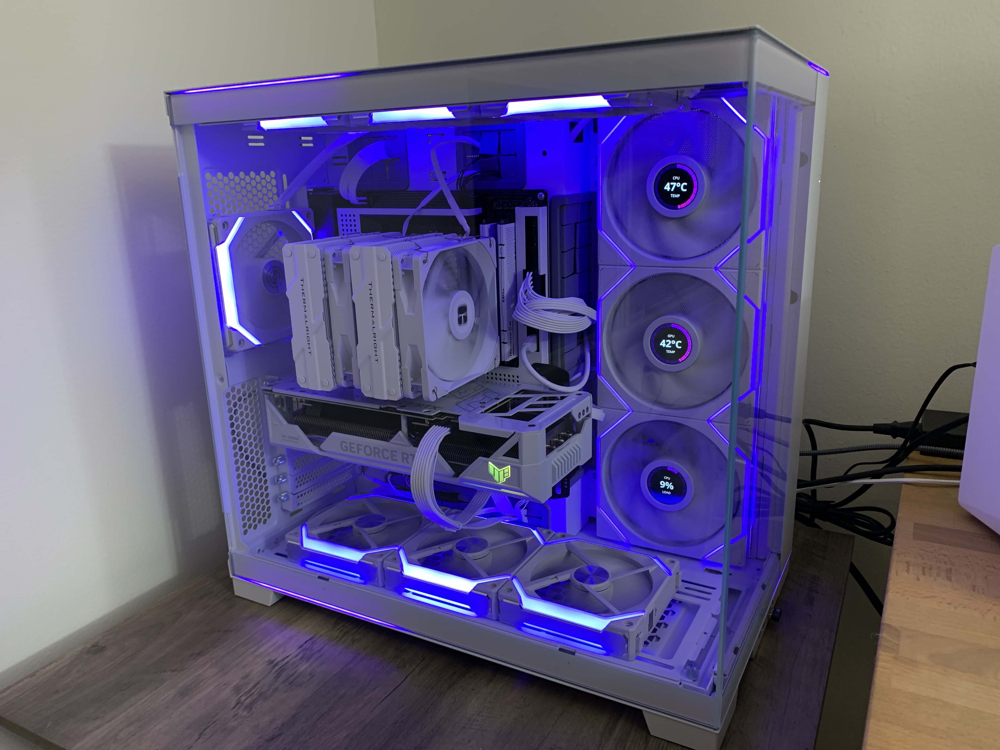
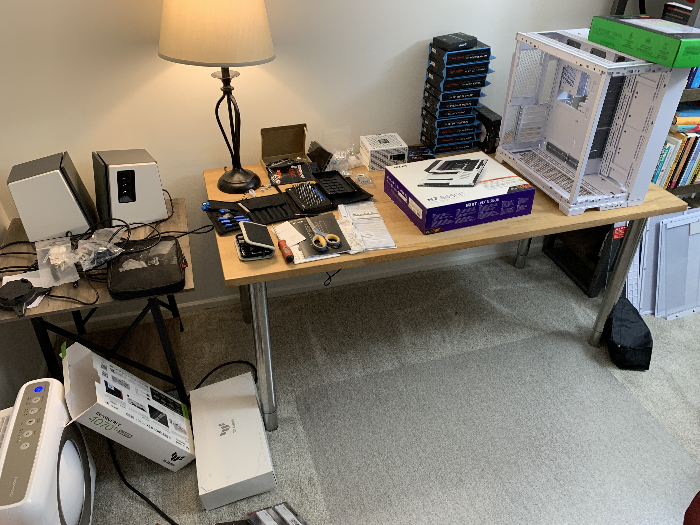
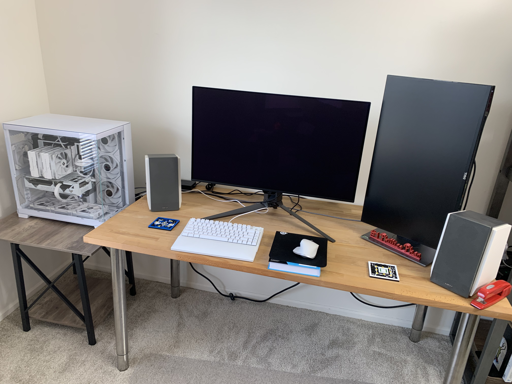
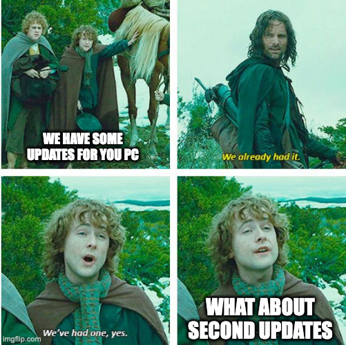

In the closing days of summer this past year, I started to get an itch about building a new gaming PC. In this post, I'll share what I built and some notes on its assembly.

<figure>

<figcaption>Assembled computer powered off.</figcaption>
</figure>

<figure>

<figcaption>Assembled computer powered on.</figcaption>
</figure>

## Inspiration

I had been playing a few games on my Mac laptop over the summer, including Civilization VI and Stardew Valley. Civilization VII was formally announced in June, triggering an interest in a new gaming PC. While I could technically play Civ7 on a Mac, it would likely play much better on a proper gaming PC.

It had been 8 years or so since I [last built a gaming PC](https://mikezornek.com/posts/2016/6/my-new-pc-gaming-computer/) (a top-end of its time 1080 Nvidia-based tower). The main games I played on it back then were MMOs like World of Warcraft and Final Fantasy 14. I also enjoyed many hours of City Skylines and Portal 2.

In recent years, I shelved the gaming PC and have, instead, enjoyed my game time via other outlets, such as my PlayStation and Switch. The idea of a new gaming PC for Civ7 and a space to tinker with those MMOs again was intriguing.

## Components

[PC Parts list.](https://pcpartpicker.com/list/zCygTY)

<figure>

<figcaption>Various PC parts laid out for assembly.</figcaption>
</figure>

For this build, I wanted to lean more toward a visual presentation. My last build was very economical, a traditional black tower with no real frills. It would be fun to give this some personality. It's a white build with some limited RGB lighting that would lean towards a purple hue. 

I chose the [Lian Li O11 DYNAMIC EVO RGB](https://lian-li.com/product/o11d-evo-rgb/) case. I have seen this tower a few times on various YouTube videos. I really enjoyed the spacious interior, the glass sides, and the sleek lines. As I started working with this case, I was impressed with the build quality and layout. I love having the motherboard on one half with a hidden chamber for all the various wires and fan controllers.

I chose the AMD Ryzen 7 7800X3D 4.2 GHz 8-Core Processor for CPU, my first AMD processor ever.

For graphics, I debating a lot of options. Ultimately, I chose a more expensive choice than I originally planned, picking the GeForce RTX 4070 Ti SUPER. I picked this for the extra video RAM (16 GB), which I hope will help in the future. We will see how well games like Civ7 (and a possible Red Dead 2 with mods) actually utilize all this horsepower. For now, it sits there, almost bored with my current gaming choices and their simple needs.

For the monitor, I went with the [Asus ROG Swift OLED](https://rog.asus.com/us/monitors/27-to-31-5-inches/rog-swift-oled-pg32ucdm/), a 31.5-inch screen running at 240 Hz. This thing is gorgeous. Since getting an OLED TV in 2020 and my iPad Pro earlier this year, I have found it hard to consider other display options. I love the rich colors and the deep blacks. I like the glossy finish too; it makes colors pop.

I went with various Lian Li RGB options for cooling fans, including three of the [LCD-display variety](https://lian-li.com/product/uni-fan-tl-lcd/). I currently use the temperature and load metrics, but I might use some GIF memes in the future. Getting the right mix of white color, reverse airflow, and sizes was actually harder than I expected. I compromised on sizes (I wanted 140mm but had to get 120mm) and normal direction (mounting in reverse to get the airflow I needed).

The final meaningly decision was CPU cooling. I went with an air-cooled solution, a Thermalright Peerless Assassin. Water-cooled all-in-ones are popular and can squeeze out extra performance, but I dislike the complexity and the motor noise moving the fluid around. I prefer the simplicity of airflow, and considering the space my case provides, I expect it to be more than enough for my needs.

## Assembly

It has been a bit since I last built my last gaming PC, so I took my time and watched a lot of [YouTube videos](https://www.youtube.com/watch?v=c-0WW77_fM8) to help me get comfortable with an approach and answer some questions. 

I have big hands, so work like socketing the CPU and applying thermal paste can be daunting, but I took my time, and it worked out.

Handling the graphic card is similarly stressful since it is so large and expensive. You need to put pressure on it to get it into the PCI slot, BUT NOT TOO MUCH PRESSURE! (Aside: I broke a small tab of my old 1080 graphics card before, and happily, it did not cause an issue -- but the memory and worry persist.)

The other stressful thing about the graphic card is the power. I've seen [Steve's coverage](https://www.youtube.com/watch?v=Y36LMS5y34A) of these 12VHPWR plugs, and this design is an absolute shit show. Again, I approached this carefully, ensuring everything was secure and not overly stressed in the cord bend (another advantage of having such a large case interior).

When I first attempted to power-on the computer, I **did not** get it to POST.

> POST, short for power-on self-test, is a series of tests and procedures your PC runs through before loading the operating system.

I saw red lights on my motherboard and was very nervous. I assembled everything inside the tower, so disassembling and debugging what was causing the computer to not POST was very intimidating. Luckily, I worked on simpler debug steps first, which meant reseating the RAM. This required removing one of the CPU fans, but it was a low-impact first thing to try -- and lucky for me, that resolved the issue. The RAM seems fine, I just needed to reseat it. (FWIW, I did give the PC plenty of time to configure the memory on those first attempts. I am aware that as you change the memory layout the motherboard needs to cycle/relearn the memory speeds.)

If I were doing this again, I might suggest buying a test bench setup or otherwise doing a sanity POST verification of the components before putting them in a case.

After I got the computer to POST, one issue I did run into was fans. I misunderstood the wide range of fan models Lian Li was selling and ended up buying a mix of fans and controllers that were not fully compatible. I made a midday MicroCenter run to buy compatible alternatives and had to reinstall them a few times to get it all worked out. Ultimately, I had to install two separate fan controllers (one for the LCD fans and another for the simple RGB fans).

<figure>

<figcaption>The full desk shot.</figcaption>
</figure>

## Windows

Not having a readily available Windows computer around, I followed some [instructions](https://windowsreport.com/windows-11-usb-installer-on-mac/) to download the Windows 11 installer and make a bootable USB drive from my Mac. This worked fine for me, though sadly, I did not get a working network driver for the motherboard's wifi chip from Windows, so I had to download some manual drivers onto a separate USB drive to get that working. Once I was on the wifi, I could get all the other drivers directly from this machine, as well as the many OS-level updates.

<figure>

</figure>

I had a Windows 10 license from my old gaming PC, which worked fine for registering this copy of Windows 11. 

Windows 11 is frustratingly pushy about trying to get you to create your local account via an online Microsoft account. I used a few [suggestions](https://www.youtube.com/watch?v=Q20jF5m-G0s) to avoid this, but it seems like an ongoing nag I get from time to time.

One of the biggest problems I ran into was the EFI boot partition. So, EFI is what Windows uses as its boot loader, and when you install Windows, it tries to be helpful. It self-discovers all the hard drives in your computer and will attempt to set up what is needed. What I observed is that when I did my clean install of Windows, it saw a working EFI partition on the USB installer and would not set one up on my main SSD. Thus, my system would boot on a power cycle if I had the USB installer plugged in but would not if removed.

I did 4 or 5 clean installs of Windows, trying to nudge it in the right direction. I tried to pull out the USB drive at a specific point during the installation, but it never worked as I wanted. I ended up following some [instructions](https://www.youtube.com/watch?v=CZ17JrgFFhw) to manually create an EFI partition on my SSD and finally got everything to boot on a clean power up with no USB drive plugged in.

## Tools

During this assembly, I loved using my [iFixit tools](https://www.ifixit.com/Tools). Having all the various screw types and extenders really came in handy. I've used this set for two notable projects now (this and [my Framework laptop](https://mikezornek.com/posts/2021/9/framework-first-thoughts/)) and continue to appriciate how well they work.

It's easy to overlook, but make sure you have many USB drives if you do a build like this. I did not and had to do a data dance when creating USB drives to flash the motherboard with the latest BIOS and other things. Keep that Windows 11 bootable USB drive around for future issues.

## Final Thoughts

I'm really pleased with my build. I had to make a few visual compromises with the fans, but overall this turned out just as I had hoped.

So far, my main games have been Civ 6, Stardew Valley (trying to finish perfection on my latest farm), and World of Warcraft (rolled a new gnome mage on the new Classic servers). 

As 2025 approaches, I'm looking forward to Civ 7 and a playthrough of Red Dead 2 with some mods to shake up the gameplay. There is a rumor that MLB: The Show might get a PC release this year, and if so, I might play it here.

<video controls width="100%">
  <source src="oh-yeah.mp4" type="video/mp4" />
  <a href="oh-yeah.mp4">Download MP4.</a>
</video>

***

If you have a game suggestion or any follow-up questions, [reach out](/contact).
