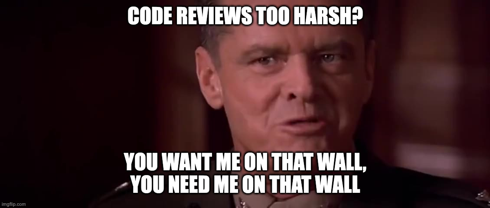

<figure>

</figure>

Yesterday I took to `r/ProgrammerHumor` to reply to [this post about code review](https://www.reddit.com/r/ProgrammerHumor/comments/1ib4ifc/titleisdealingwithatoxicsenior/). I used a meme I [crafted back in September](https://jawns.club/@zorn/113194431261362116) and posted this meme as I was preparing for quarterly performance review season. It since has gotten some replies that have me laughing out loud. Recording for prosperity.

[Intelligent-Touch936 writes](https://www.reddit.com/r/ProgrammerHumor/comments/1ich83t/comment/m9rixfv/): 

> We live in a world that has code, and that code has to be perfect. Who's going to ensure that? You? You, with your lenient comments? I have a greater responsibility than you can possibly fathom. You weep for your feelings and you curse the review process; you have that luxury. You have the luxury of not knowing what I know: that my critique, while harsh, probably saved the project. And my existence, while meticulous and unkind, brings us closer to a flawless system. You want me to be nicer? You can't handle the nicest! Because deep down in places you don't talk about at stand-ups, you want me on that review. You need me on that review. 
>  
> We use words like "optimize," "refactor," "debug." These words are the backbone of our development process. I have neither the time nor the inclination to explain myself to someone who rises and sleeps under the very quality code that I provide and then questions the manner in which I provide it. I'd rather you just said "thank you" and went on your way. Otherwise, I suggest you grab an IDE and get to work. Either way, I don't give a damn about what you think you're entitled to!

**Prosecutor:** Did you force push main?

**Defendant:** I did what I needed to do.

**Prosecutor:** DID YOU FORCE PUSH MAIN?

**Defendant:** YOU'RE GODDAMNED RIGHT I DID!
