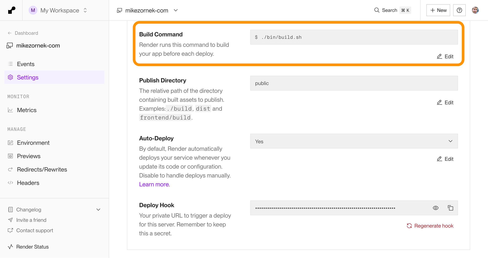

I host this site at [Render.com](https://render.com/). Specifically, I use Render's [Static Site product](https://render.com/docs/static-sites). It's a good product and free for most usage. It features an auto-configured SSL certificate, global CDN, pull request previews, and many other nice things. I'm also paying Render to host some [Elixir things](https://rankedvote.app/) and enjoy the simplicity of fewer things to manage

When you read the docs, Render provides instructions on what to do [if you are using Hugo](https://render.com/docs/deploy-hugo) to build your static site. Unfortunately, their version of Hugo is locked and a bit dated as I type this. (I observed version `0.124.0` when the current version of Hugo is `1.46.5`.) Some other static allow you to set a `HUGO_VERSION` environment variable, but sadly Render does not support this.

Render allows you to supply a custom build command, and I've taken the opportunity to install an updated version of Hugo per deployment so I can keep it current. Here is the script and some other notes to keep in mind.

## Using a custom build command

You can read more [official docs](https://render.com/docs/deploys#build-command) about the build command, but in short, you set it up in the `Settings` for your site. Instead of a single command, you can point it to a build shell script from your project's repo.



My [build script](https://github.com/zorn/mikezornek.com/blob/63fbcfc5687e778afeafb7d7520a14e0c6cc7437/bin/build.sh#L1) looks like this:

```bash
#!/usr/bin/env bash

# This script is used by Render to build the app for production deployment.

# set up an exit on error
set -o errexit

# Save the initial directory
ORIGINAL_DIR="$PWD"

# Install npm dependencies
echo "Installing npm dependencies..."
npm install --verbose

# Install specific version of Hugo
HUGO_VERSION="0.145.0"  # Change this to your required version
echo "Installing Hugo ${HUGO_VERSION}..."

# Create directory for Hugo download and installation
mkdir -p "${HOME}/bin"
mkdir -p /tmp/hugo
cd /tmp/hugo

# Download and install specific Hugo version
wget -q https://github.com/gohugoio/hugo/releases/download/v${HUGO_VERSION}/hugo_extended_${HUGO_VERSION}_Linux-64bit.tar.gz
tar -xzf hugo_extended_${HUGO_VERSION}_Linux-64bit.tar.gz

# Move Hugo to a directory you have permission for
mv hugo "${HOME}/bin/"

# Add the bin directory to PATH
export PATH="${HOME}/bin:${PATH}"

# Verify installation
hugo version

# Return to project directory
cd "$ORIGINAL_DIR"

# Now you can add your Hugo build commands here
hugo --logLevel info
```

In addition to installing Hugo, I also install some npm packages, including Tailwind and the Tailwind Typography plugin, which I am using for my Hugo template HTML. One thing to keep in mind here is that Render does [honor and expect](https://render.com/docs/node-version) a `NODE_VERSION` inside your environment settings to hint what version of node to use. This static site was defaulting to a pretty old version of node when I started without a `NODE_VERSION` environment variable, and that seems to be [based on when the static site service was initialized](https://render.com/docs/node-version#history-of-default-nodejs-versions).

I do a bit of extra logging to help me debug, but overall, this script is pretty straightforward. Make sure to grant execution permissions with `chmod a+x build.sh`  to the shell script when composing it. 

## Inefficiencies

Installing Hugo (and node things) for every deployment is excessive and will be charged against my [pipeline minutes](https://render.com/docs/build-pipeline#pipeline-minutes), but for the simple needs of this site, which is published a few times a month I doubt it will add up to anything much. If you want to optimize this, consider Dockerizing the deployment and perhaps even assembling the static content in a continuous integration system like GitHub Actions. (I was planning on that at first, but this build command approach was more straightforward for now.)
