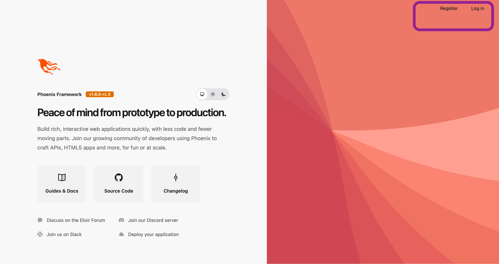
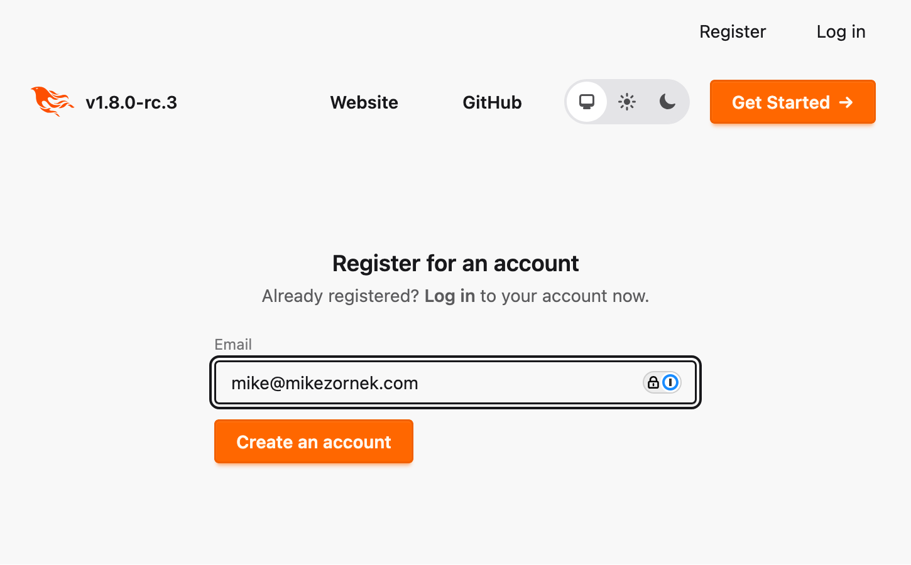
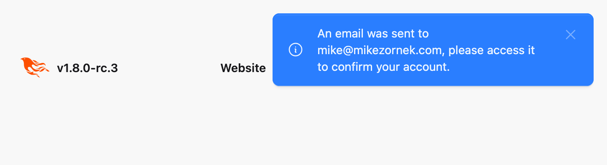
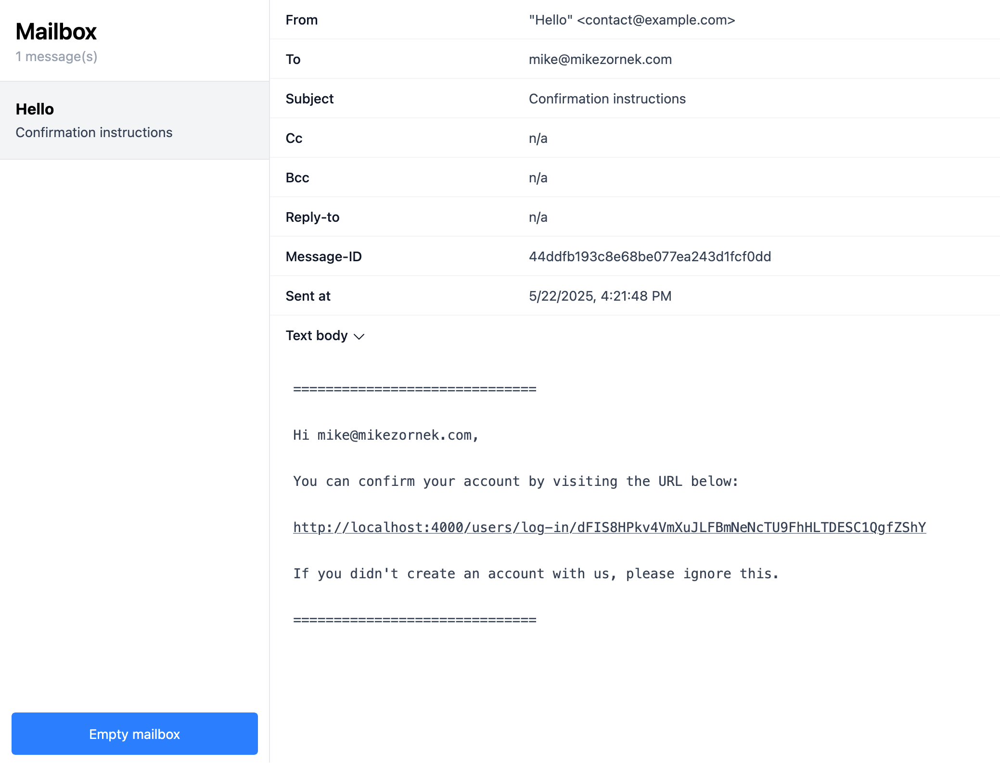
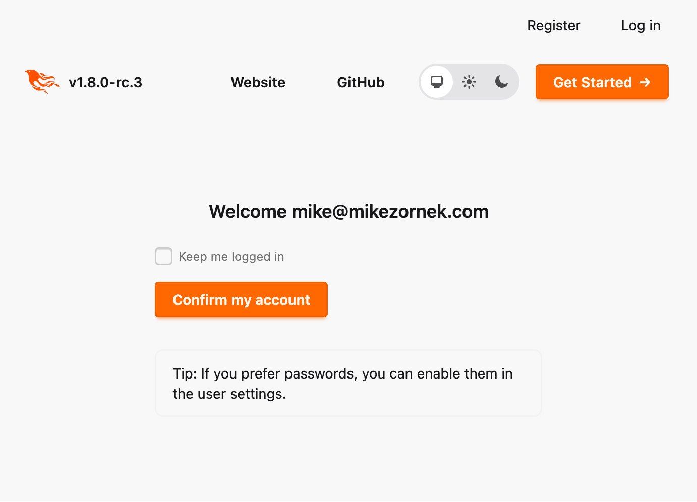
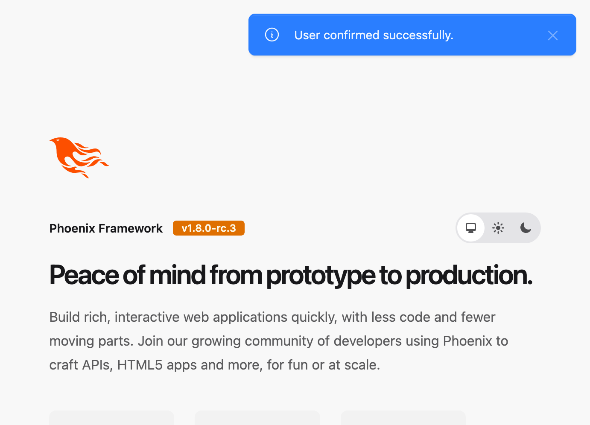
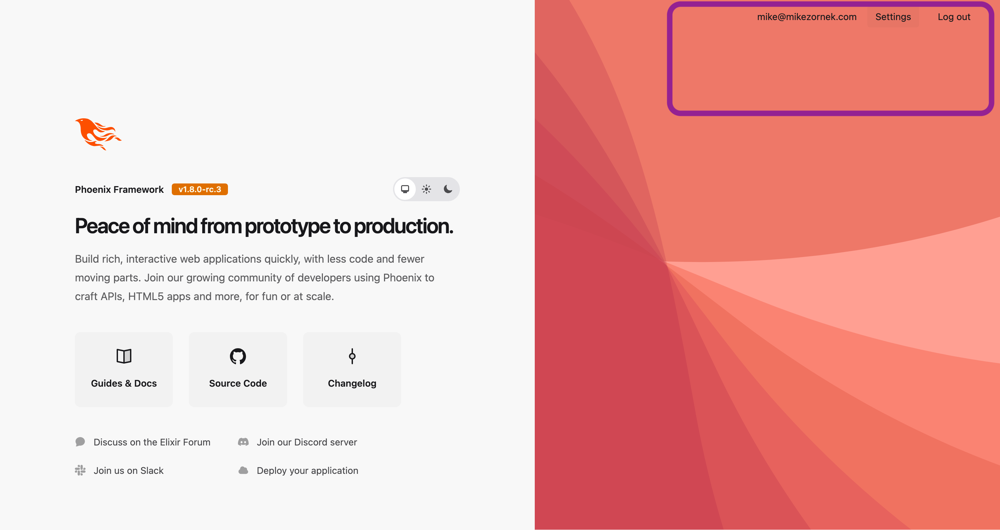
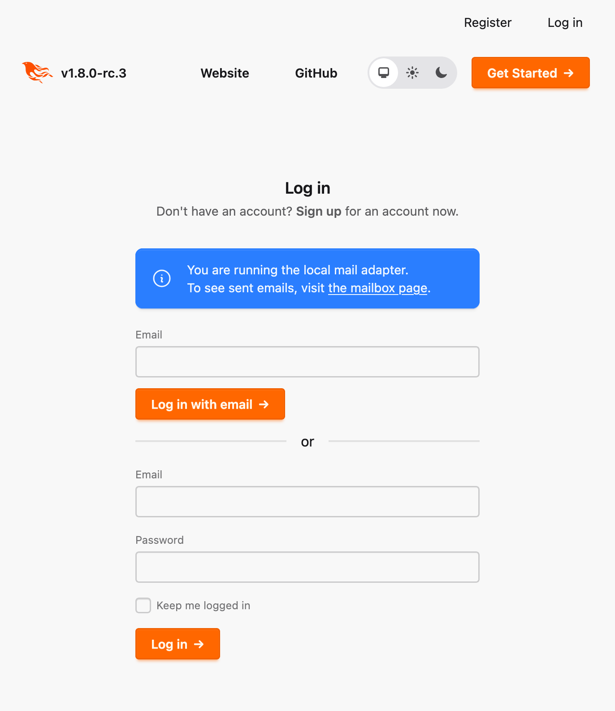

With Phoenix 1.8, the authentication code generator inside `phx.gen.auth` has been revamped, favoring an emailed 'magic link' authentication flow.

In this blog post, I'll give a visual tour of how this looks to the user, what the core schemas/contexts look like, and I'll sprinkle in some personal commentary as we go.

## Background on authentication

When building any web application, user registration, authentication, and authorization are extremely common needs. The Phoenix team wants to help and provides tools and patterns to help get you jump-started.

The Mix task `phx.gen.auth` is one such tool. Using it inside a fresh Phoenix project, you can set up a community-vetted starting point to allow user registration and authentication. 

You'll also spot some small files created by the `phx.gen.auth` task related to [Scopes](https://hexdocs.pm/phoenix/1.8.0-rc.3/scopes.html) a Phoenix 1.8 authorization pattern, but we will not be talking about authorization today.

Creating user registration and authentication flows have a large surface area for security concerns, and using a community-vetted approach like this is highly recommended. Even if you decide to roll your own, generating the community's recommended code can be a valuable reference tool to inform your custom design.

## The sample `Hello` project

The project we'll be reviewing today was created by:

Installing a prerelease `phx_new` command:

    mix archive.install hex phx_new 1.8.0-rc.3

Creating a new project:

    mix phx.new hello

And generate authentication logic:

    mix phx.gen.auth Accounts User users

You can find a repo with this code at <https://github.com/zorn/magic-link-demo>.

## User experience

I consider myself a user-focused developer, so let's start with a visual review of how this registration and authentication feels from a user point of view.

### Navigation updates



One of the first outcomes of running the code generator is a change to the site navigation. In the upper-right you now have links for `Register` and `Log in`.

### Registration page



On the registration page, you'll see a form asking for a single input value,  the user's email.

While password authentication is still an option, a password is not asked for at the time of registration. 



Once filled out, the user is presented with a toast explaining that an email was sent to confirm their account.

### Opening the confirmation 'magic link'



When working in local dev, the Phoenix app runs with a web interface to a fake email inbox at `http://localhost:4000/dev/mailbox/`.



Upon clicking the magic link, the user is presented with a simple form that offers an optional checkbox to `Keep me logged in` (which will last for 14 days; see module attribute `@session_validity_in_days`).

This page is required because magic links can be "viewed" by automated systems, such as email link security tools or even URL preview cards seen in apps like Slack. We need to require a user action, and by using the form `POST` (which automated tools should avoid), we have stronger confidence that the token in this magic link will not be used unexpectedly.

Once the user clicks on the `Confirm my account` button, they will, in fact, be authenticated AND their account confirmed. On subsequent flows, the button will say `Log in`.



After authentication, the user is redirected to a predetermined `signed_in_path` or a stored `user_return_to` path and is presented with a toast saying they have been authenticated.

### Authenticated navigation



After the user is authenticated, the navigation changes to show the account email address, a `Settings` link, and a `Log out` link.

### Log in with email

To examine the log in form, we will first `Log out` and see a simple toast with `Logged out successfully.`. Then, upon clicking the `Log in` link, you will see this page:



The upper half of the page invites you to `Log in with email`. Filling out an email will result in a toast saying, `If your email is in our system, you will receive instructions for logging in shortly.` That email looks very similar to the confirmed email we showed before.

**Aside:** It is good security practice to build systems so as not to leak user data. I suspect that is the intent of this message's phrasing. However, the system is not doing this in all places. If you try to register with a known email address, it [leaks the existence](has_already_been_taken.png) of the email in the system with `has already been taken`. There is a balance between pure security concerns and helping the user. You, as the system designer, should decide which path to take for your specific app. I wish the generated code was more consistent, however.

### Log in with email/password

The bottom of the page offers a more traditional email/password form. It works as expected. If you are following along, you might be asking yourself, "But I did not create a password?"

An account can, in fact, have a password. It is set on the `Settings` page we will view below. However, out of the box, the Settings page and its `Save Password` form is an optional page, not all users would have seen.

**Aside:** I think it is a bit odd that this generator is doing Log in with email **and** a secondary (optional) Log in with email/password. In my own professional experiences, I've done each separately but never both at the same time. It feels like a UX decision that could lead to user confusion. 

### Settings


As an authenticated user, you'll see that the `Settings` page provides two forms, one for `Change Email` and one for `Save Password`.

### Change Email

When you put in a new email value and click `Change Email` the change does not happen immediately. Instead, a link with a token identity for a `UserToken` record that contains the request is sent via email. Only when that link is activated is the change applied.

The generator logic inside of [`update_user_email/2`](https://github.com/zorn/magic-link-demo/blob/main/lib/hello/accounts.ex#L119) will destroy any previous `UserToken` records, protecting against multiple change email links going out. All previous ones are deleted upon creation of a new `change:#{user.email}` token context. More on the `UserToken` schema below.

### Save Password

Setting a password is not a requirement on the registration page.

To set the initial password (or change the current one), you need to fill out this form with a password value and a confirmation. Out of the box, this will require a 12-character length value, but other requirements can be added, and the generated code offers suggestions inside of [`User.validate_password/2`](https://github.com/zorn/magic-link-demo/blob/1de3ac787dc7e98721a2e3df468e454a3275d74b/lib/hello/accounts/user.ex#L81-L90).

You might note this form does not ask for the current password. Instead, this whole settings page utilizes a function from `Accounts` called [`sudo_mode?/2`](https://github.com/zorn/magic-link-demo/blob/1de3ac787dc7e98721a2e3df468e454a3275d74b/lib/hello/accounts.ex#L85-L97). The boolean function is documented as follows:

```elixir
  @doc """
  Checks whether the user is in sudo mode.

  The user is in sudo mode when the last authentication was done no further
  than 20 minutes ago. The limit can be given as second argument in minutes.
  """
  def sudo_mode?(user, minutes \\ -20)
```

If the user attempts to load the setting page using a more stale authenticated session, they'll get a flash redirect saying, `You must re-authenticate to access this page.`. Some other user experiences would ask for a confirmation of the current password; this is an alternative approach to that security need.

**Aside:** I don't like the name `sudo_mode?/2`. For me, `sudo` implies an increase in privilege. I renamed the function `recently_authenticated?/2` in my own fork of this logic.

## Schemas

All of the core authentication logic is found inside `Hello.Accounts`. There are two main persisted entities.

```elixir
  schema "users" do
    field :email, :string
    field :password, :string, virtual: true, redact: true
    field :hashed_password, :string, redact: true
    field :confirmed_at, :utc_datetime
    field :authenticated_at, :utc_datetime, virtual: true

    timestamps(type: :utc_datetime)
  end
```

The first is `Hello.Accounts.User`, and this is a schema for the persisted entity for the registered user. Most fields are pretty straightforward. Good to see the use of `redact: true` for those password-related fields. 

I feel a little curious about the `virtual` `authenticated_at` field. This is a value that is patched into the `User` struct [during calls to](https://github.com/zorn/magic-link-demo/blob/1de3ac787dc7e98721a2e3df468e454a3275d74b/lib/hello/accounts/user_token.ex#L63) `Hello.Accounts.get_user_by_session_token/1` and later evaluated by [`sudo_mode?/2`](https://github.com/zorn/magic-link-demo/blob/1de3ac787dc7e98721a2e3df468e454a3275d74b/lib/hello/accounts.ex#L85-L97). This feels like a performance choice, connecting values earlier in the call stack instead of repeating a database call later, but I'm generally suspicious of `virtual` fields as they lead to many questions when trying to understand how the fields are populated. 

The second entity is `Hello.Accounts.UserToken`, and this schema creates a container of sorts that will be used for a variety of tasks.

```elixir
  schema "users_tokens" do
    field :token, :binary
    field :context, :string
    field :sent_to, :string
    field :authenticated_at, :utc_datetime
    belongs_to :user, Hello.Accounts.User

    timestamps(type: :utc_datetime, updated_at: false)
  end
```

When you authenticate, in addition to the Phoenix session / cookie, a `UserToken` record is created. The reasoning for this is documented in the `build_session_token/1` function:

```elixir
  @doc """
  Generates a token that will be stored in a signed place,
  such as session or cookie. As they are signed, those
  tokens do not need to be hashed.

  The reason why we store session tokens in the database, even
  though Phoenix already provides a session cookie, is because
  Phoenix' default session cookies are not persisted, they are
  simply signed and potentially encrypted. This means they are
  valid indefinitely, unless you change the signing/encryption
  salt.

  Therefore, storing them allows individual user
  sessions to be expired. The token system can also be extended
  to store additional data, such as the device used for logging in.
  You could then use this information to display all valid sessions
  and devices in the UI and allow users to explicitly expire any
  session they deem invalid.
  """
  def build_session_token(user) do
    # ...
  end
```

However, this `UserToken` schema is used for more than just sessions. 

When the system sends an emailed magic link to log in, that is a reference to a `UserToken`. Again, the power to expire these is very handy.

The system even uses `UserToken` when changing an email. The wanted new email address is [encoded in the link](https://github.com/zorn/magic-link-demo/blob/1de3ac787dc7e98721a2e3df468e454a3275d74b/lib/hello/accounts.ex#L268) sent over email.

## Closing thoughts and nitpicks

So that is a quick visual overview of what you'll find in Phoenix 1.8's update `phx.gen.auth` code generator. [Formal documentation](https://hexdocs.pm/phoenix/1.8.0-rc.3/mix_phx_gen_auth.html) has more detailed information and if you want to follow the community discussions that led to this change see this [issue](https://github.com/phoenixframework/phoenix/issues/6041) and [PR](https://github.com/phoenixframework/phoenix/pull/6081).

I have mixed feelings about the change overall. 

I think my primary concern is that this adds friction to the deployment of Phoenix toy projects that want user registration. Requiring the developer to acquire transactional email services is one more thing to deploy, and there are plenty of projects where I'd like user registration but desire to keep the dependencies as small as possible. 

When I first heard about this change, I thought it would be opt-in, but [there is no option](https://hexdocs.pm/phoenix/1.8.0-rc.3/Mix.Tasks.Phx.Gen.Auth.html) to prefer email/password as the primary user flow. It is not a giant leap to generate code and then pull some of it back, remove the magic links, and introduce email/password during registration (I'm doing that for my current Phoenix sandbox), but an official option would be welcome.

Other small nitpicks I'd encourage others to consider when adapting this code for your own projects:

- I think button labels should have a consistent case. This project has a mix of title-cased buttons and first-word-only capitalization. Many also have a left-pointing arrow, which adds some visual flair to help promote a primary page action but can be visually overwhelming when you see multiple buttons using it, like on the log in page.
- I'm not sure why it says `Change Email` but `Save Password`. I wish it were consistent with the verb `Change`. I thought maybe it would only say `Save` Password when the password was missing, but in my experience, it was a static button label.

*** 

If you welcome this kind of nitpick criticism of your own project, I am available for [Elixir Consulting](/elixir-consulting/). 😅
