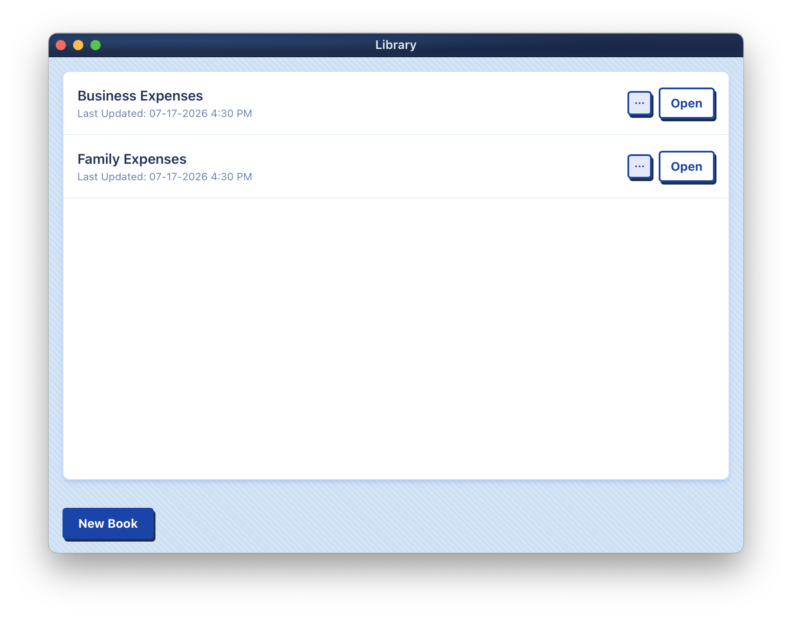
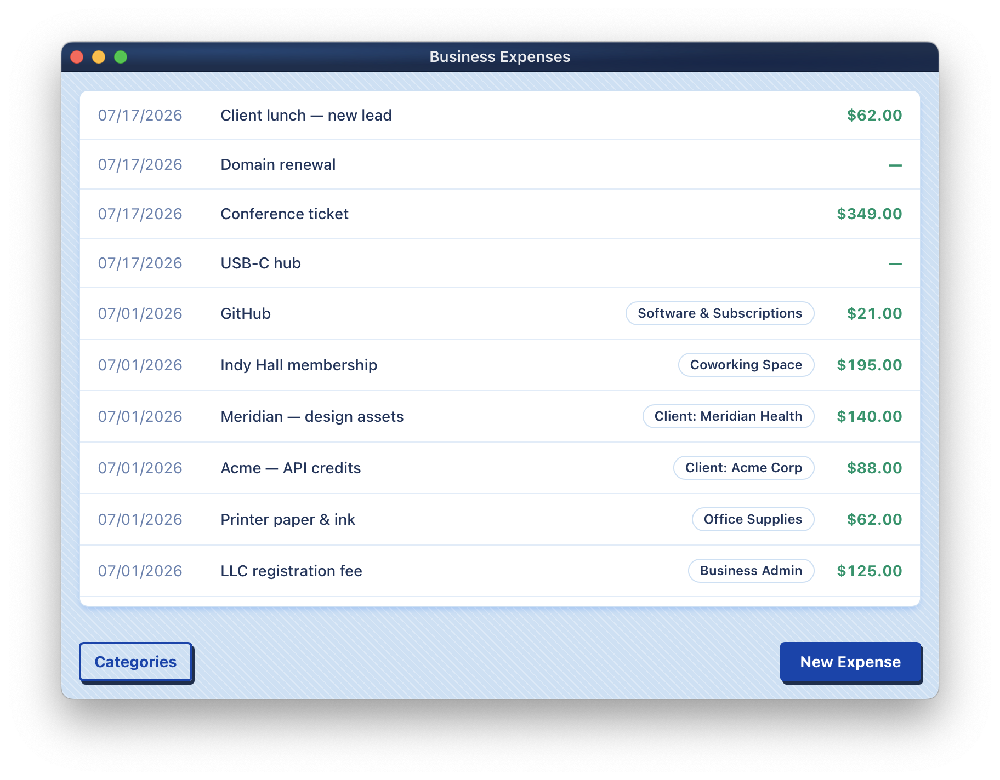
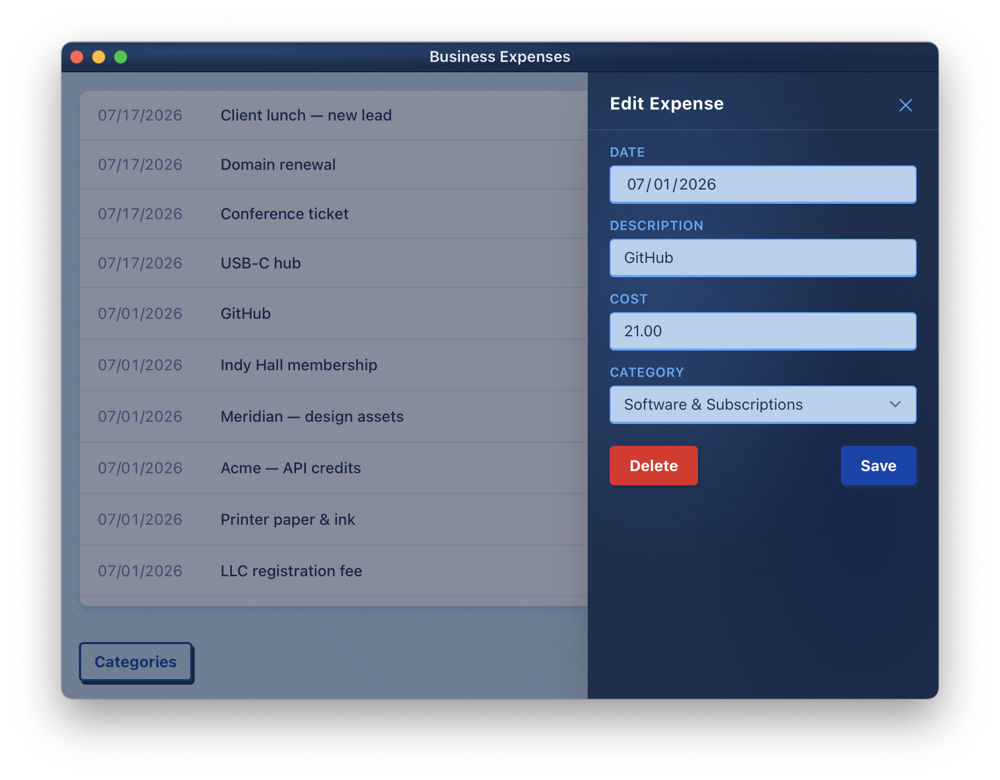
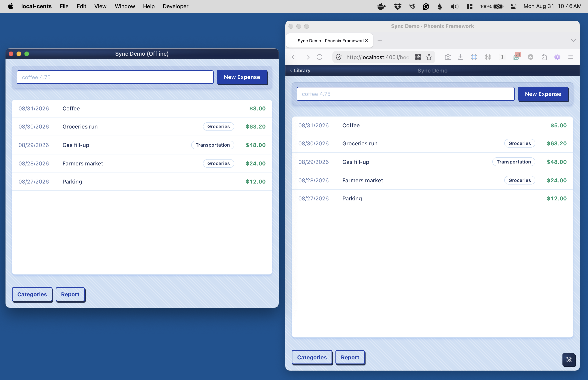
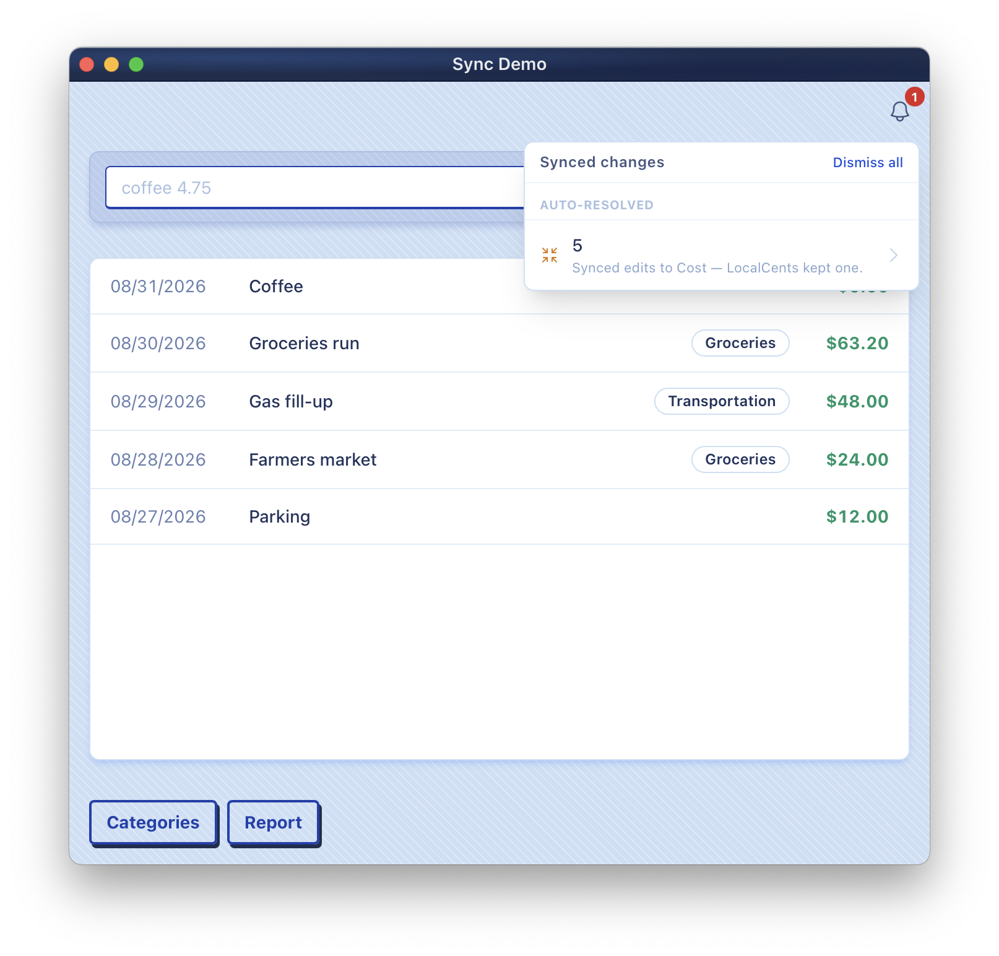
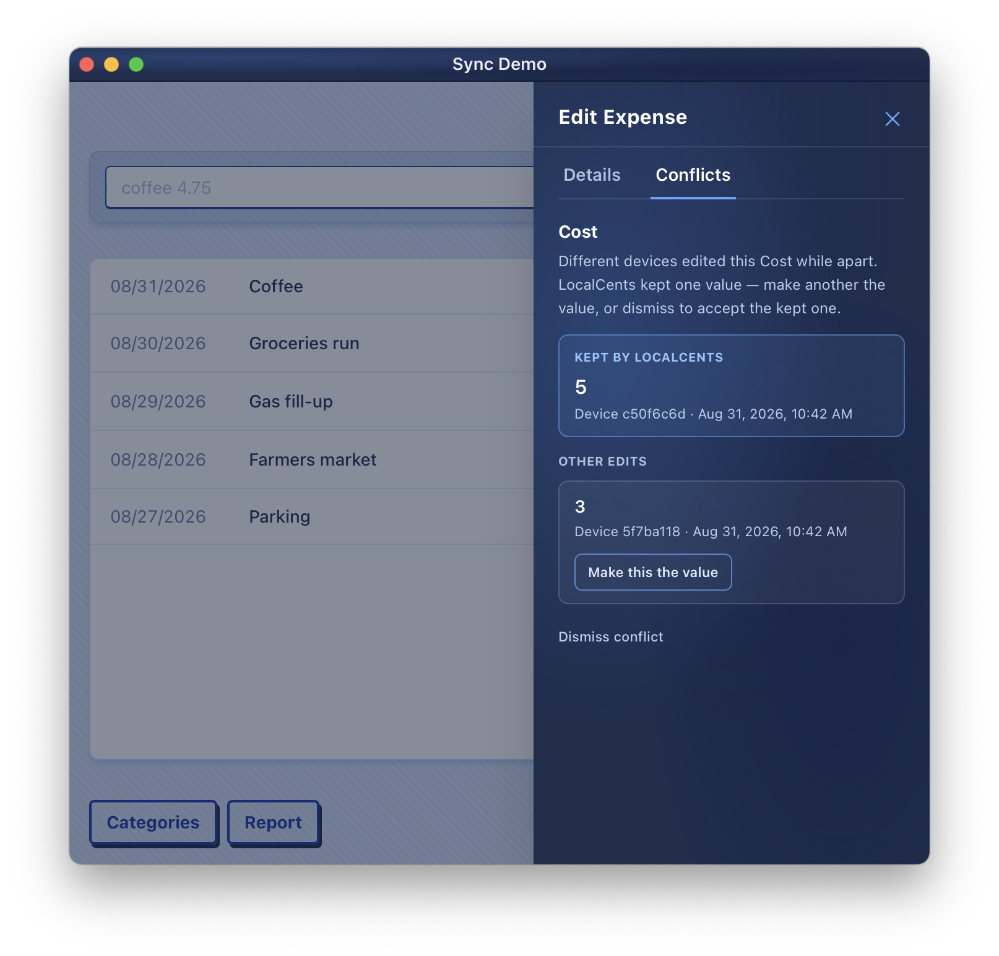
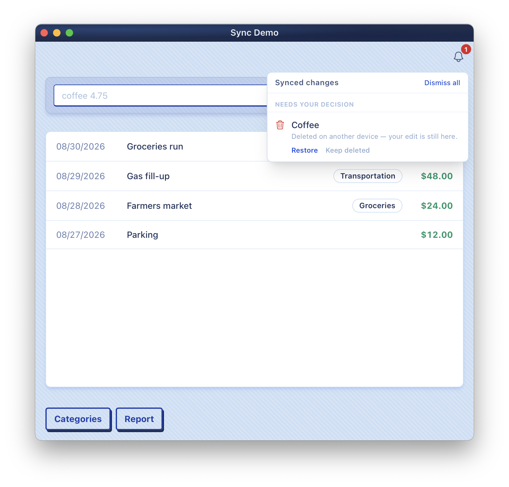

I previously blogged about [What is Local-first Software?](/posts/2025/2/what-is-local-first-software/) back in February of 2025 and while my interest has been steady I never had a real opportunity to get my hands dirty with the technology. Over the past few months I've been tinkering on an educational side project, a simple expense tracker, called [LocalCents](https://github.com/zorn/local_cents/) and have some interesting things to share.

## Local-first Software

I won't rehash the entirety of [my previous blog post](/posts/2025/2/what-is-local-first-software/), but to put it succinctly, local-first software is all about empowering the user. It values:

- local data, and thus quick responses to user commands
- using multiple devices to accomplish your work, and the deterministic syncing tech that makes it work (even during long offline separation)
- seamless collaboration with others without a centralized server
- long term usage through true data ownership   

There are many CRDT (conflict-free replicated data type) tools that work towards these ideals but the one I follow most closely is called [Automerge](https://automerge.org/).

Automerge comes from the same folks of Ink & Switch that wrote [the first essay](https://www.inkandswitch.com/essay/local-first/) that coined the term _local-first_. Automerge is a CRDT persistence layer written in Rust. It compiles to WASM and has native support for JavaScript as well as other languages and frameworks.

## LocalCents, a local-first expense tracker

My project LocalCents is an [Elixir](https://elixir-lang.org/) / [Phoenix](https://www.phoenixframework.org/) application (my core competency). I bundle it inside a macOS application binary using [Tauri](https://tauri.app/) (a Rust-based app wrapper library and ecosystem) and utilize [ElixirKit](https://github.com/livebook-dev/elixirkit) to send messages back and from from Elixir to Tauri/Rust. To get Automerge working inside my Elixir app I use [Rustler](https://github.com/rusterlium/rustler).

Here are some screenshots of LocalCents in action on macOS:

Each document is a "book". You can have multiple books, they are each separate documents.

A list of expenses in the app with a quick entry bar at the top.

An editor pane for an expanse.

On face value not a ton of interesting things are happening here. 

The repo does contain a `./scripts/two-peer-demo.sh` script that will setup of a more interesting scenario. The long term idea is that LocalCents would be running on multiple devices or even a website but this script simulates by having two instances of the app run, one as a macOS application binary, and another as a web server, accessible via a browser.

As you make changes on one device those changes will broadcast over WebSocket to other connected peers who apply the change immediately. To help demonstrate collisions the macOS app has a `Developer > Enable Offline Mode` toggle. With the macOS app offline you can then make changes that will collide, like changing coffee to $3 on macOS and $5 on the web.

Once you bring the macOS app back online the changes will be exchanged and a winner chosen.

Aside: This is a key design aspect to CRDTs -- when a conflict happens a deterministic winner must be chosen. In the case of Automerge the winner is determined through an `operation_id` (counter, actor) which is a kind of [Lamport clock](https://en.wikipedia.org/wiki/Lamport_timestamp).

One of the areas I was most interested in while working on LocalCents was if and how I might bubble up these conflicts to users. There are lots of high risk changes where if there were conflicting edits across devices or users, I would want some kind of audit trail. For LocalCents this takes shape as a notification bell and warning.

Upon interacting with the bell you are sent to a new Conflicts tab of the edit pane where you can observe the collision, the value chosen and the value dismissed. If you prefer the dismissed value you can then choose it to live on as the real value.

Another collision can come in the form of outright deletion. For Automerge the delete always takes president, but again, I offer a warning to a user should they have edited while offline any entity that was was deleted. They can choose to revive the deleted entity or accept it's removal.

## Final Thoughts and Observations

LocalCents was dreamed up as a educational side project to tinker with Automerge and it has come to a close. Some final observations:

- Automerge is really cool tech, and since it is built using Rust / WASM can be integrated into a variety of environments. The problem space we choose was pretty basic and to be clear there are some concerns like access controls which can be harder to build into a distributed tool like Automerge. Ink & Switch are working on this through [Keyhive](https://www.inkandswitch.com/project/keyhive/), though it feels a little bleeding edge.
- Tauri seems equally helpful if you need to do something cross platform. My biggest red flag would be it's iOS support, which still relies on CocoaPods (which is deprecated). I would hope to see them transition to some of the newner Swift library toolkits. Also, if you are looking to build as close to a native-feeling app as possible you'd probably utilize the many Tauri tools to get things like [system-level context menus](https://v2.tauri.app/learn/window-menu/) (in my project I faked them with CSS).
- While I did not go into detail, I utilized [a full GenServer architecture](https://github.com/zorn/local_cents/blob/main/docs/book-runtime-architecture.md) to manage the Automerge document binary. So much of my day to day is simple CRUD through a context powered by PostgreSQL/Ecto. It was fun to have built something more BEAMy.
- This project used ElixirKit to talk back and forth between the BEAM and Rust, but [there](https://github.com/elixir-desktop/desktop) [are](https://github.com/burrito-elixir/burrito) [many](https://github.com/GenericJam/mob) [others](https://github.com/bartblast/hologram) you can look to for inspiration.
- This was also the first time I really truly embraced [Phoenix Storybook](https://github.com/phenixdigital/phoenix_storybook) and managing an isolated component system (internally called `Bond`). It worked, but I would generally recommend extracting components rather than building them out ahead of time especially early in the project. I found I built things I did not use and then had to remove them.
- I used AI a ton in this project. It was a good learning experience (and fueled many other [blog posts](/tags/ai/)), but it did take away my true comprehension for how Automerge works and how Rust works. I knew enough to get the demo to work but fear the loose ends I don't see. As a comparison when I see people using AI to commit to Elixir projects I contribute to, there are tons of Elixir norms broken. I wonder how many I am breaking in my work here for Automerge and Rust.

## What's Next?

[LocalCents](https://github.com/zorn/local_cents/) was intentionally sketched out as a short term educational side project. I paused some of my open telemetry research to focus on a single side project and so I may rekindle that in the near term. I'm also starting to dream about a proper product again. I could imagine a future where I lean on Automerge for such a thing, and it could be in the accounting space, as space I frequent in my own work as well as client work. To support that I'm reading [an early draft](https://www.youtube.com/watch?v=vOhC1y-1Lz0) of The Mom Test (second edition) which is a great book on customer research.
