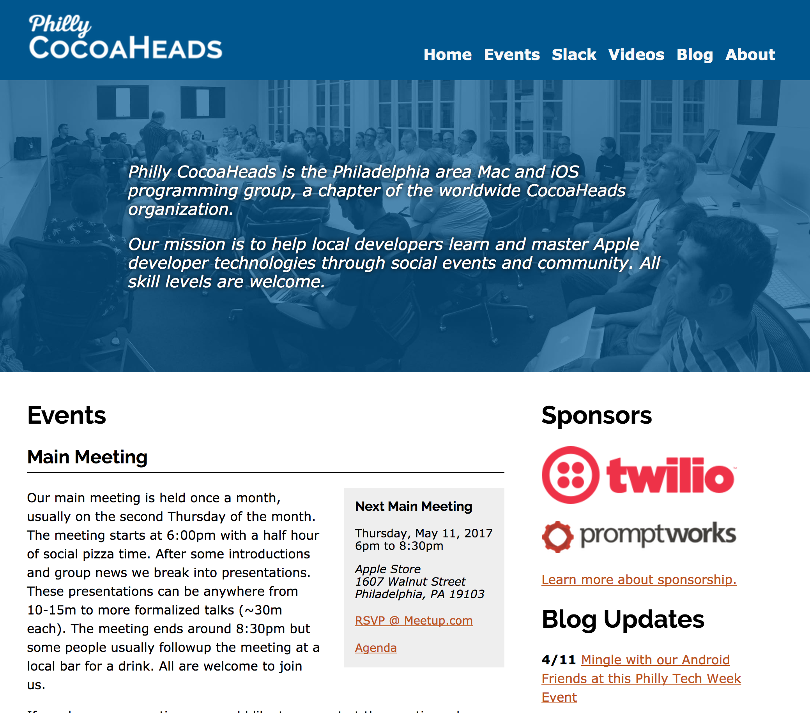
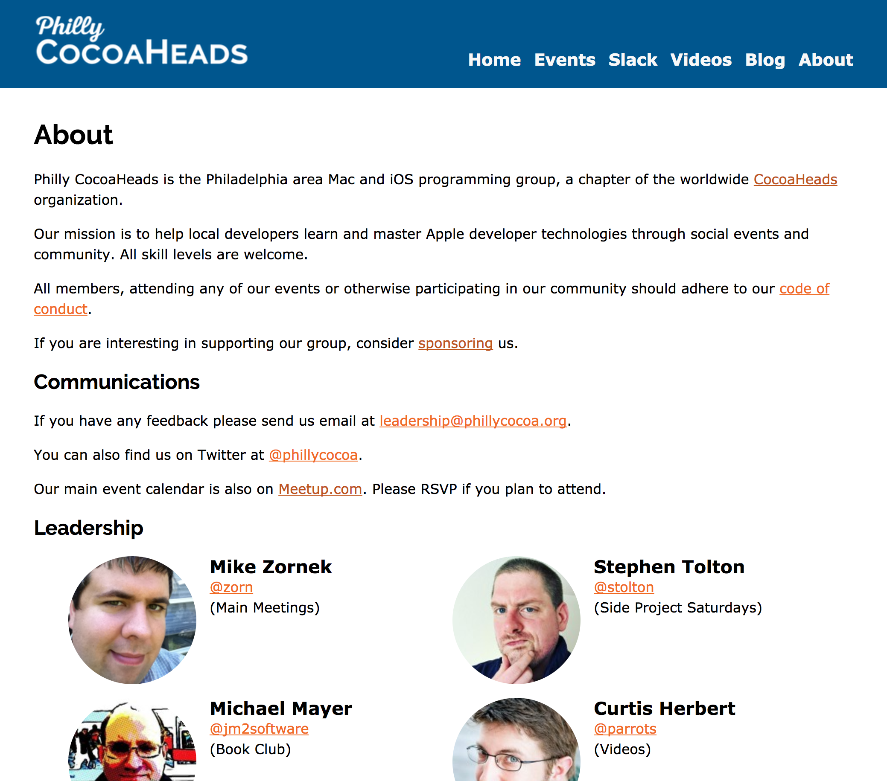

## Philly CocoaHeads Website (Hugo)

Project Goals:

* Rebuild website to focus on informing new people about the group.
* Replace WordPress with something more static to avoid update maintenance and security concerns.
* Allow for collaboration from more than a single person.
* Allow for content to be edited in Markdown.

Results:

* New clean design built in handcrafted HTML5 and CSS.
* Content reorganized and rewritten to introduce the group better and explain events in much more detail.
* Site design augmented to work as custom Hugo theme, allowing us to use Hugo as our static-site generator.
* Continuous integration setup to allow for publishing based on GitHub merge events; from CircleCI to hosting on Amazon S3.

<http://phillycocoa.org/>

Video Tour

<iframe src="https://player.vimeo.com/video/214552178" width="640" height="360" frameborder="0" allow="autoplay; fullscreen" allowfullscreen></iframe>

**Related Tech:** 

<ul>
<li><a href="https://gohugo.io/">Hugo</a>, a static site generator written in <a href="https://golang.org/">Go</a>.</li>
<li><a href="https://github.com/">GitHub</a> for source control hosting.</li>
<li><a href="https://circleci.com/">CircleCI</a> for deployment.</li>
<li><a href="https://aws.amazon.com/s3/">Amazon S3</a> for web hosting.</li>
<li><a href="https://www.hover.com/">Hover</a> for domain name management.</li>
</ul>