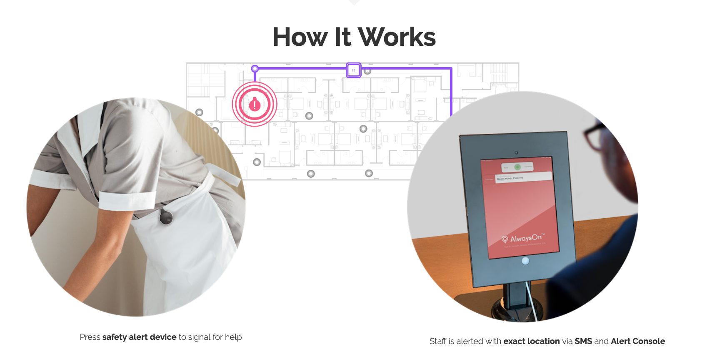

## ROAR For Good

[AlwaysOn](https://www.roarforgood.com/) is a security platform for hotels and its employees. After hitting a panic button, hotel security is given an exact, room-specific location of the event. 

From a technical stand point AlwaysOn uses a custom mix of bluetooth mesh networking and other tools to power the service. I myself helped with the backend tools. Using [Elixir](https://elixir-lang.org/) and [Phoenix](https://www.phoenixframework.org/) we crafted an admin website that can help track and update all the client info and the remote site hardware that is deployed.

**Related Tech:** Elixir, Phoenix, Ecto, Postges, Amazon Deployment Tools